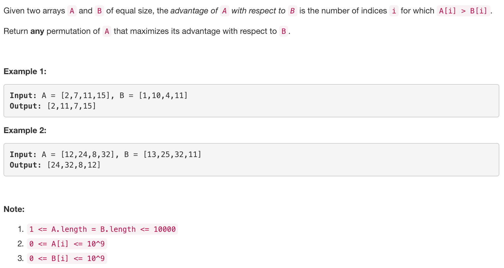
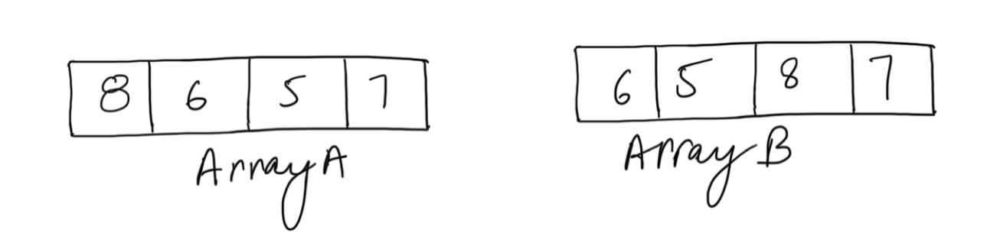
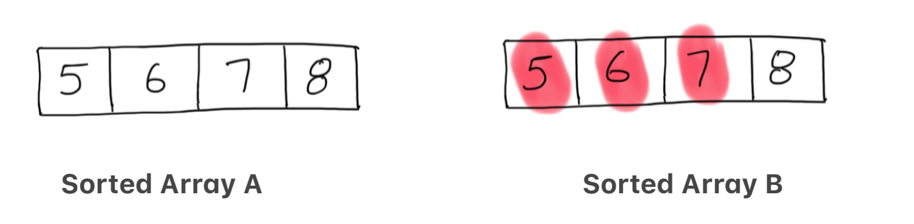
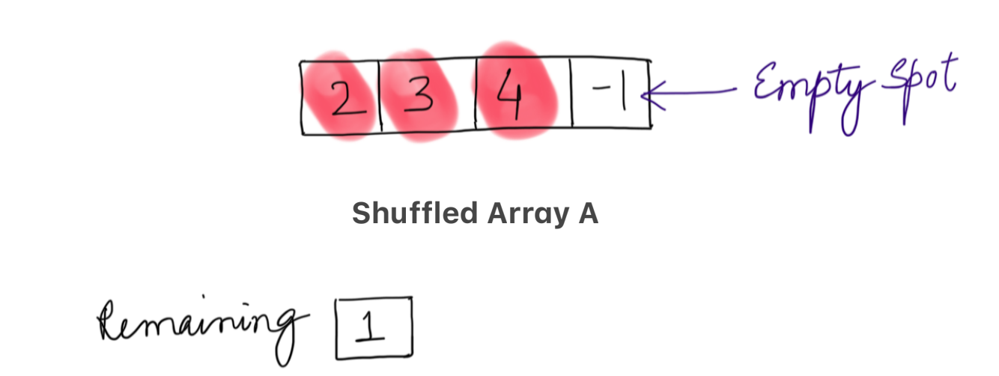
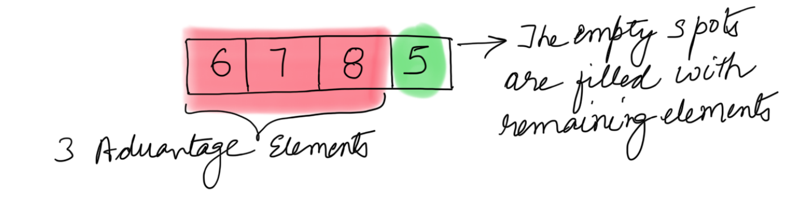

<p align="center">

</p>

---
### Solution 1: Be Greedy !!

#### Motivation

We need to shuffle the array `A` so that we can maximize the pairs of elements in A and elements in B, such that `A[i] > B[i]`, i is the index of the array. A brute-force way of solving this would be to try out all the permutations of the array A. We cannot do that since it would be computationally intractable to process all `N!` permutations and find the best one.

We need to come up with something better.

Consider two arrays:
```
A = [5, 6, 7, 8]
B = [5, 6, 7, 8]
```

`Possible Pairing - Advantage - 2`

 A | B
---|---
`8`|`5`
`7`|`6`
 5 | 7
 6 | 8

In the above example, if we pair up A's `8` and B's `5`, we have lost the chance of pairing up B's `5` with a better candidate, which might be smaller number than `8` and hence A's `8` could be utilized some where else.

`Better Pairing - Advantage - 3`

 A | B
---|---
`6`|`5`
`7`|`6`
`8`|`7`
 5 | 8

As seen in the above example, if we paired the smallest elements in A with the smallest elements in B initially, we would have more advantage pairs. The basic intuition for this problem is to be greedy.

Here, by greedy we mean start with the smallest values in A and pair them with the smallest values in B. This would ensure that a lower value in A is matched to a lower value in B. If not then we look for other higher values. Directly jumping on to higher values in A might lead to wrong pairs in the beginning as described above and the smaller values in `A` might not find a suitable partner. :)

>Starting with smaller values of A makes sure the smaller values in A are utilized first leaving us with bigger values for later bigger values of B. Giving us more chances of forming advantage pairs.

#### Algorithm

<p align="center">

</p>

Above are two arrays `A` and `B` and we need to find the best advantage shuffle for A, with respect to B.

1. Sort `A` in increasing order of value.
2. Reform the list `B` to also store the original indices of each element. This index is to be used later on, to place the `shuffled array A` element corresponding to the correct `B`'s element.
3. Now sort the reformed array `B` on the basis of value, in increasing order.

    <p align="center">
    
    </p>

    The above figure shows the sorted arrays A and B. In the implementation we keep elements of B as tuples, to store the original index of each element next to it.

4. Initialize a new array `shuffled_A` to be returned.
5. Iterate both the sorted arrays using index pointers say, `i` and `j`.
6. If at any point, element in `A` is greater than element in `B` then this pair is useful in increasing the advantage. Place it in the shuffled array at the correct spot using the corresponding index value from array `B`.
7. Else, The element in `A` is added to a list of remaining elements, to be used later.

    <p align="center">
    
    </p>

    The `red` markings show elements of array A which have an advantage over array elements of B and are put at the correct positions in `shuffled_A`. The `green` marking is to show positions which are left blank. `Remaining` list keeps the elements of `A` which do not have any advantage.

8. After we are done with finding all the advantage elements in `A` and placing them in the correct spot in `shuffled_A`. We can put all the remaining non advantage elements of A in the empty spots of `shuffled_A`. Since, the elements in these empty spots do not count towards the advantage, hence their placement doesn't matter.

    <p align="center">
    
    </p>

#### Complexity Analysis

* Time Complexity: `O(NlogN)` since we have to sort the elements to get a list A and B.
* Space Complexity: `O(N)`, where N is the size of array A. All the elements in A might not classify for an advantage over B's elements and the remaining list size could get as big as that of A.

#### Link to OJ

https://leetcode.com/problems/advantage-shuffle/

---
Article contributed by [Divya](https://github.com/DivyaGodayal).
