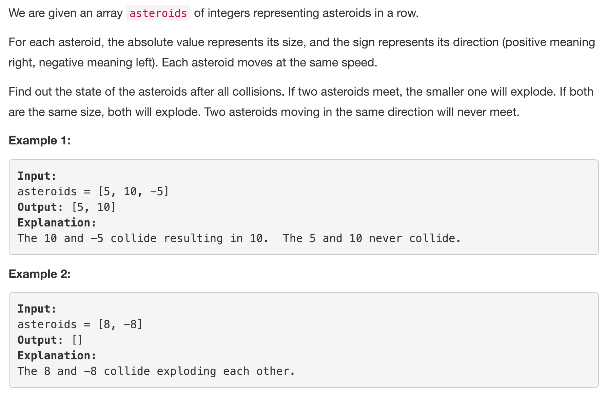
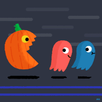
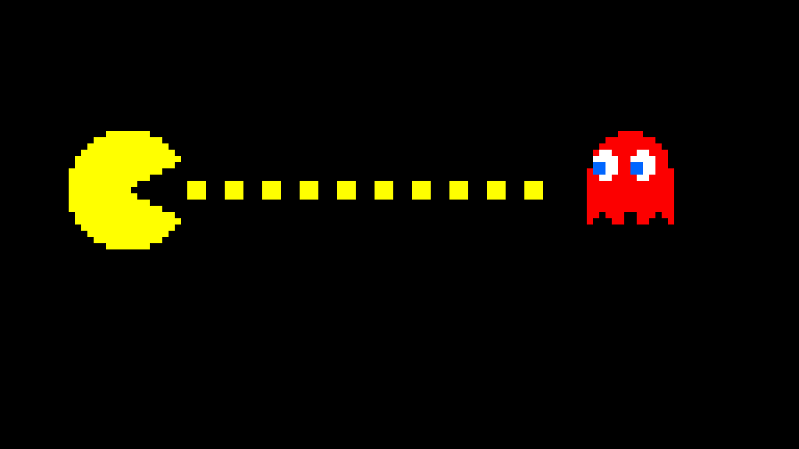
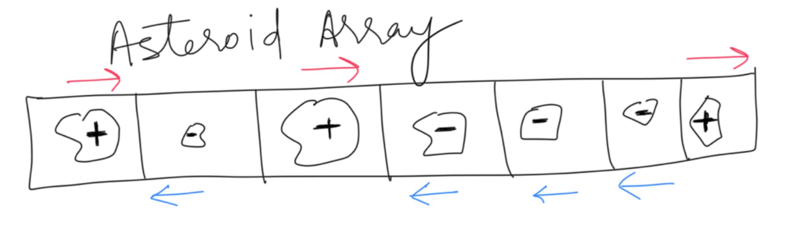
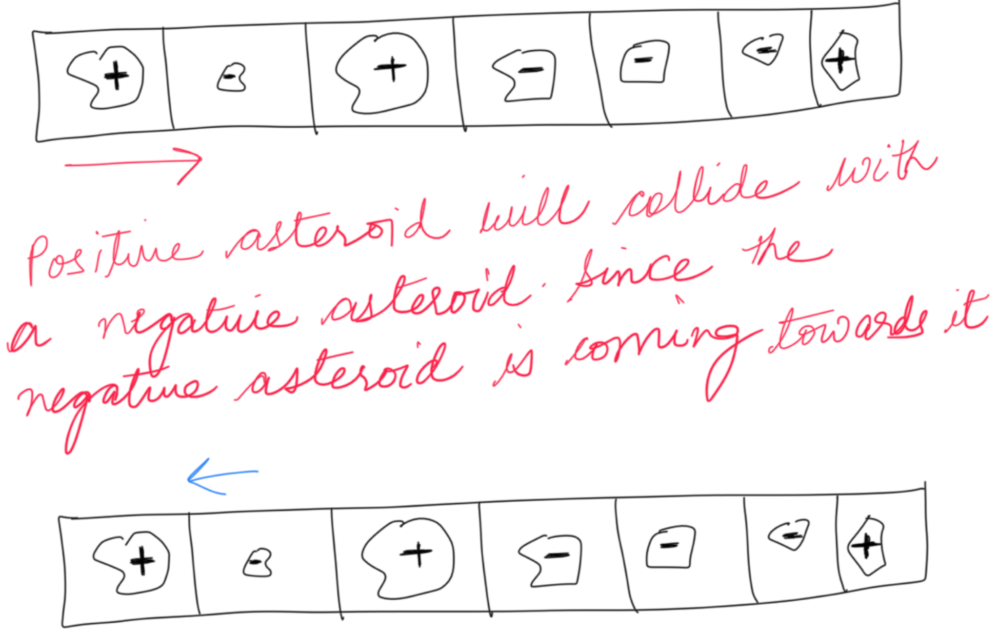
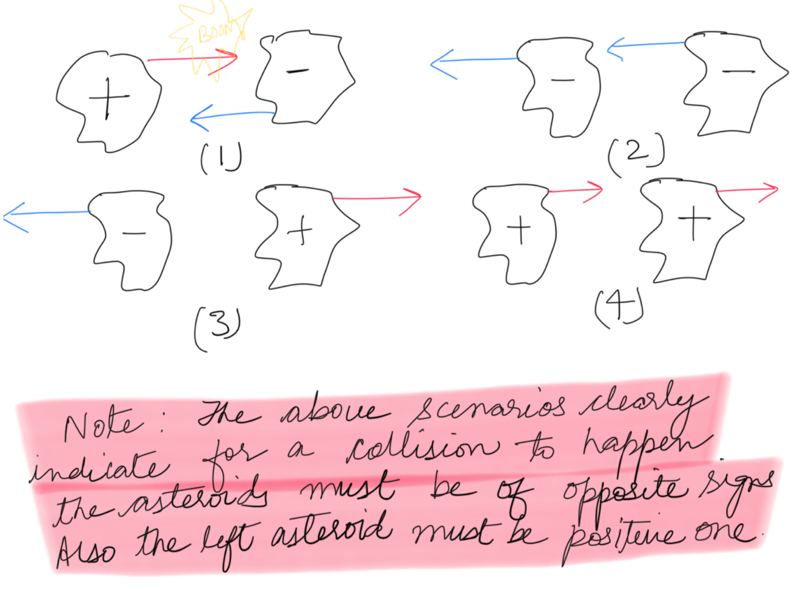

  

This problem similar to the game of Pacman, in the sense if the Ghost is moving towards a Pacman, and they meet the Pacman dies. Though in this problem who dies, depends on its size. If the Pacmans and the ghosts are moving towards each other, then there is definitely an explosion. Otherwise when moving in the same direction the chase never ends.

  

Our task is to identify all the situations where there is collision, that is when the two are moving towards each other.

  

**Survival of the fittest** - The survivor of the collision is the one who is bigger. If the collision is amongst equal opponents, then none survives.

---
### Solution 1: Stack Approach

#### Motivation

  

We are given a row of asteroids. Moving from left to right in this array of asteroids we will come across the following:

1. Asteroid moving to the right. i.e. `Positive Asteroid`.

2. Asteroid moving to the left. i.e. `Negative Asteroid`.

  

Whenever a `positive asteroid` is encountered, it's outcome of survival could be left for future, since it's moving to the right and we might still have some negative asteroid in the remaining array (i.e. asteroid which is moving towards it), for a possible collision of course!

The decision of a `negative asteroid` could be made the moment it is encountered. This is because we are iterating the array from left to right and a negative asteroid is moving to the left. The corresponding collision asteroids for the incoming negative asteroid, can only be an asteroid from its left which is moving towards it. Hence for a negative asteroid, the already encountered positive asteroids can lead to possible collision.

This essentially means, we can use a stack to save all the asteroids which are still intact. The most recent positive asteroids sitting at the top of the stack could then be used to find out the collisions with the incoming negative ones.

  

#### Algorithm

1. We are using a stack to maintain the current state of the asteroids, while iterating the given asteroid array.
2. Iterate the asteroid array from left to right. Let's call the current element of this array, `incoming asteroid` for the elements of the stack.
3. If the incoming asteroid is a `positive asteroid`, push it to the stack.
4. If the incoming asteroid is a `negative asteroid`, we would need to find out the most recent surviving positive asteroid which would have appeared till now. For this we check the stack top.

    a. If the stack top has a positive asteroid there would be a collision between the two.
    - If both are of same size no one survives. And hence we just pop the stack top.
    - If the incoming asteroid is of smaller size, it will not survive the collision. But the asteroid at the stack's top would remain as is.
    - If the incoming asteroid is bigger than stack's top then we pop the stack's top and repeat the entire step 4 for the same incoming asteroid and but new stack top.

    b. If the stack top has a negative asteroid, then current asteroid is just pushed on to the stack.

5. Once all the asteroids are seen, the elements in the stack would now be the list of asteroids which survived and hence this could be returned as the state after collision.

#### Implementation Notes

The stack we have used is an array implementation of stack, such that the last element of the array would be the top of the stack. At any point in time the `stack` would be a list of currently surviving asteroids. The negative asteroid will never be to the right of a positive asteroid in the stack, since they will always collide. Hence the `survivors` would always be a `list of negative asteroids`(if any) followed by a `list of positive asteroids`(if any).

#### Complexity Analysis

* Time Complexity: `O(N)`, where N is the size of the asteroid array and we iterate the asteroid array.
* Space Complexity: `O(N)`. In the worst case, all the asteroids might be of same sign and no collision happens. In this case the stack would be of size `N`.

#### Link to OJ

https://leetcode.com/problems/asteroid-collision/

---
Article contributed [Divya](https://github.com/DivyaGodayal)
