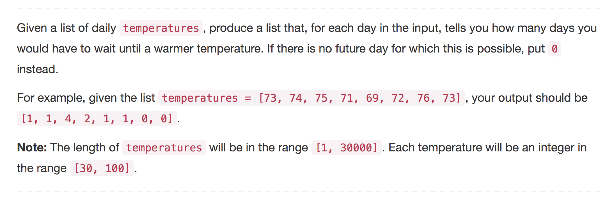

<p align="center">

</p>

We are given a list of temperatures over multiple days, we are to find, for every individual day, after how many days will a warmer day arrive. If you think about these temperatures as just numbers, then what we have to do here is:

>Given a list of numbers, for every number, we have to find out the index of the next higher element in the list. That's all we have to do to solve this question.

We don't need to report the actual index of the next larger element, we need to report the distance of that index from the current index. This classic problem can be solved by two different data structures
    1. Heap
    2. Stack

---
### Solution 1: Using Heaps

#### Algorithm

1. We keep on iterating over the list of numbers and we do the following for each element.

2. We pop all smaller elements from the heap. The current element will act as the next higher element for all of these smaller elements that are there in the heap. `Note:` if this was not the case and some previous index would have been the next larger element for some of these elements in the heap, then they would not be there in the heap in the first place at this point.

3. After removing all the smaller elements from the heap and assigning their next largest element properly, we add the current element to the heap and we move forward.

#### Complexity Analysis

* Time Complexity: `O(NlogN)` since we eventually push and pop every element from the heap and considering we have `N` elements in the heap.
* Space Complexity: `O(N)` as occupied by the heap.      

---
### Solution 2: Using Stack

It turns out that we can do better on this task, complexity wise by using the stack data structure.

#### Algorithm

1. We iterate on the array in reverse.

2. For every element we do these steps:
    1. Pop all the elements from the stack that are smaller than the current element or until the stack becomes empty.
    2. If we find an element that was larger than the current element, then that element on the stack would be the next larger element corresponding to the
    current element.
    3. If the stack becomes empty, then the current element is the largest one till now.
    4. Add the current element to the stack and repeat the process.
    `Note:` We are moving in the reverse direction on the array for this to work.

Let us try and dry run the stack based algorithm on the following example. As a slight modification to the algorithm described above, we add the element's index to the stack and not the actual element because the question asks us to print the number of days till the next warmer day.

```
[75, 69, 72, 76, 73]
 <-----------------

 * i = 4, element = 73, stack = []
    --> add 4 to the stack.
    --> next_largest[4] = 0

 * i = 3, element = 76, stack = [4]
    --> Pop until stack empty or larger element found.
    --> element > temperatures[stack[top]], therefore stack.pop()
    --> next_largest[3] = 0
    --> add 3 to the stack    

 * i = 2, element = 72, stack = [3]
    --> element < temperatures[stack[top]]
    --> next_largest[2] = stack[top] - i = (3 - 2) = 1
    --> add 2 to the stack

 * i = 1, element = 69, stack = [2, 3]
    --> element < temperatures[stack[top]]
    --> next_largest[4] = stack[top] - i = (2 - 1) = 1
    --> add 1 to the stack

 * i = 0, element = 75, stack = [1, 2, 3]
    --> Pop until stack empty or larger element found.
    --> element > temperatures[stack[top]], therefore stack.pop()
    --> element > temperatures[stack[top]], therefore stack.pop()
    --> element < temperatures[stack[top]]
    --> next_largest[0] = stack[top] - i = (3 - 0) = 3
    --> add 0 to the stack
```

```
next_largest = [3, 1, 1, 0, 0]
```

    
#### Complexity Analysis    

* Time Complexity: `O(N)` since we process each element in the given array exactly once.
* Space Complexity: `O(N)` since the stack may contain `N` elements in the worst case.  

#### Link to OJ

https://leetcode.com/problems/daily-temperatures/

---
Article contributed by [Sachin](https://github.com/edorado93) and [Divya](https://github.com/DivyaGodayal).
