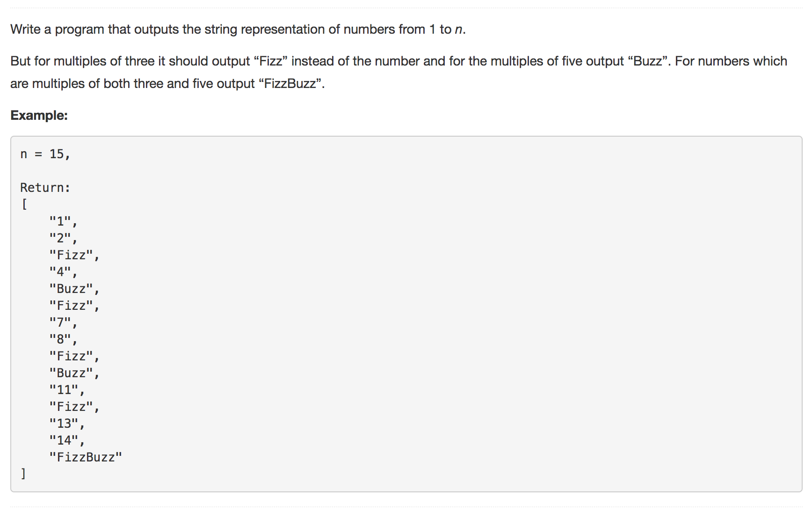

You must have played FizzBuzz as kids. FizzBuzz charm never gets old. And so here we are looking at how you can take on one step at a time and impress your interviewer with a better and neat approach to solve this problem.

---
#### Approach 1: Naive Approach

**Intuition**

The first approach is based on a simply divisibility check by `3`, `5` or both.

**Algorithm**

1. Initialize an empty answer list.
1. Iterate on the numbers from $$1 ... N$$.
2. For every number, if it is divisible by both 3 and 5, add FizzBuzz to the answer list.
3. Else, Check if the number is divisible by 3, add Fizz.
4. Else, Check if the number is divisible by 5, add Buzz.
5. Else, add the number.
</pre>

**Complexity Analysis**

* **Time Complexity**: `O(N)`
* **Space Complexity**: `O(1)`

---
#### Approach 2: String Concatenation

**Intuition**

This approach won't reduce the asymptotic complexity, but proves to be a neater solution when `FizzBuzz` comes with a twist.
What if `FizzBuzz` is now `FizzBuzzJazz` i.e.
<pre>
3 ---> "Fizz" , 5 ---> "Buzz", 7 ---> "Jazz"
</pre>

If you try to solve this with the previous approach the program would have too many conditions to check:

1. Divisible by 3
2. Divisible by 5
3. Divisible by 7
4. Divisible by 3 and 5
5. Divisible by 3 and 7
6. Divisible by 7 and 3
7. Divisible by 3 and 5 and 7
8. Not divisible by 3 or 5 or 7.

This way if the `FizzBuzz` mappings increase, the conditions would grow exponentially in your program.  

**Algorithm**

Instead of checking for every combination of these conditions, check for divisibility by given numbers i.e. 3, 5 as given in the problem. If the number is divisible, concatenate the corresponding string mapping `Fizz` or `Buzz` to the current answer string.

For eg. If we are checking for the number 15, the steps would be:
<pre>
Condition 1: 15 % 3 == 0 , num_ans_str = "Fizz"
Condition 2: 15 % 5 == 0 , num_ans_str += "Buzz"
=> num_ans_str = "FizzBuzz"
</pre>

So for `FizzBuzz` we just check for two conditions instead of three conditions as in the first approach.

Similarly, for `FizzBuzzJazz` now we would just have three conditions to check for divisibility.

**Complexity Analysis**

* **Time Complexity**: `O(N)`
* **Space Complexity**: `O(1)`

---
#### Approach 3: Hash it!

**Intuition**

This approach is an optimization over approach 2. When the number of mappings are limited, approach 2 looks good. But what if you face a tricky interviewer and he decides to add too many mappings?

Having a condition for every mapping is not feasible or may be we can say the code might get ugly and tough to maintain.

What if tomorrow we have to change a mapping or may be delete a mapping? Are we going to change the code every time we have a modification in the mappings?

We don't have to. We can put all these mappings in a `Hash Table`.

**Algorithm**

1. Put all the mappings in a hash table. The hash table `fizzBuzzHash` would look something like ``{ 3: 'Fizz', 5: 'Buzz' }``
2. Iterate on the numbers from $$1 ... N$$.
3. For every number, iterate over the `fizzBuzzHash` keys and check for divisibility.
4. If the number is divisible by the key, concatenate the corresponding hash value to the answer string for current number. We do this for every entry in the hash table.
5. Add the answer string to the answer list.

> This way you can add/delete mappings to/from to the hash table and not worry about changing the code.

So, for `FizzBuzzJazz` the hash table would look something like ``{ 3: 'Fizz', 5: 'Buzz', 7: 'Jazz' }``

**Complexity Analysis**

* Time Complexity : `O(N)`
* Space Complexity : `O(1)`

---
Originally published in [@LeetCode](https://leetcode.com/articles/fizz-buzz/).
 
Analysis written by: [@godayaldivya](https://leetcode.com/godayaldivya/).
