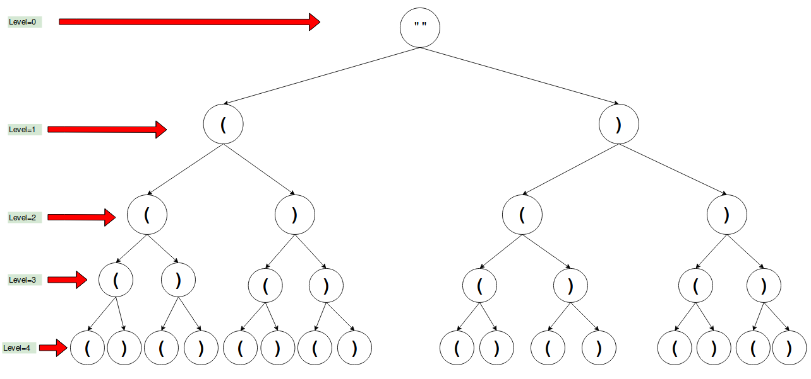
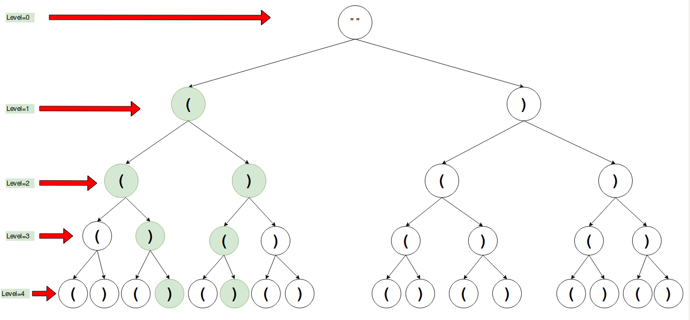

## Generate Parentheses

<p>

</p>


---

### Solution : Backtracking

####  Motivation
So we are given `N` pairs of parentheses and we have to return all the valid expression using these `N` pairs.

Below is the list of all valid expressions for `N = 2`.
#### `( ) ( )`
#### `( ( ) )`

So here's the approach. The length of any expression will always be equal to `N * 2`. So, at every index of the expression we have 2 choices to fill it either `(` or `)`. So  we try to fill every index of the expression recursively either by using `(` or `)` and check the validity of the expression. This can be accomplished with the help of Backtracking.

Below is the recursion tree formed by backtracking for `N = 2`.

<p>

</p>

As per the recursion tree from the above diagram, if we try forming strings by traversing from root node to every leaf node then we get all possible expression for that `N`. So from the above we have listed all the possible expressions for `N = 2`.

```
 ((((
 ((()  
 (()(  
 (())  
 ()((  
 ()()  
 ())(  
 ()))  
 )(((  
 )(()  
 )()(  
 )())  
 ))((  
 ))()  
 )))(  
 ))))
```

The only valid expressions out of these are:

```
 ()()
 (())
```

From the above valid expressions we can observe that, the expressions where the number of open parentheses `(` and close parentheses `)` are equal are the valid ones. The paths of the above valid expressions have been highlighted in the below diagram.

However, not all expressions having equal number of `(` and `)` parentheses are valid. For e.g. `))((` is not a valid expression. If you process the valid expressions from left to right you will notice that the number of `)` parentheses never become greater than `(`. e.g.

```
(())

i = 0, l = 0, r = 0
i = 1, l = 1, r = 0
i = 2, l = 2, r = 0
i = 3, l = 2, r = 1
i = 4, l = 2, r = 2
```

However, for the invalid expression `))((` we can see that right at the start we have a `)` parentheses but no `(` parentheses to match it.

```
))((

i = 0, l = 0, r = 0
i = 1, l = 0, r = 1 INVALID
```  

<p>

</p>


#### Algorithm
1. We start with an empty string  and mark it as `level = 0` and make a postorder traversal.
2. As mentioned before, at every step along the way we have two choices: we can either use the `(` parentheses or the `)` parentheses.
3. During the traversal we will keep track of the opening parentheses `(` and closing parentheses `)` and whenever we encounter such cases where number of closing parentheses are more than opening parentheses we will reject it. This helps prune the recursion tree a lot.
4. At `level = N*2` we check if the count of both open parentheses `(` and closing parentheses `)` is equal to zero and the equality condition is enough to guarantee the validity of the expression.

#### Complexity Analysis
* Time Complexity: `O(2^(2N))` where `N` is the number of pairs of parentheses.
* Space Complexity: `O(N)` where `N` is the number of pairs of parentheses. The space is occupied by the recursion stack in this case.

#### Link to OJ
https://leetcode.com/problems/generate-parentheses/

---
Article contributed by [Arihant Sai](https://github.com/Arihant1467)
