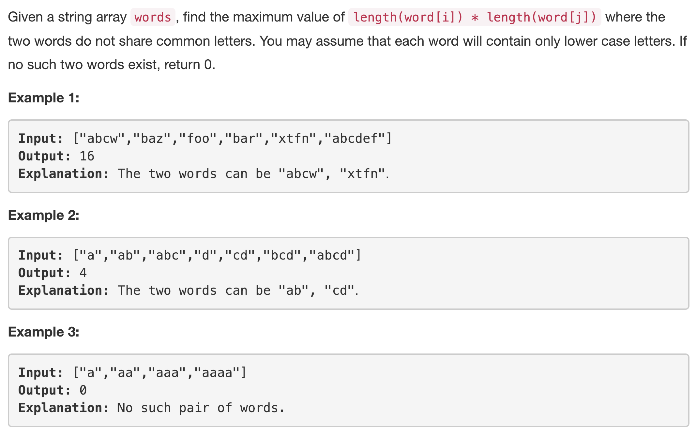
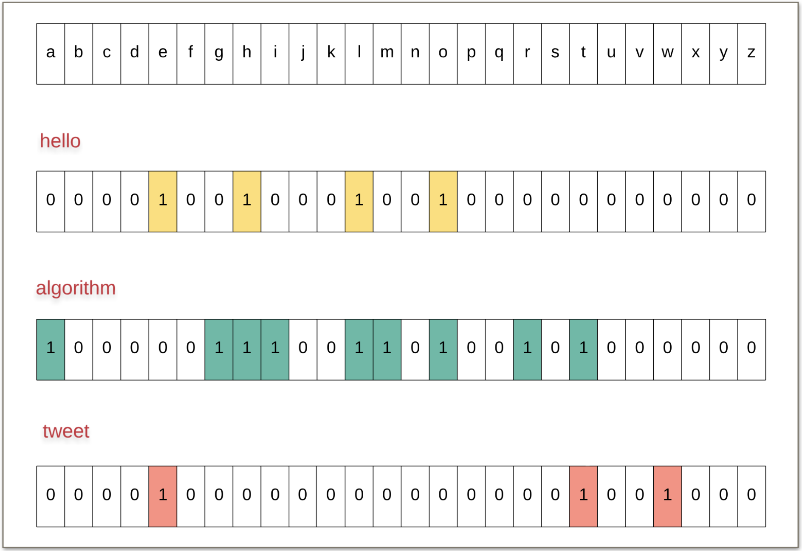

---
### Solution 1: Brute Force

#### Motivation

The good news is that a slightly optimized version of the brute force algorithm will get your code accepted on the platform.

#### Algorithm

The brute force way is to check all the pairs of words and for each pair, check if there are any common characters between them. For all such pairs that don’t have any common characters, record the maximum value of len(word1) * len(word2).

1. We perform preprocessing that maps each word to their set of characters. This will be handy later on.  
2. Have an outer loop, let's say `i`, that iterates from `0..N`
3. Then have another loop, nested inside the outer one. Let's call this one, `j`. It iterates from `i + 1 .. N`.
4. This will help us consider all the pairs of words as candidate pairs for maximum product of word lengths.
5. For a given pair of words, `A[i]` and `A[j]`, we need to find out if they share any characters or not. If they don't, then they are a valid pair and we can consider them for finding out the maximum product of word lengths.
6. For each pair of words, we perform a set intersection to check whether the two words have any common characters or not.
7. Record `max(len(A[i]) * len(A[j]))` for all valid pairs.

#### Complexity Analysis

* Time Complexity: `O(26 . N²) = O(N²)`. The set intersection is performed for every pair of words. Each set simply consist of the characters that the word is made of. So, the maximum size of such a set can be 26 (considering that's the size of the alphabet in our question). Hence, the constant 26 in the complexity mentioned above. But, since it's a constant, we ignore it in our analysis.
* Space Complexity: `O(N)` for the preprocessed map.

---
### Solution 2: Bitmaksing

#### Motivation

It turns out that we can’t get rid of the part where we have to consider each pair of words from the given array. So, we can’t get rid of the `O(N²)` part of the algorithm. The portion that we can get rid of, however, is the part where we compare two words and see if they have any common characters. That constant 26 slows down the algorithm a lot.

An important thing to note here is that the question simply cares about common characters and not their frequency or their order.

>What if we simply use a bitmask to represent the characters in a word.

What we can do here is to have a bitmask consisting of 26 bits to represents the characters belonging to a particular word. Let’s look at such a representation for a few words to make things clearer.

If two words would have any common characters, then the corresponding bits for those characters would be set in the bitmasks for both the words. Hence, all we have to do is to do a bitwise AND of the bitmasks representing two words and check if we get a 0 or not

#### Algorithm

1. Initialize a map, `map_` which, for every word in the list, stores it's bit representation. Since the question doesn't care about the frequency of different letters, a bit representation works just fine.
2. Have an outer loop, let's say `i`, that iterates from `0..N`
3. Then have another loop, nested inside the outer one. Let's call this one, `j`. It iterates from `i + 1 .. N`.
4. This will help us consider all the pairs of words as candidate pairs for maximum product of word lengths.
5. For a given pair of words, `A[i]` and `A[j]`, we need to find out if they share any characters or not. To do this, we simply perform `bitwise AND` of their masks. In case it evaluates to `0`, it implies they don't have any common characters. This is a `O(1)` time operation as opposed to possibly `26` earlier on.
6. Record `max(len(A[i]) * len(A[j]))` for all valid pairs.

#### Complexity Analysis

* Time Complexity: `O(N²)`. We got rid of the constant, 26, from the previous algorithm and this speeds up things a lot.
* Space Complexity: `O(N)` for the preprocessed map.

---
### Solution 2: Optimized Bitmaksing

#### Motivation

It turns out, we can improve this algorithm even further.

The improvement can be made because of the fact that two different words can have the same bitmask. For e.g. `hello` and `llohhel` both would have the same bitmask representation. We can store the longest word for a given bitmask since all we care about is maximizing the product of word lengths.

#### Algorithm

The algorithm remains the same as before. Only the preprocessing part changes. Instead of storing the bit representation for each word in a map, we store the longest word corresponding to a map in a dictionary. That is the preprocessing we perform.

Also, instead of having a nested loop over the original array of words, we now have a nested loop over the keys in our dictionary i.e. the bitmasks. We don't *really* care about the words themselves. We simply care about their lengths and the characters they contain and this information is available in the dictionary itself.

#### Complexity Analysis

This algorithm has a very interesting complexity analysis. So, our preprocessing map now contains bit representations as keys and the values are the longest words corresponding to each mask (bit representation).

Instead of iterating over the original list of words, we iterate over the bitmasks in the dictionary. Each bitmask is composed of `26` bits. That implies, we can have `2^26` possible bitmasks. That is a really huge number.

> However, the important thing is, this number is a CONSTANT. It is not dependent upon the initial array/list size i.e. N and hence, according to asymptotic analysis, it can be safely ignored. It's literally a Joke!

Think of it this way. If we had a gazillion numbers. `2^26` would seem very small, a teeny tiny bit that can be ignored. Hence, it's considered a constant.

* Time Complexity: `O(N)`. The nested loops are over the dictionary now and the size of dictionary is constant. Hence, the only time taken is to iterate over the initial array for creating the masks themselves.
* Space Complexity: `O(1)` since the dictionary size doesn't depend on `N`.

#### Link to OJ

https://leetcode.com/problems/maximum-product-of-word-lengths/description/

---
Article contributed by [Sachin](https://github.com/edorado93)
