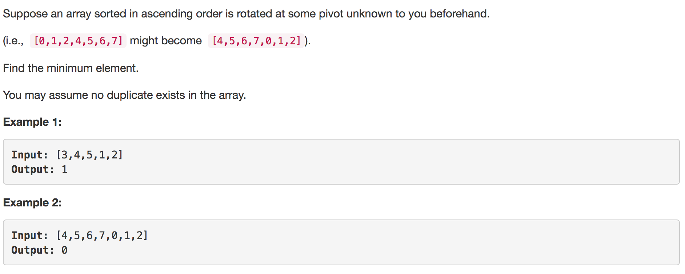
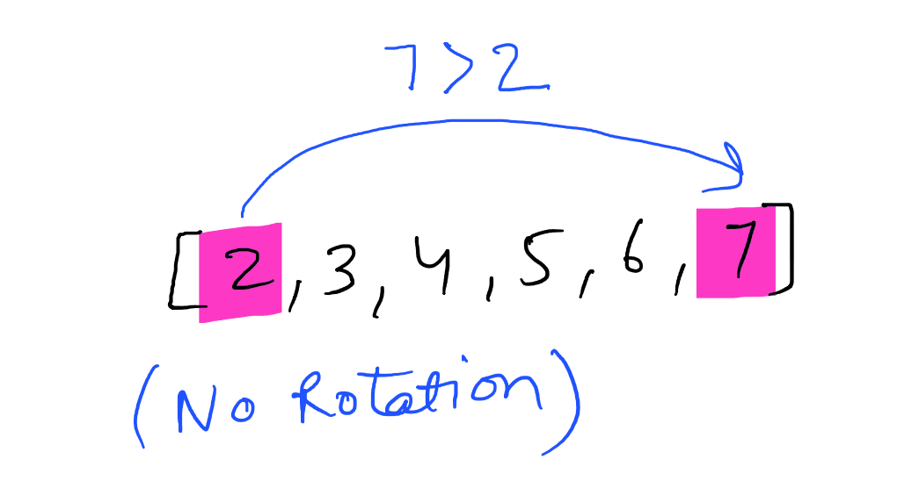
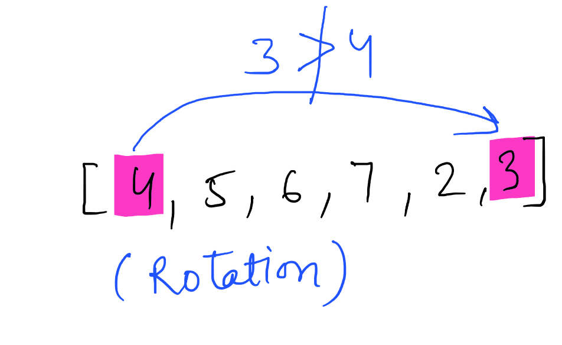
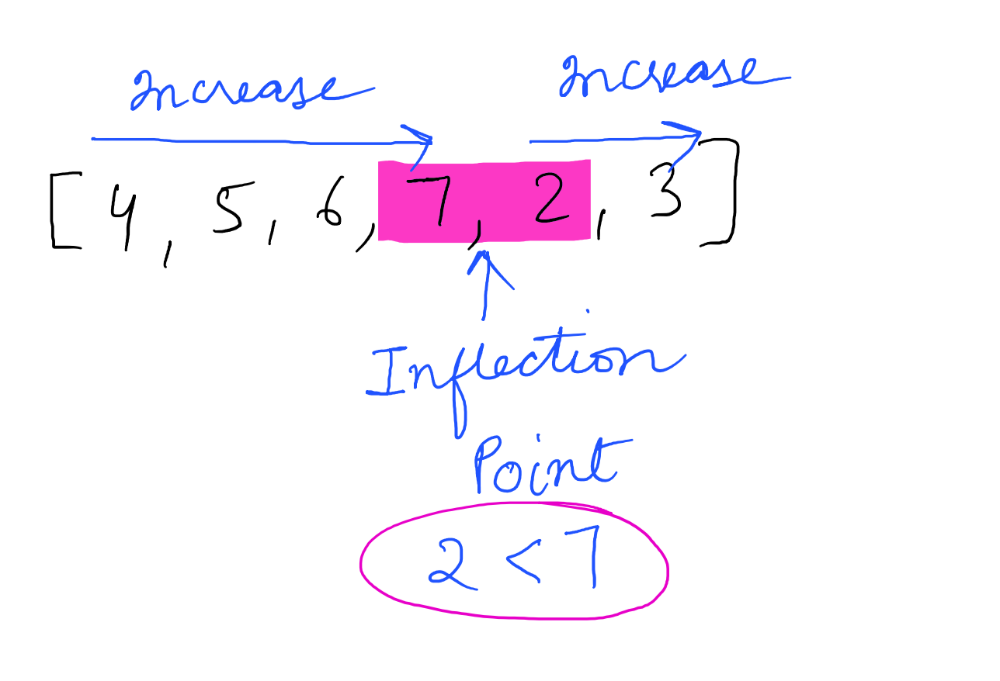
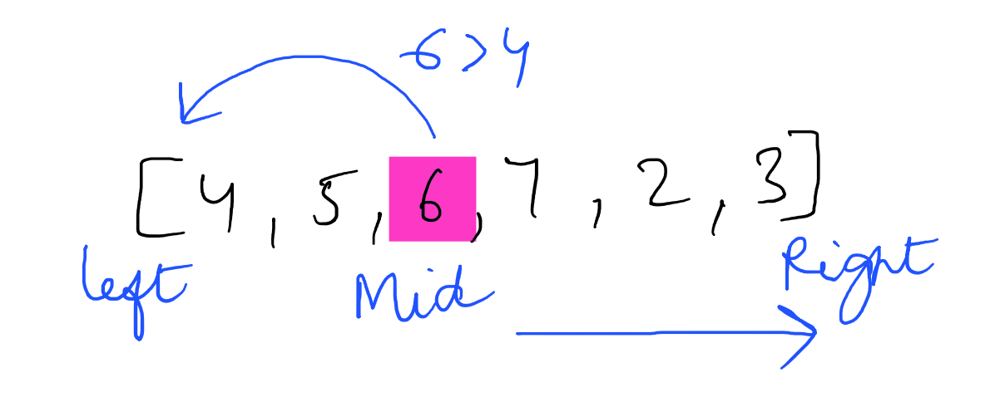
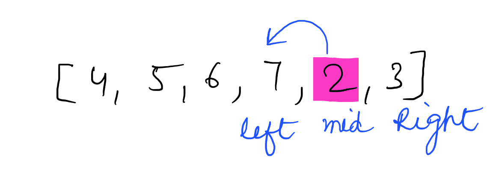

---
### Solution 1: Modified Binary Search

#### Motivation

This is another question which tests you on your understanding of the `Binary Search` algorithm. In binary search, you find out the mid point and decide to either search on the left or right depending on some condition. In this question we would essentially do the same but we need to find out what this condition is. 

We want to find the smallest element in a rotated sorted array. What if the array is not rotated? How do we check that? If the array is not rotated then the entire array is in ascending order which means the `last element > first element`.

In the above example 7 > 2. This means the array is still sorted and has no rotation.

In the above example 3 < 4. Hence the array is rotated. This happens because the array was initally `[2, 3 ,4 ,5 ,6 ,7]`. But after the rotation the smaller elements`[2,3]` go at the back. i.e. [4, 5, 6, 7, `2, 3]`. Because of this the first element`[4]` in the rotated array is now greater than the last element.

This means the array is not sorted fully. There is a point in the array at which you would notice a change.  This is the point which would help us in this question. We call this point the `Inflection Point`.

In this modified version of binary search algorithm, we are looking for this point. In the above example notice the inflection point. 

> All the elements to the left of inflection point >= first element of the array.

> All the elements to the right of inflection point < first element of the array.

#### Algorithm

1. In the usual manner we find the mid element of the array. 
2. If the `mid element > first element of array` this means the we are still on the left part of the inflection point. 
3. If `mid element < first element of array` this means we are on the right part and will have to look for inflection point on the left.

In the above example mid element `6` is greater than first element `4`. Hence we continue our search to the right of mid.
We stop our search when we find the inflection point, when either of the two conditions is satified:

* `nums[mid] > nums[mid + 1]` mid+1 is the smallest.
* `nums[mid - 1] > nums[mid]` mid is the smallest.

In the above example. With the marked left and right pointers. The next mid element is `2`. The element just before `2` is `7` and `7>2` i.e. `nums[mid - 1] > nums[mid]`. Thus we have found the point of inflection and `2` is the smallest element.

#### Complexity Analysis

* Time Complexity: Same as Binary Search `O(logN)`
* Space Complexity: `O(1)`

#### Link to OJ

https://leetcode.com/problems/find-minimum-in-rotated-sorted-array/description/

---
Article contributed by [Sachin](https://github.com/edorado93) and [Divya](https://github.com/DivyaGodayal)

