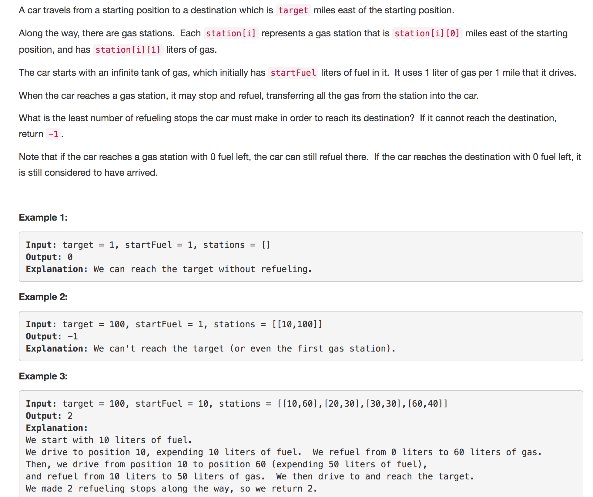
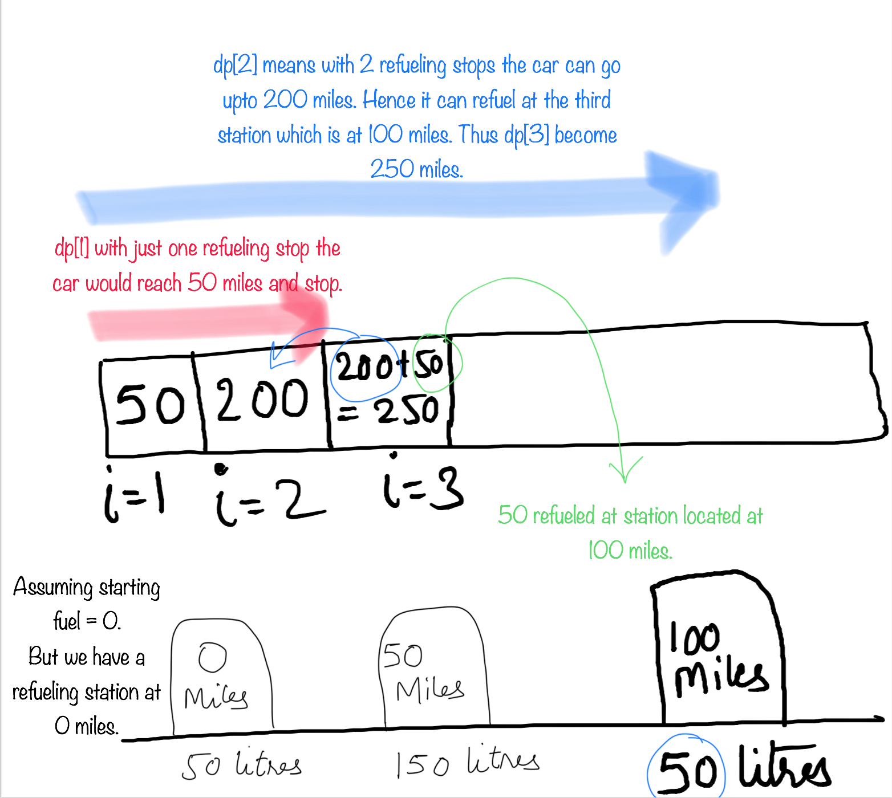
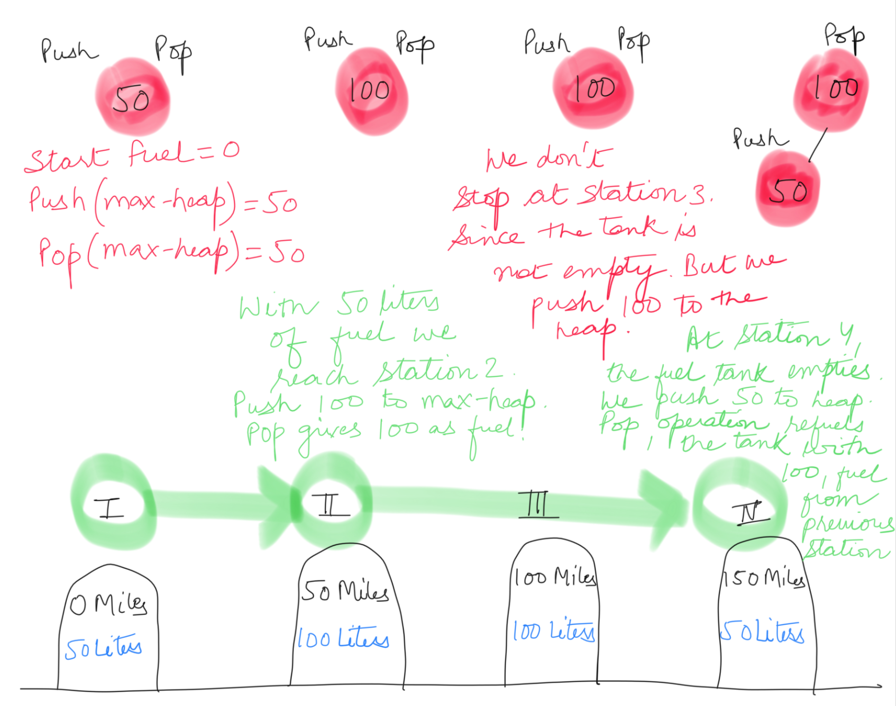

<p align="center">

</p>

---

### Solution 1: Dynamic Programming Approach

#### Motivation

This problem is similar to the longest increasing subsequence problem.

  Lets define dp[j]:
  `dp[j] -  the farthest location we can get to using j refueling stops.`

  e.g. If dp[2] = 200 miles, this means we can reach a max distance 200 miles from the start location by refueling at 2 stations.

We need to reach the target in the minimum number of steps/stations. Hence, we want the smallest `i` for which `dp[i] >= target`.

#### Algorithm

1. We visit each station in order. For every station we check the dp array moving backwards from the current index.
If the value of the dp cell `dp[j]`, where `j < i` indicates that its reach is equal to or beyond the current station's location `stations[i]`, this means with `j` refueling stops the car can reach or possibly cross the station `i`. Hence we add the current station's fuel to `dp[j]` and we find the max of all possible `j`'s.

    ```
      stations[i][1] = Fuel at Station i.
      dp[j+1] = max((dp[j] + stations[i][1]), dp[j+1])
      dp[j+1] = the farthest location we can get to using j + 1 refueling stops.
    ```

2. Any time we could reach (or cross) a station, `station[i] = (location, capacity)` with `j` refueling stops
,`dp[j]`, we can now reach that distance plus `capacity` i.e. `dp[j] + capacity` with j+1 refueling stops.

3. This means we are adding a ,
For example, if we could reach a distance of 200 miles with 2 refueling stops, and now we added a station at location 100 with 50 liters of fuel, then we could `potentially` reach a distance of 250 miles with 3 refueling stops.

<p align="center">

</p>

#### Complexity Analysis

* Time Complexity: O(N<sup>2</sup>), where N is the number of stations.

* Space Complexity: O(N), the space used by the dp table.

---
### Solution 2: Max-Heap Approach

#### Motivation

This approach is much easier to understand. The question just asks us to calculate the number of minimum stations we need to stop at to refuel the car to reach the target. The best thing about this problem is that it's not reality. And so we don't have to take our decision promptly. We don't have to take a decision of choosing to refuel the car while actually crossing the station in the car.

#### Algorithm

1. So, this is what we do. We drive to whatever maximum we can, while keeping a track of all the stations that came along.

2. Once the fuel gets over we greedily pick from the stations we crossed. `Picking up the station which has the maximum fuel`.

3. This process could be repeated till we hit the target.

4. To maintain a list of stations which came on the way and pop out the max one when needed, we can use a max heap. So whenever we run out of fuel we can pop the top element from the heap. The number of pops is the number of stations we need to stop at to refuel.

5. If we never hit the target sum, then we return -1.

<p align="center">

</p>

#### Complexity Analysis

* Time Complexity: O(NlogN), where N is the number of stations.

* Space Complexity: O(N), the space used by heap.

#### Link to OJ

https://leetcode.com/problems/minimum-number-of-refueling-stops/description/

---
Article contributed by [Sachin](https://github.com/edorado93) and [Divya](https://github.com/DivyaGodayal)
