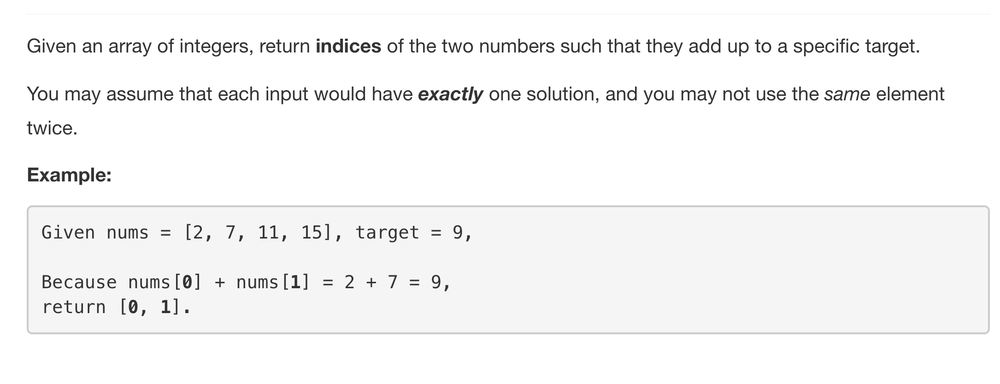

This is probably the easiest problem from the [N-Sum](../README.md) family. The problem statement simply asks us to return the indices of a pair of numbers that add up to give the target sum provided in the question. There are multiple approaches to solve this problem. We will start with the most brute and straightforward way of solving it and then move onto other optimal approaches.

---
### Solution 1: Brute Force

#### Motivation

The first approach derives it's motivation from the question statement itself. Simply try all possible pairs of numbers and check which one adds to give the target.

#### Algorithm

1. Use a nested looped structure to consider all possible pair of indices.
2. For a given pair `i` and `j`, check if `nums[i] + nums[j] == target`.
3. When we find such a pair, simply return the indices.

#### Complexity Analysis

* Time Complexity: `O(N^2)` since we try all of the pairs from a given list of `N` numbers.
* Space Complexity: `O(1)` since we don't use any additional space for finding the pair.

This is the slowest approach to solving this simple problem. There are other approaches listed below that are much faster than simple brute force.

---
### Solution 2: Use Sorting

#### Motivation

We can make use of sorting to arrange the numbers in ascending order once and then find the required pair in linear time. The only issue with sorting is that we will distort the original ordering of numbers and the question asks us to return the *indices* of the pair of numbers. So, we will have to use additional memory to keep track of original indices as well.

#### Algorithm

1. Create a new list of tuples of the form `(num, original_index)`. The tuple represents the number in the list, `nums` along with it's index in the list.
2. Sort the given list of numbers.
3. Initialize two pointers `l = 0` and `r = N - 1`.
4. Loop until `left < right`.
    1. Say the current sum is `S = nums[left] + nums[right]`.
    2. If `S < target`, then, we need to progress `left` one step forward. This will cause `S` to increase and that is what we want.
    3. If `S > target`, that means we are overshooting. We can't change `left` since it's already at it's minimum. We move `right` one step backwards. This will cause `S` to reduce.
    4. If `S == target`, it means we have found the target. We return `(nums[left][1], nums[right][1])` since we are to return *original* indices of the two numbers and sorting the list distorts the original ordering.

#### Complexity Analysis

* Time Complexity: `O(NlogN)` for sorting.
* Space Complexity: `O(N)` since we create a new list of tuples.

---
### Solution 3: Use Hashing

#### Motivation

It turns out, there's a better approach to solve this problem by making use of additional memory. If we keep on hashing the numbers in a dictionary and for a given index, `k`, we check if `target - nums[k]` is in the dictionary or not, then we would be able to solve this problem in linear time.

#### Algorithm

1. Initialize a dictionary `D`.
2. Iterate over the given list of numbers.
3. For a given index, `i`, check if `target - nums[i]` is in the dictionary, `D`. If it is, then simply return the pair found.
4. Else, simply add `nums[i] --> i` to the dictionary i.e. key would be `nums[i]` and `i` would be the value.

#### Complexity Analysis

* Time Complexity: `O(N)` since we iterate over the numbers list once.
* Space Complexity: `O(N)` since we hash each of the numbers in the list.

#### Link to OJ

https://leetcode.com/problems/two-sum/

---
Article contributed by [Sachin](https://github.com/edorado93)
