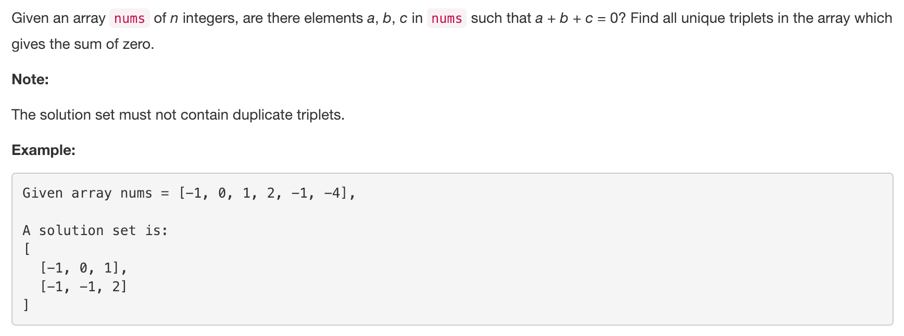

<p align="center">

</p>

---
### Solution 1: Brute Approach

#### Motivation

The first thing that comes to our mind is a very brute way. That is looping through to form all the combinations. While the approach is not wrong, but is very slow.

#### Algorithm

Use three loops to from all the triplets possible from the given array of numbers. The triplets whose sum is equal to zero are the triplets we need to record.

Below is the code snippet for this appraoch:

<!-- ```python
class Solution(object):
  def threeSum(self, nums):
      """
      :type nums: List[int]
      :rtype: List[List[int]]
      """
      ans_dict = {}
      # 3 loops to form all the triplets
      for i in range(len(nums)-2):
          for j in range(i+1, len(nums)-1):
              for k in range(j+1, len(nums)):
                  # Triplets whose sum is zero
                  if nums[i] + nums[j] + nums[k] == 0:
                      tuple_ = tuple(sorted((nums[i], nums[j], nums[k])))
                      #  To avoid duplicate triplets
                      if tuple_ not in ans_dict:
                          ans_dict[tuple_] = True
      return ans_dict.keys()
``` -->

#### Complexity Analysis

* Time Complexity: `O(N^3)`, because we loop 3 times.
* Space Complexity: `O(1)`

Note: This approach might be good as a starting approach in an interview. But it might not be the approach interviewer is looking forward to. Also this leads to a TLE, if you submit it on the online judge.:cry: But its good to know :)

---
### Solution 2: Hashing Approach

#### Motivation

The approach is derived from the hash approach used for 2 sum problem. Loop over the array to get all the sum of pairs possible and look for the remaining sum in the given list of numbers.

This essentially means, if we have to find a triplet (A, B, C) such that A + B + C = 0 and
```
two_sum = A + B
Then, C = - (A + B) i.e. the remaining sum
```

#### Algorithm

1. Create a frequency dictionary for the given number array. This dictionary essentially holds all the unique numbers in the given number list along with their frequency of occurrence.
2. Now from the frequency list form a new reduced list. The reduced list limits the frequencies of each element to 3 or lesser.
3. From the reduced list, with every element having a max count of 3, loop over to create pairs of numbers, (first_num, second_num).
4. The remaining sum i.e. `-(first_num + second_num)` is then looked for in the frequency dictionary of numbers.
5. If the remaining sum is present in the given array, then we might have a probable triplet here. Depending on how many elements in the tuple match and if frequency of the element in the reduced list is enough to produce the triplet we add the triplet to the answer triplets set.
6. To avoid duplicate triplets, we sort the tuple of triplets and add to a set.

#### Implementation Notes

One important thing to note in this approach, is the reduction step. We need to realize it that this is a 3 sum question, the maximum contribution any number could have in a triplet is 3. Hence any list could be reduced such that maximum frequency of any given element is 3.

For eg. A list of may be 50 zeros would be reduced to just [0, 0, 0]

#### Complexity Analysis

* Time Complexity : `O(N^2)`, For finding 2Sum.
* Space Complexity : `O(N)`, where N is the size of the number list.

---
Originally published in [@LeetCode](https://leetcode.com/problems/3sum/).
<br>
Analysis written by: [@godayaldivya](https://leetcode.com/godayaldivya/).
