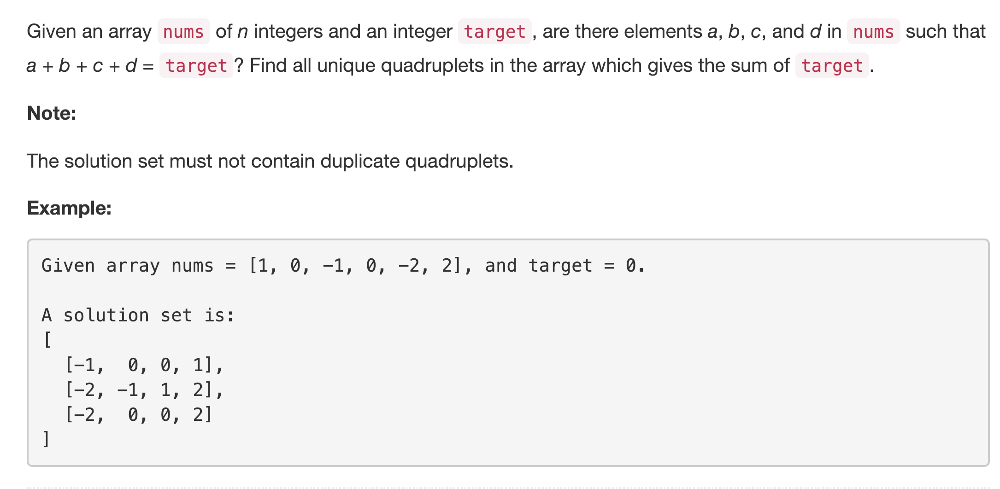

<p align="center">

</p>

This problem builds upon the classical 2Sum problem. However, in the 2Sum problem, we are asked to find a single pair of numbers that add up to a given target. In this problem we are to find *all* quadruples that add up to the given target. We only need to report *unique* quadruples.

---
### Solution 1: Brute Force (TLE)

#### Algorithm

This solution does not get accepted on the leetcode platform. It's a polynomial time solution. We simply look at *all* the possible quadruples and only consider the ones that add up to the given target. Since we can have repeated quadruples, we sort the quadruplet before adding it to the answer set.

```python
class Solution(object):
    def fourSum(self, nums, target):
        """
        :type nums: List[int]
        :type target: int
        :rtype: List[List[int]]
        """
        N = len(nums)
        ans = set()
        for i in range(N):
            for j in range(i + 1, N):
                for k in range(j + 1, N):
                    for l in range(k + 1, N):
                        if nums[i] + nums[j] + nums[k] + nums[l] == target:
                            ans.add(tuple(sorted((nums[i], nums[j], nums[k], nums[l]))))
        return list(ans)                    
```

As expected, this is super, duper slow!

<p align="center">

</p>

#### Complexity Analysis

* Time Complexity: `O(N^4)`
* Space Complexity: `O(1)`

---
### Solution 2: Fix-2 + 2Sum

#### Motivation

As mentioned before, this problem is an extension of the classical 2Sum problem. What we can do here is to fix the first two numbers for our quadruple and then for the next two numbers we can use the 2Sum approach. Let's look at the formal algorithm for this.

#### Algorithm

1. Sort the list of numbers.
2. Initialize the answer set `S`.
3. Have an external loop, `i` over all the elements in `nums`.
4. Have a second, nested loop, `j`, from `i + 1` onwards till the end of `nums`.
5. This leads to fixing the first two numbers, say `a` and `b` for the quadruple. All that remains is to find the two numbers, say `c` and `d` that sum up to `target - a - b`.
6. This becomes a 2Sum problem. We simply find *all* pair of numbers in `j + 1 -- N` that add to `target - a - b`.
7. For each pair returned from the above point, form quadruples `[a, b, c, d]` and add to `S`. We use a set (we can use a dictionary as well) here to filter out unique quadruples only.

#### Complexity Analysis

* Time Complexity: `O(N^3)` since the first two loops give us `O(N^2)` and then we have `O(N)` approach to find all the pairs `c, d`.
* Space Complexity: `O(1)` since we are not using any intermediate space to find the answer. We don't consider the answer set for space complexity.

---
### Solution 3: 2Pair Hashing

#### Motivation

It turns out, there's an even better approach that relies on the Hashing approach for the [2Sum](../2Sum/README.md) problem. The 4 sum problem for forming quadruples `[a, b, c, d]` can be broken down to a two sum problem for obtaining tuples `[x, y]` where `x = a + b` and `y = c + d`. Let's find an algorithm based on this idea.

<p align="center">

</p>

#### Algorithm

1. Iterate over the given set of numbers and form a dictionary called `pairs` maps a sum to a list of pairs of indices from the original list. e.g.:

    ```
      [-1, 2, 1, 1, 2, 0]
      target: 3

      pairs: {
        1: [(0, 1), (0, 3)],
        0: [(0, 2)],
        3: [(1, 2), (2, 3)],
        4: [(1, 3)]
      }
    ```
2. Next, we iterate over all the keys in the dictionary `pairs`. For each key, we do the following:
    1. A key essentially represents a `sum` formed by pairs of values. Let's call one of these as `sum1` and the list of pairs from `nums` that sum up to `sum1` as `list1`.
    2. We check if `target - sum1` is a part of `pairs` dictionary. If it is, then we retrieve the list of pairs from `nums` that sum up to `target - sum1`. Let's call this list as `list2`.
    3. We look at all possible combinations from `list1` and `list2`. Each combination will essentially give a quadruple of indicies `[i, j, k, l]`.
    4. We check if the quadruple doesn't contain any repeated indices. If it doesn't, then we form a quadruple of values `[nums[i], nums[j], nums[k], nums[l]]`.
    5. We sort this quadruple and add to our set `S` of all valid quadruples.

#### Complexity Analysis

* Time Complexity: `O(N^4)`. Consider the scenario where the list contains all `0s` and the target is also `0`. In that case `pairs[0] = list containing N^2 items`. That means `list1` and `list2`, both will contain `O(N^2)` items each. All possible combinations from them will give `O(N^4)` combinations. Although the worst case complexity is worse than before, but, on the OJ this performs *very* well.
* Space Complexity: `O(N^2)` considering `N^2` unique sums in the `pairs` dictionary.

#### Link to OJ

https://leetcode.com/problems/4sum/description/

---
Article contributed by [Sachin](https://github.com/edorado93)
