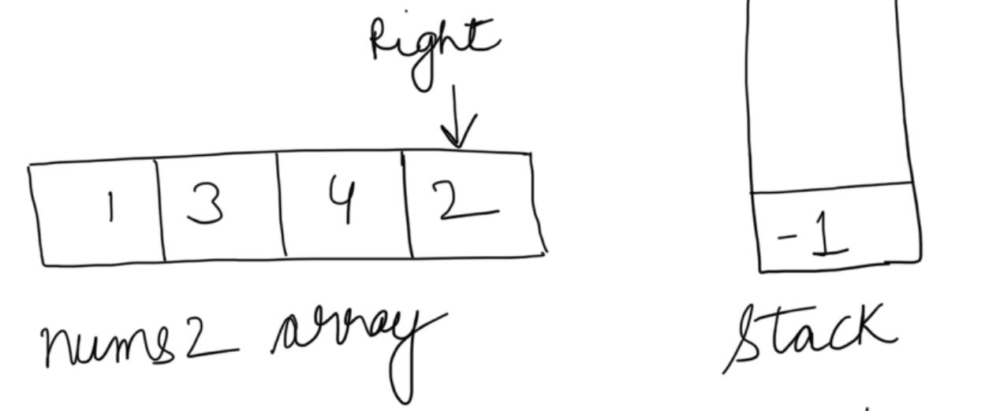
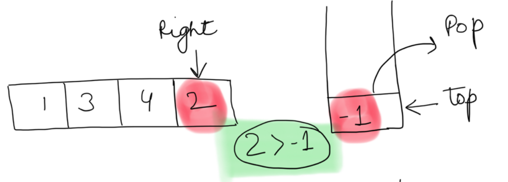
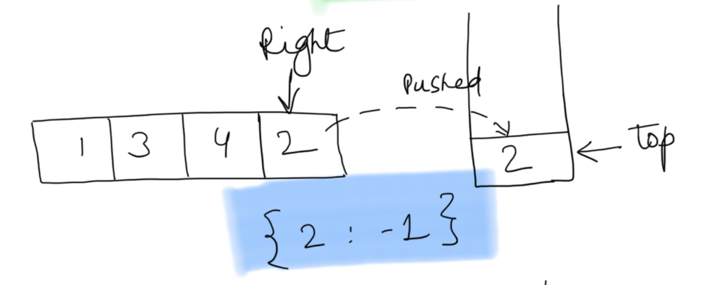
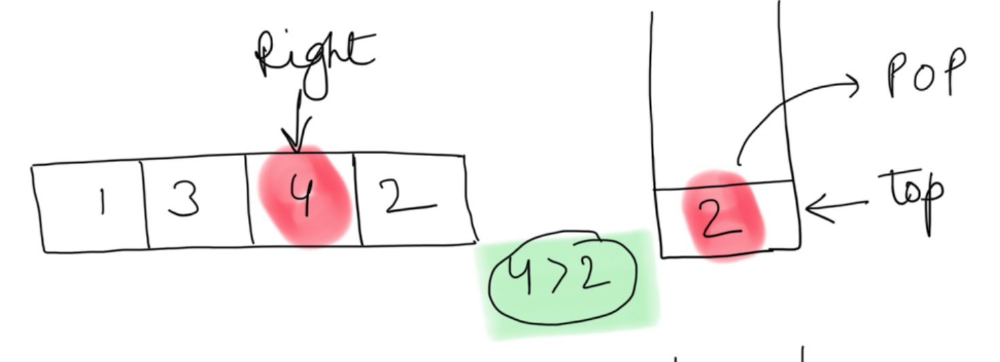
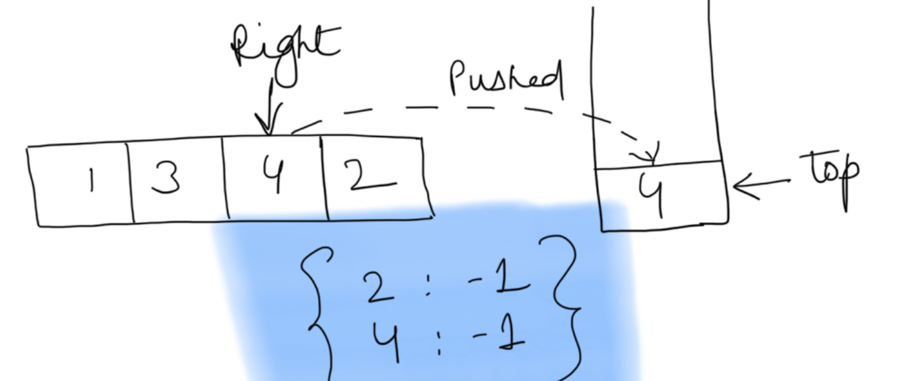
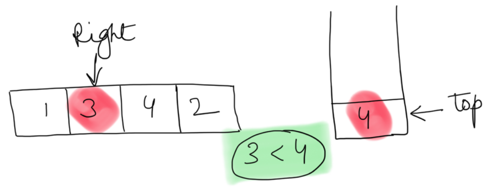
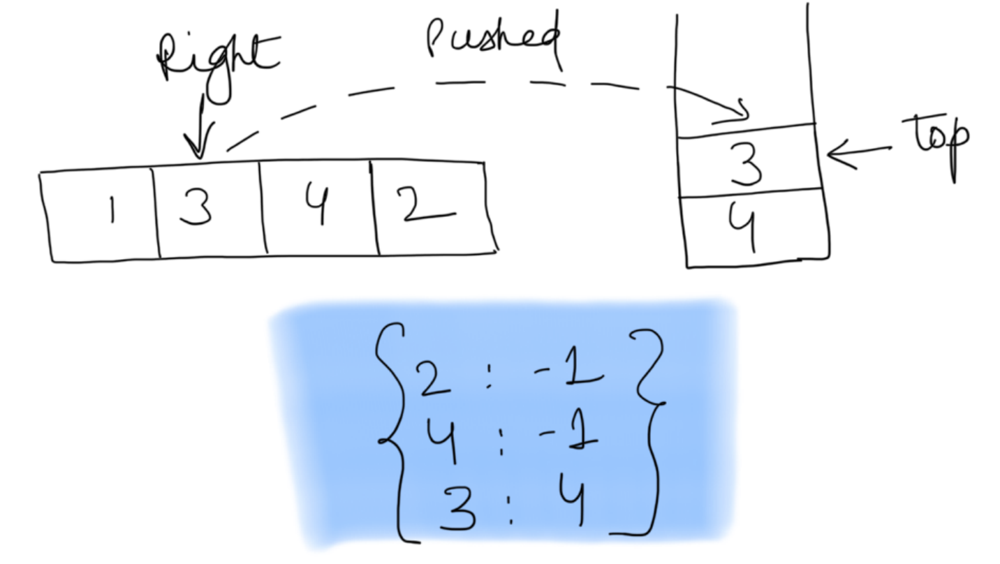
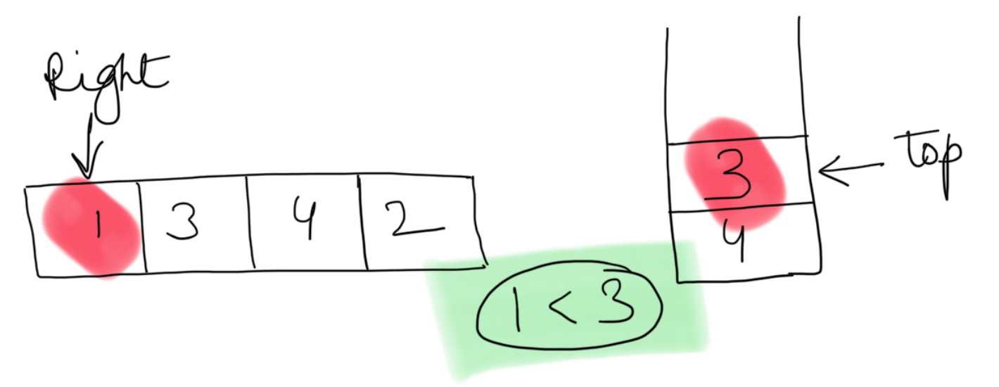
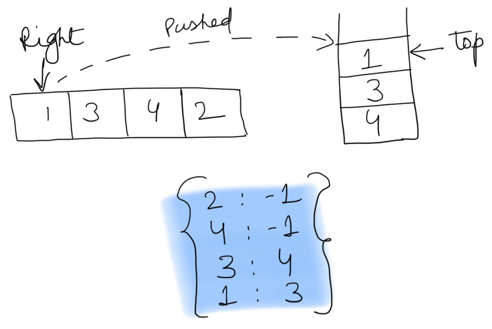

---
### Solution 1: Brute Approach

#### Motivation

The constraints of the problem are such that you might feel like trying brute approach.

#### Algorithm

1. For each element nums1[i] in `nums1` array, search nums1[i] in `nums2` array.
2. Once you have found the `nums1[i]` in `nums2` array, proceed further in the `nums2` array and find the next bigger element.
3. Once you find the next bigger element, break from the loop and continue to step 1 till you have found next bigger for each element of array `nums1`.
4. If you don't find the next bigger element for any of the element, then return the corresponding next bigger element as -1.

#### Complexity Analysis

* Time Complexity: `O(NM)`, where N is the size of array nums1 and M is the is the size of array nums2.
* Space Complexity: `O(1)`

#### Implementation Notes

We can optimize this approach a little bit by creating a hash table or a dictionary from `nums2` array. The entry of this dictionary for `nums2` would look something like `{Element stored at an index i  : i}`. So now you don't need to search for an element in `nums2`, rather you can just find out its index from the dictionary in constant time and then from this index onwards look up for the next bigger element.

---
### Solution 2: Stacks !

#### Motivation

This approach is not as intuitive as it should be. But is very interesting and an important one. Stack is a very good data structure to main history. The top could be the latest happening. This is what this approach utilizes. The stack top would always have the latest maximum value.

We will first find the next bigger for all the elements in array `nums2`.

#### Algorithm

1. Starting the last index iterate the `nums2` array, backwards.

    

    
    

    Stack would be used to maintain the greater elements up to a certain point. The `-1` entry of stack indicates, stack is empty.

2. While traversing compare every element `num` of `nums2` array compare with the stack top. Keep popping stacks top element while the stack top has a smaller element than the current element `num`.

    

    
    

    The only element on the stack is `-1` and is smaller than the current element pointed by the `right` index pointer.
    Hence stack top is popped.

3. If stack exists then, the next bigger element for the current element `num` is the one at the top of the stack. If not we save the next bigger element to be -1. We save this mapping in a dictionary `find_nums_dict` to be used later.

4. Since all the smaller elements were popped off the stack top, now we can push the element `num` on the stack since it's guaranteed to be greater than its successors which were removed.

    

    
    

    There was no elements on the stack when `2` was pushed. Hence, there is `no next greater` element for `2`. So we put -1 as its next greater in the dictionary. And `2` is then pushed on to the stack.

    Note: By pushing `2` on the stack we save the current number on to the stack, since it could be next greater for some other number to its left. `2` is only removed when a number greater than it is pushed on the stack.

    

    
    

    When `4` (a greater number) is pushed on to the stack, keeping `2` (a lesser number) does not make sense. Since if `4` is not utilized as a greater number for the numbers to the left of `4`, `2` would never be utilized. Hence `2` is popped.

    

    
    

    And `4` is pushed on the stack.

    

    
    

    Notice, here `3 < 4(stack top)`, so nothing is popped and we push `3` on the stack top as well.

    

    
    

    The next greater for `3` would obviously be `4`, since `3` couldn't get `4` off stack as it was lesser.

    

    
    

    Similarly `1 < 3(stack top)` and hence is pushed on stack. It's next greater is `3`.

    

    
    

5. After all the elements of `nums2` array have been visited, we would have their next bigger element stored in `find_nums_dict` dictionary. This dictionary could then be used to form the next bigger list corresponding to elements present in `nums1`.

#### Complexity Analysis

* Time Complexity: `O(M + N)`, where N is the size of array nums1 and M is the is the size of array nums2.
* Space Complexity: `O(M * N))`

#### Link to OJ

https://leetcode.com/problems/next-greater-element-i/

---
Article contributed [Divya](https://github.com/DivyaGodayal)
