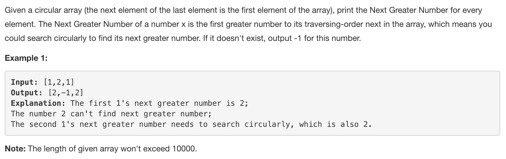
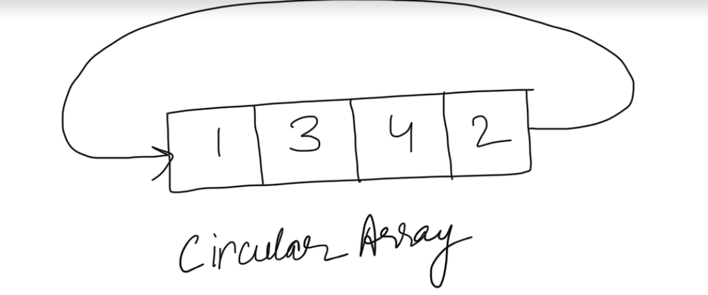
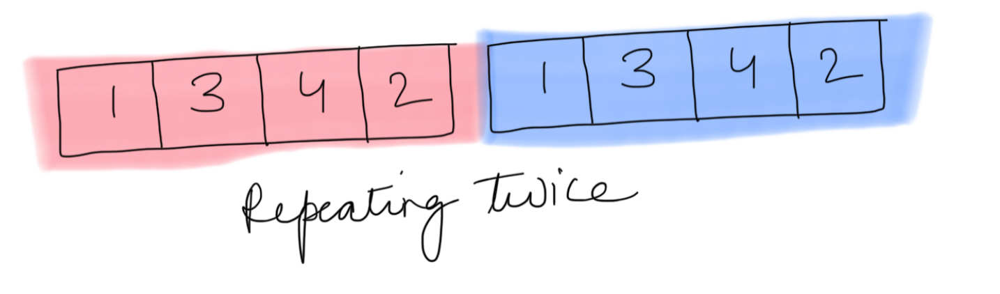

This problem is very similar to [Next Greater Element I](https://leetcode.com/problems/next-greater-element-i/).

Circular array is very similar to repeating the array elements twice. Hence we can imitate the circular nature of the array by making two passes through the array.

---
### Solution 1: Brute Approach

#### Motivation

Brute approach gives a Time Limit Exceeded on the OJ.

#### Algorithm

1. Since this question has circular array, so we can double up the original array to form a double array `doubledNums`. Since we repeat all the elements again, the ending elements would be followed by the starting elements.
2. Each element, let's say `n`, in `nums` array would have the same index `i` in `doubledNums`.
3. So we start from `i+1` in `doubledNums` that proceed further in the `nums2` array and find the next bigger element.
4. Once you find the next bigger element, break from the loop and continue to step 2 till you have found next bigger for each element of array `nums`.
5. If you don't find the next bigger element for any of the element, then return the corresponding next bigger element as -1.

#### Complexity Analysis

* Time Complexity: `O(N^2)`, where N is the size of array nums.
* Space Complexity: `O(N)`, to double up the array.

---
### Solution 2: Stacks !

#### Algorithm

The steps are same as described for [Next Greater Element I](https://leetcode.com/problems/next-greater-element-i/).
The only differences are:

1. The given array for this problem is a circular array. Hence in the algorithm we deliberately go through the array twice. Since, going through the array twice is similar to imitating a circular array, hence we eventually get the next greater for all the elements if not on the first pass.

2. This problem has only one array, we need to return a list of next greater for all elements of the same array in which we are looking for next greater element, unlike the [Next Greater Element I](https://leetcode.com/problems/next-greater-element-i/) problem. So we do not need an extra dictionary to compile results for another array.

#### Implementation Notes

A little bit optimized and may be better way of doing this  would be first finding the greatest element in the array as the starting point, moving left and doing one full pass in the array. Choosing the greatest element as the starting point helps since this element won't need any second pass in the array for correcting its next greater. Also all the elements ahead of it won't go beyond the greatest element, since they would already have the maximum value of the array.

#### Complexity Analysis

* Time Complexity: `O(N)`, where N is the size of array nums.
* Space Complexity: `O(N)` for the stack.

#### Link to OJ

https://leetcode.com/problems/next-greater-element-ii

---
Article contributed [Divya](https://github.com/DivyaGodayal)
