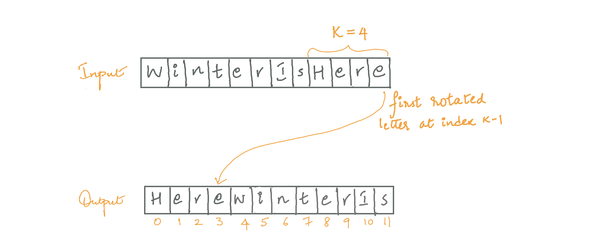

<!-- Screenshot -->

<!-- Introduction -->

---
### Solution: Reverse of reverse is original! 
The problem has a difficulty level of 'Easy' on Leetcode, for which many straightforward solutions are available. Since our aim is to elucidate hard concepts and breathe creativity into boring implementations, let's try to solve it using O(1) extra space with a bit of imagination.

#### Motivation

<!-- basic motivation for the approach -->
We need to rotate the array to the right by `k` steps, which is the same as rotating each element to the right one by one, `k` times (we won't be using this approach though). This means that after `k` rotations, the last element in the array would be at `kth` position from the beginning, i.e., `(k-1)th` index. To make it easier to understand, consider an array of characters.

First letter that is rotated should be at index `k-1`. Similarly, the second letter to be rotated should be at index `k-2`, third at index `k-3` and so on.
This can be done in two steps:
1. Shift the letter to the head of the array. Reversing the entire array achieves this.

2. Move it from head of the array to its respective place. From here, we can see that the 'e' at index `0` needs to be at index `3` and 'H' at index `0`. We are only one reversal away from the result!

#### Algorithm

<!-- stepwise algorithm details. May or may not include pseudo-code -->
k=number of rotations to the right
1. Reverse the entire array, from index `0` to `n-1`.
2. Reverse the subarray from index `0` to `k-1`.
3. Reverse the remaining subarray from index `k` to `n-1`.

Reversal of an array/subarray can be done by initializing a pointer to start index, another pointer end index and swapping them both. Increment start, decrement end. Continue the process as long as `start<end`

#### Implementation Notes

<!-- optional section -->
Note that when array is rotated by number of steps equal to the length of array, it is the original array itself. Based on the same logic, `length+k` rotations is equal to `k` rotations.
Hence, k = k % length.

#### Complexity Analysis

* Time Complexity: 
* Space Complexity:

#### Link to OJ

https://leetcode.com/problems/rotate-array/
<!-- Add link here if available -->

---
Article contributed by [samhitharamaprasad](https://github.com/samhitharamaprasad)
