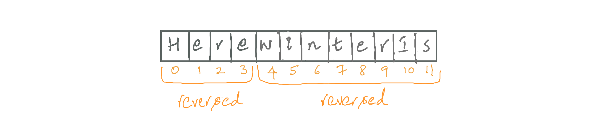

---
### Solution: Reverse of reverse is original! 
#### Motivation

We need to rotate the array to the right by `k` steps, which is the same as rotating each element to the right one by one, `k` times (we won't be using this approach though). In doing so, the last element in the array would be at `kth` position from the beginning, i.e., `(k-1)th` index. To make it easier to understand, consider an array of characters.

The last character in the original array should be at index `k-1` after rotation. The second last character should be at index `k-2`. Similarly, the rest of the characters should follow suite. This can be done in two steps:
1. Reverse the entire array thus bringing the last `k` characters to the front. However, their ordering is still messed up.

2. Move the character at the head of the array to its respective place. 
 Similarly, the second letter to be rotated should be at index `k-2`, third at index `k-3` and so on. From the picture, we can see that  'e' (at index `0`) needs to be at index `3`, 'r' at `2`, 'e' at `1` and 'H' at `0`. We are only one reversal away from the result!

#### Algorithm

Let k = number of rotations to the right
1. Reverse the entire array, from index `0` to `n-1`.
2. Reverse the subarray from index `0` to `k-1`.
3. Reverse the remaining subarray from index `k` to `n-1`.

Reversal of an array/subarray can be done by initializing a pointer to start index, another pointer to end index and swapping them both. Increment start, decrement end. Continue the process as long as `start < end`.

#### Implementation Notes

Note that when array is rotated by number of steps equal to the length of array, it becomes the original array itself. Based on the same logic, `length + k` rotations is essentially the same as just `k` rotations.
Hence, we can use the `%` operator to find the exact number of rotations needed i.e., `k = k % length`.

#### Complexity Analysis

* Time Complexity: Each reversal takes linear time as it only implements a single while loop. So, time complexity is `O(n)`, where `n ` is the size of the array.
* Space Complexity: Since array is modified in-place, space complexity is `O(1)`.

#### Link to OJ

https://leetcode.com/problems/rotate-array/

---
Article contributed by [samhitharamaprasad](https://github.com/samhitharamaprasad)
