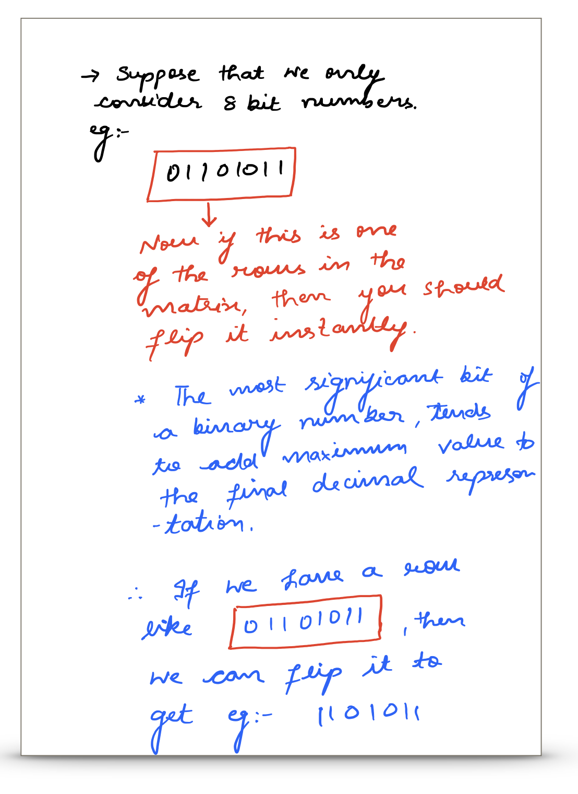

<p align="center">

</p>

The question lists a kind of operation that we can perform on the given matrix. This operation is that 
of toggling the value of a particular cell. Every cell is filled with a `0` or a `1` and we are allowed to toggle the value of any number of cells in the matrix. The only condition is the way in which we can toggle some set of cells. 

The question says that we cannot simply toggle the value of a particular cell. Rather, we are to perform this in moves where a move consists of selecting a specific row or column and then toggling all of the values in that particular row or column. 

We can perform such an operation any number of times on any set of columns or rows etc., such that the result matrix has
the maximum score. Every row of this matrix is interpreted as a binary number, and the score of the matrix is the sum of these numbers. We want to maximise this very score. 

---
### Solution 1: Greedy Iterative Approach
 
#### Motivation

Consider how a binary number is usually structured. Consider the following self labelled example for this. 

A binary number is made up of bits ranging from the most significant bit to the least significant bit. If we consider the decimal representations of the binary number, then the MSB contributes the maximum value to the overal representation or value. 

eg:- 
```
100 = 2^3 + 0 + 0 + 0 = 12
0111 = 0 + 2^2 + 2^1 + 2^0 = 7

The most significant bit has more contribution than all the others combined.  
```
This is one of the main ideas as far as row toggling is concerned. Let's look at the algorithm based on this idea of row toggling. 

```python
if matrix[row][0] == 0:
    toggle(row)
```

<p align="center">

</p>

#### Algorithm

1. We look at all the rows one by one and we toggle those that have a 0 in the first column. 

2.Once the rows have been fixed, we will move onto the columns. As far as the first column is concerned, we will not change a thing there because the first columns is all 1s. 

3. We will start from the second column onwards and we will see, for each column, if the number of 0s is more than the number of 1s, then we toggle that column, else we let it be. 


#### Complexity Analysis

* Time Complexity: `O(MN)` where the matrix is of size `M-by-N`.
* Space Complexity: `O(1)`

#### Link to OJ

https://leetcode.com/articles/score-after-flipping-matrix/

---
Article contributed by [Sachin](https://github.com/edorado93) and [Divya](https://github.com/DivyaGodayal)

* **Time complexity** = `O(MN)` where the matrix has M rows and N columns. 


