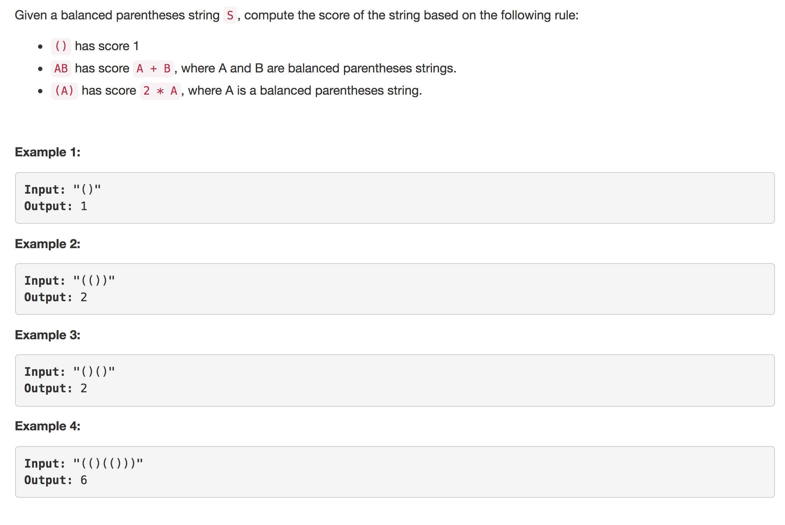
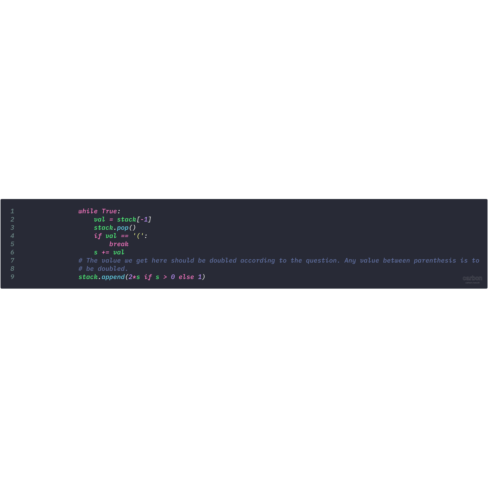

<p align="center">

</p>

---
### Solution 1:

#### Algorithm

* The question's description begs us to use the standard stack based approach
that is pretty famous for these types of questions.

* So, we keep processing one character at a time and perform a
certain calculation (or not)  depending upon what that character was.

* Let's start off with the very simple case. Say we encountered the opening bracket i.e. `(` as the
character. Now, according to the question if we have certain value inside braces i.e. say `(X)`, then
as part of the total score, this would contribute `2X`.

* We need to mark this opening bracket in our stack so that we can perform the correct set of calculations. So,
we simply push this opening bracket onto the stack and continue.

* Now, the other possibility is that we encountered the closing bracket i.e. `)`.
Handling this can be trickier than usual and we shall look at a few test cases for this.
If you look at the code for this, you will find `[TEST-CASE-SAMPLE-1]` in the comments. This means
a sample test case is provided here that would explain the code there.

<p align="center">

</p>

  So, the test case is as follows.

  ```
  (()()())
  process (, stack = ['(']
  process (, stack = ['(', '(']
  process ), stack = ['(', 1], score = 1
  process (, stack = ['(', 1, '(']
  process ), stack = ['(', 1, 1], score = 1
  process (, stack = ['(', 1, 1, '(']
  process ), stack = ['(', 1, 1, 1], score = 1
  process ),

  Now here we need to first add up all these scores and we keep summing till
  we find an opening bracket. The sum till then is 3. Since this is non zero (according to the
  code, we will push 2*3 = 6 into the stack.

  stack = [6].

  We will return sum(stack) = 6 now.
  ```

* We could have simply returned the only value remaining in the stack. But that would only be
correct if we were sure that the stack will always have a single score in it when we finish
processing all the brackets. That is not the case however.

* Look at this second example test case.

  ```
  ()()
  process (, stack = ['(']
  process ), stack = [1], score = 1
  process (, stack = [1, '(']
  process ), stack = [1, 1], score = 1

  Now, we cannot return a single element from the stack as the answer, since there are 2
  scores in there. We just need to sum them up and return.
  ```

#### Complexity Analysis

* Time Complexity: `O(N)`. The reason for this is that we will be processing all our brackets exactly once.
We push a score onto the queue for every closing bracket. How many scores we will
process in the stack before pushing the updated score there depends on problem to problem.
But, the complexity would be some magnitude of N but never `O(N^2)`.

* Space Complexity: `O(N)`. Consider an example like `()()()()()()` for this to be clear.

#### Link to OJ

https://leetcode.com/problems/score-of-parentheses/description/

---
Article contributed by [Sachin](https://github.com/edorado93) and [Divya](https://github.com/DivyaGodayal).
