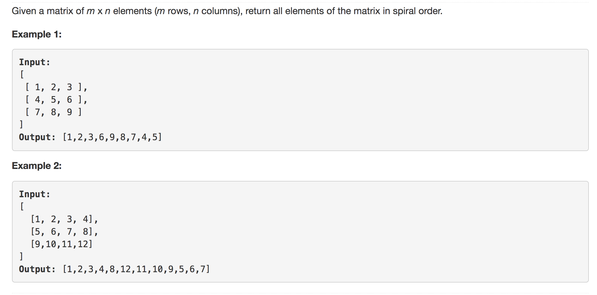

<p align="center">

</p>

---
### Solution 1: Iterative

#### Motivation

This solution is based on the idea of printing the matrix from the outermost perimeter to the inside and this does the job in an iterative fashion. 

#### Algorithm

As for maintaining the direction and switching when we hit the boundaries, we just need the tuples

```
directions = [(0,1),(1,0),(0,-1),(-1,0)]
```

as our directions and these can be used for maneuvering the matrix in the spiral format. The code is extremely simple, have a look at the pseudocode though

```
let count = total number of element to be printed
let i, j be the representation of the cell we are currently at starting off with 0,0
directions = [(0,1),(1,0),(0,-1),(-1,0)]
let di be the index in the directions array, starting off with 0 and it will go till 3 and then restart.

while count > 0
      while 0 <= i < R and 0 <= j < C and cell[i][j] != none
          print cell[i][j]
          mark cell[i][j] as none
          count += 1

          i += directions[di][0]
          j += directions[di][1]

      i -= directions[di][0]
      j -= directions[di][1]

      di = (di + 1) % 4    
      i += directions[di][0]
      j += directions[di][1]

```


This simple piece of code covers all of the edge cases and there are a lot of edge cases to cover eg: a matrix with just 1 element, a row matrix, a column matrix etc. 

#### Complexity Analysis

* Time Complexity: `O(MN)`
* Space Complexity: `O(1)`

### Solution 2: Recursive

#### Motivation

 Following is a slightly complicated recursive implementation of the same problem. So this is how we would go about printing the matrix if there are N rows and M columns

 * 1st row
 * Mth column
 * Nth row
 * 1st column
 ---
 * 2nd row
 * (M - 1)th column
 * (N - 1)th row
 * 2nd column

 ... and so on. This looks like it can be solved recursively on the face of it. Because once we are done printing the outermost structure or the perimeter to say of the given matrix, all that is left is the inner portion which is a matrix in itself and the same process can be repeated for it. So we will employ a recursion based solution to this problem.

#### Algorithm

The parameters to the given recursive function are the following 4
* Starting row (s_r)
* Starting column (s_c)
* Ending row (e_r)
* Ending column (e_c)

1. We start our indices `i` and `j` at `s_r and s_c` and the first step is to print out the first row. While printing out the first row, note that we only have to increment the column value i.e. `j` and not the row `i`.

2. Once the first row has been printed, we move on to printing out the last column. So `j = e_c - 1` (Considering 0 based indexing) and `i` is something that has to be updated. Note: The first element of the last column has already been printed as a part of the printing out of the first row. So we shouldn't print it again.

3. In a similar fashion we now print out the last column starting from `i=1 and j=e_c - 1`. We keep updating the row index until we reach the last row and at that point we have completely printed out the last column. Now we shift to printing the last row from last column to the first column i.e. in reverse thus adhering to the spiral nature of the printing required by the question. Note: We have already printed out the last element of the last row as a part of printing out the last column. So we shouldn't print it again.

4. We keep printing in this fashion, first the last row and then the first column from bottom to top. When we reach the first element i.e. `i = s_r and j = s_c` that means we have printed out the perimeter and now we can recurse on the remaining matrix i.e. `(s_r + 1, s_c + 1, e_r - 1, e_c - 1)`.

#### Complexity Analysis

* Time Complexity: `O(MN` since we have to process all the elements of the matrix once.
* Space Complexity: `O(min(M, N))` since we have a recursion stack whose depth is decided by the minimum of number of rows and columns.

#### Link to OJ

https://leetcode.com/problems/spiral-matrix/description/

---
Article contributed by [Sachin](https://github.com/edorado93) and [Divya](https://github.com/DivyaGodayal)
