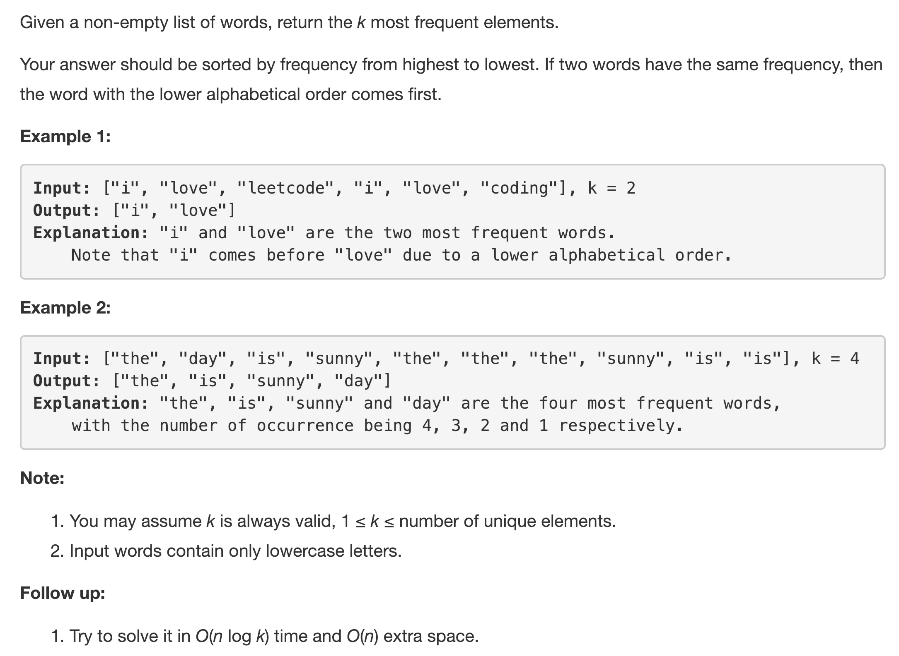
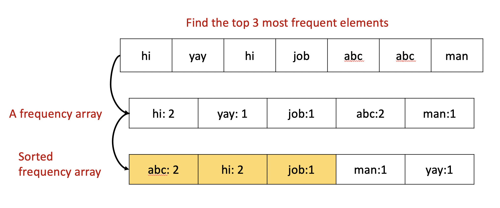
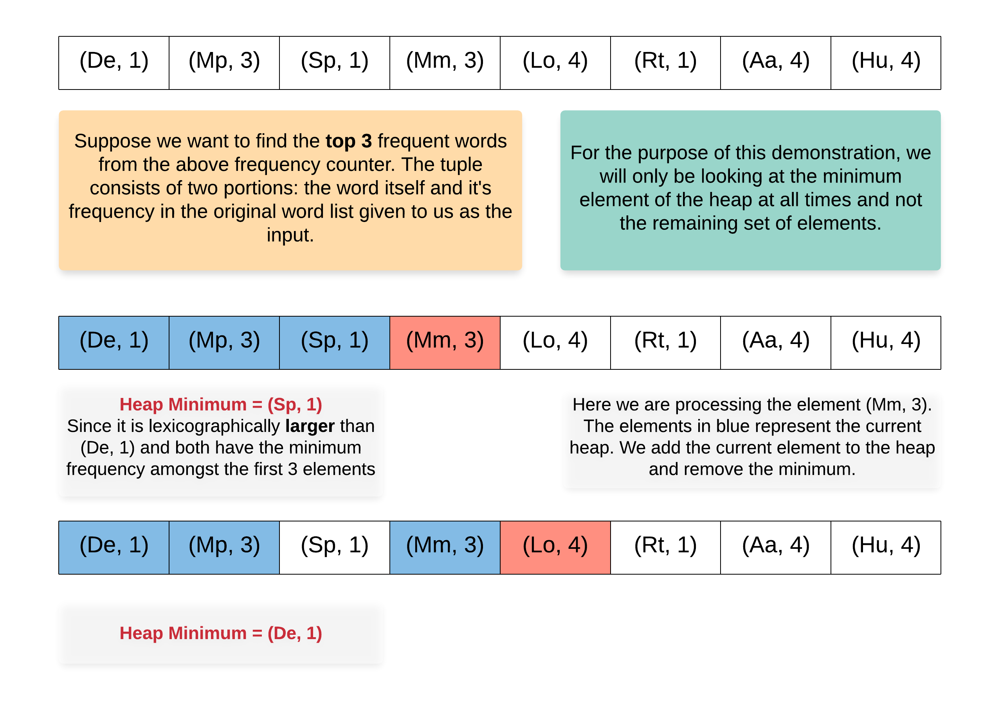
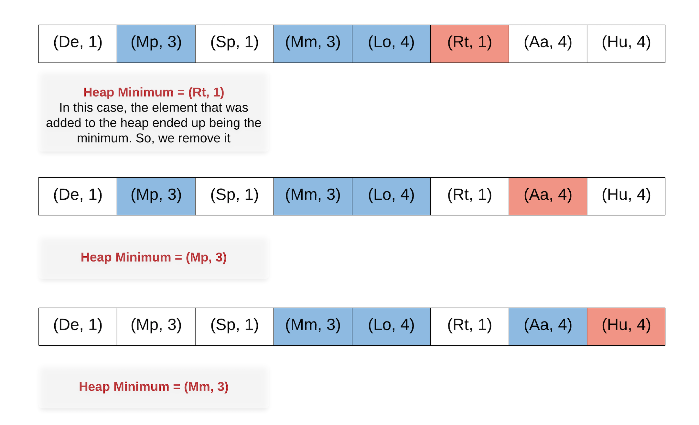
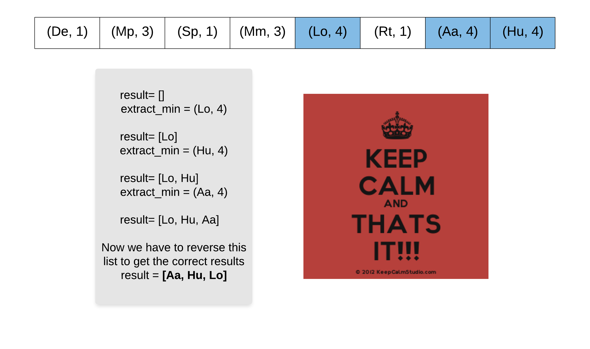

---
### Solution 1: Sorting based Approach

#### Motivation

This is probably the simplest of approaches for this question. What we essentially do here is to sort the given list of words in ascending order `based on their frequency` and simply pick the top-k words or the first k words from the sorted array.

The thing to take care is that we need to break ties using lexicographic ordering. We can make use of a custom comparator function for achieving this. Let's look at a formal algorithm describing this approach in detail.

#### Algorithm

1. Initialize a frequency counter `C` corresponding to the initial array of words given to us.
2. Create a new array `A` consisting of tuples of the form `(key, value)` where `key` represents the frequency of the word and `value` represents the word itself.
3. Sort the array `A` using a custom comparator. The comparator prefers words with higher frequency and for words having the same frequency, words that are lexicographically smaller are considered. If we are using a language like Python, we don't really need to write a custom comparator. This is further explained in the Implementation notes section.
4. After sorting the array, we simply pick the first `k` elements and return them as the final resulting array.

Have a look at the figure below which shows the execution of the above code on a sample word list.

As we can see in the above figure, we were required to pick the top 3 most frequent words. Frequency wise, the third most frequent word could have been `job` or `man` or even `yay` since all of them have a frequency of 1. But, according to the question we should select the word `job` since it is lexicographically the smallest of the three.

#### Complexity Analysis

* Time Complexity: `O(NlogN)` considering there are `N unique` words in the array. This is the time complexity of sorting all of them.
* Space Complexity: `O(N)` considering there are `N unique` words in the array. There is extra space since we create an intermediate array consisting of tuples of the form `(frequency, word)`.

---
### Solution 2: Heap Based Approach

#### Motivation

If you are familiar with the heap sort approach, it would be super quick to understand this approach since this is derived from the heap sort. Essentially, in the above approach we sort the entire list of words and their frequencies. In the worst case there can be `N` unique words i.e. all the words in the list can be unique. In such a scenario, the sorting complexity would be `O(NlogN)` as mentioned in the previous approach.

As it turns out, we don't really need to sort the *entire* list of words and their frequencies. We are only interested in obtaining the top `K`. So, we can first build a max-heap using the words and their frequencies would act as the heap key i.e. the key used to arrange entries on the heap.

Once we have our heap, we can simply perform `extract_max` operation on the heap `K` times i.e. extract the maximum element from the heap, `K` times and we will have our final array. This way, we won't have to bear the complexity of sorting the entire list of words. Let's look at the complete algorithm for this approach.

#### Algorithm

1. Initialize an empty max heap `H`.
2. Build a frequency counter `C` from the word list given to us. We can't get rid of this since we are to find the top k most *frequent* elements. We need one pass to find the frequencies.
3. Add the tuple `(frequency, word)` to the heap for each of the words in our counter. We have to write a custom comparator to use the `frequency` as the heap key (i.e. key to arrange elements in the heap). In case the frequencies are the same then select the smaller word lexicographically.
4. Essentially, we can build a custom class containing the two entries: `frequency` and `word`. In this class, we write `override` the `<` and the `==` operators.
5. Once we are done constructing the heap, we simply remove or `extract_max` from the heap `K` times to get the top `K` frequent words.

#### Complexity Analysis

* Time Complexity: Consider that we have `N` unique words. Heap construction takes linear time i.e. `O(N)`. Thereafter, we will simply remove the maximum element `K` times giving us the overall complexity of `O(KlogN)` since an extract max operation on a heap takes `O(logN)` time.
* Space Complexity: `O(N)` since our heap consists of `N` elements. So, even though we optimized our time complexity, the space complexity remained the same.

---
### Solution 3: Optimized Heap Based Approach

#### Motivation

This approach is very similar to the previous approach. However, instead of using a `max-heap`, we now use a `min-heap`.

Wait, what?

Yes. We will adopt a reverse ideology here to find out the top `K` frequent elements. Essentially, we will use a min-heap for the first `K + 1` elements in our counter i.e. the word frequency counter that we build initially. T

Thereafter, for each element, we first remove the minimum element from the heap and then push the current one onto the heap. The idea is that we will always pop the baddest element off of the heap and in the end, we will be left with the `K` most frequent elements.

Let's have a look at the formal algorithm that describes this approach in detail.

#### Algorithm

1. Initialize an empty max heap `H`.
2. Build a frequency counter `C` from the word list given to us. We can't get rid of this since we are to find the top k most *frequent* elements. We need one pass to find the frequencies.
3. Add the tuple `(frequency, word)` to the heap for the first `K` elements in the counter. The invariant here is that the heap should always contain the most frequent `K` elements at all times. Since, initially we've only seen/processed the first `K` elements, those become the most frequent.
4. For each of the remaining `N - K` elements, we will perform two steps:
    1. `H.push(element)` i.e. push the current element to the heap and `heapify` so as to maintain the min heap property.
    2. `H.extract_min()` to remove the *worst* element from the set of `K + 1` elements in the heap thus maintaining our invariant that the heap should contain the most frequent `K` elements at all times.
5. Like in the previous approach, we will have to use a custom comparator because there's no other way around the requirement in the question that for same frequencies, we should prefer lexicographically smaller words. ***However,*** in this approach we remove the worst element from the heap when we perform `H.extract_min()`. That means for same frequency words, we will be removing the word which is lexicographically *larger*.
6. We keep on processing elements like this and eventually, once all `N - K` elements have been processed, we will be left with the `K` elements we desire.
7. The only way to obtain them would be to perform an `extract_min` operation. So, after removing all of them and adding them to a final `result` array, we would have to reverse the array since the elements would have been extracted in the reverse order.

If that was too much to process all at once, the following three figures explaining the algorithm will definitely make things clearer.

#### Complexity Analysis

* Time Complexity: `O(NlogK)` since now we build a heap of size `K` initially which takes `O(K)` time and thereafter, we perform one push and one extract operation for each of the `N - K` elements. Each such operation takes `log(K)` time and hence, the overall complexity is `O(NlogK)`.
* Space Complexity: `O(N)` since we still build a frequency counter for the words. The space occupied by the heap is smaller since there are always `K` elements in the heap and `K <= N`.

#### Link to OJ

https://leetcode.com/problems/top-k-frequent-words/description/

---
Article contributed by [Sachin](https://github.com/edorado93)
