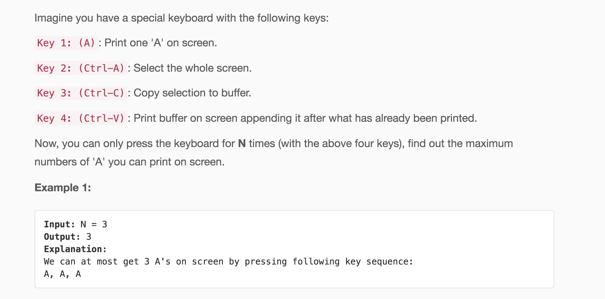

<p align="center">

</p>

---
### Solution 1: Using Dynamic Programming

#### Motivation

So we are given a special keyboard and we have 4 different type of keys namely
    * Print 'A'
    * Select all the characters printed on the screen `Ctrl+A`
    * Copy all the 'A's that have been printed on the screen till now `Ctrl+C`
    * Paste the 'A's that are there right now in the buffer and `Ctrl+V`

If you look at these set of keys, you'd know that the three keys select, copy and paste would come 
one after the other in that order. We would never have a solution where we would be pressing the 
select key twice or the copy key twice one after the other. That does not make sense. 

The `Ctrl+V` key however will be pressed multiple times because it leads to increase in the number of 
characters in the screen. 

So the only two keys responsible for actually printing something on the screen are `Print A` and `Ctrl+V`. The `Ctrl+V` will 
only work if we have something copied in our buffer. 

There is a specific regex that will be followed in any soution for this problem.
```
(Print A)*(Ctrl+A Ctrl+C (Ctrl+V)*)*

N = 11, A A A A A Select Copy Paste Paste Paste Paste = 25
N = 11, A A A Select Copy Paste Paste Select Copy Paste Paste = 27
N = 11, A A Select Copy Paste Paste Select Copy Paste Paste Paste = 24
```    

As you can see above, there are multiple characters that can be printed on the screen 
depending upon what form of the regex is followed. But, the regex will always be the same 
for a given problem that we will have multiple print statements initially and then 
we will have a combination of `select + copy + paste` and that would be followed by multiple 
`paste` commands. 

Naturally, we can break this down into subproblems because we will have smaller number 
of keystrokes left after pressing a certain number of commands on the keyboard. 

#### Algorithm

1. Say that a specific solution to a given value of `N` would end like this `select, copy, paste, paste`. 
Now, we know that these are 4 keystrokes and the previous `N - 4` keystrokes would have 
generated some number of characters on the screen. Say that number is `X`. Then, these 4 commands would 
lead to `X + X + X = 3X` number of characters on the screen eventually. 

2. There is no way we can greedily find out the optimal solution to this problem. The only way we have is to try out all 
possibilities of the ending keystrokes and recurse on the remaining ones and see which returns the 
maximum number of characters. Have a look at the short python snipped that codifies this recursive relation just described.  

```python
for i in range(N):
    # The base case for these values. 
    if i <= 6:
        dp[i] = i
    for j in range(i - 3, -1, -1):
        dp[i] = max(dp[i], (i - j - 1) * arr[j])
``` 

#### Complexity Analysis

* Time Complexity: `O(N^2)`
* Space Complexity: `O(N)` used by the dp array.

It turns out, we can do better than this and can solve this in linear time as well. 

<p align="center">

</p>

---
### Solution 2: Optimized Dynamic Programming

#### Motivation
 
Say that the maximum number of characters that we can print on the screen with `X` keystrokes is `f(X)`.
Now, consider the following two set of options for further keystrokes. 
 
 ```
 f(X), select, copy, paste, paste, paste, paste = 6 * f(X)
 f(X), select, copy, paste, copy, paste, paste = 6 * f(X)
 ```
 
Although, the number of keystrokes are the same in both the cases and so is the end result, 
but the second sequence is better because it has a buffer of size `2 * f(X)` as opposed to the 
first one which has a buffer of size `f(X)`. So, one more `paste` operation would
give us `7 * f(X)` from the first sequence and `8 * f(X)` from the second one. 
 
Using this idea we can optimize our DP based solution. 

#### Algorithm

The optimization here  is that we will only consider a max of 4 `paste` operations before recursing down to smaller 
subproblems. Because, after 4 consecutive `paste` commands, we can have an alternative that is better. So, no point considering a sequence with say 10 `paste`operations. 
 
 ```python
for i in range(N):
    # The base case for these values. 
    if i <= 6:
        dp[i] = i
    for j in range(i - 3, i - 7, -1):
        dp[i] = max(dp[i], (i - j - 1) * arr[j])
```

This makes the complexity of our solution come down from `O(N^2)` to `O(4 * N)` which 
is essentially `O(N)`.

#### Complexity Analysis

* Time Complexity: `O(N)`
* Space Complexity: `O(N)`

#### Link to OJ

https://leetcode.com/problems/4-keys-keyboard/

---
Article contributed by [Sachin](https://github.com/edorado93) and [Divya](https://github.com/DivyaGodayal)
