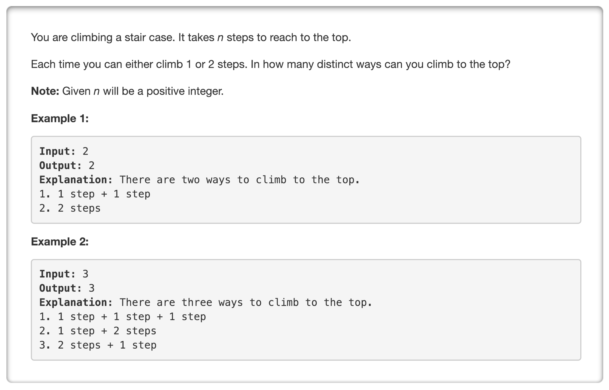
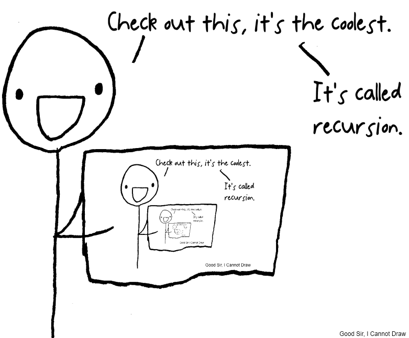

<p align="center">

</p>

---
### Solution 1: Memoization

#### Motivation

Some problems have a certain defined structure to them which begs to be solved using recursion. Let's see what the problem asks us to do in a little more detail before moving onto the algorithm.

So, at each point in time we are allowed two different choices as to the kind of move we can make. We can either climb one step or two steps at a time. Eventually, we have to reach a given number of steps. Let's look at all the ways of reaching `N = 4`.

```
1, 1, 1, 1
1, 1, 2
2, 2
2, 1, 1
1, 2, 1
```

There are 5 different ways of climbing `4` steps given that we can either climb `1` step or `2` steps at a time. Looking at the solutions above, we can't really see a well defined pattern.

> What do we do when we have a given task/goal to achieve and we have multiple choices but we don't know which one to take exactly?

<p align="center">

</p>

Yes, that's right. We try all all the possible options using recursion. So, that's the motivation for our first approach (and the second one as well!).

#### Algorithm

1. Let's assume we have a function called `findAll` which takes in a value of `N` and this is the recursive function that we will work with.
2. For every recursive function, we ought to define a base case where the recursion would terminate. What would happen if we don't provide a base case?

    <p align="center">
    
    </p>

    > You'll get a stack-overflow exception because your recursion stack would soon run out of memory.

3. The base case for our recursion would be when `N` becomes `0`. In these cases, we don't need to recurse any further and we simply return `1` as the result for this particular recursive call. The reason we don't recurse any further is because we don't have any more steps left to climb 😅😅.
4. Within the recursion, we simply make two recursive calls: `findAll(N - 1)` and `findAll(N - 2)`, add the results returned by these two calls and return them. The catch is that we only make the second recursive call i.e. `findAll(N - 2)` if we have at least 2 steps left to climb. Otherwise, we only stick to the `findAll(N - 1)` call.
5. As the name of the approach says, we need memoization here. If we don't use that, our simple recursive solution would give a time limit exceeded error on the OJ.
6. Adding memoization is pretty simple to a recursive solution especially to something as simple as our current problem. We simply cache the results calculated for a given `N` in a cache called `memo`. In a recursive call, if we find that we have already calculated the result for `N`, we simply return `memo[N]`.

Have a look at the recursion tree below to realize the importance of memoization in this problem. We can clearly see in the figure below that there are overlapping sub-problems in our recursion tree and we can save on a lot of computation by using caching.

<p align="center">

</p>

#### Complexity Analysis

* Time Complexity: `O(N)` since we calculate the result for a given value of `N` only once (due to caching) and for a given input, we have to go calculate all the results from `N` down to `0` i.e. our base case.
* Space Complexity: `O(N)` since our recursion stack occupies space equivalent to the height of the recursion tree. The height would be the path `N, N - 1, N - 2, N - 3 ... 0`.

---
### Solution 2: Dynamic Programming

#### Motivation

The motivation for this approach is the same as the previous one. The only downfall of the previous approach is that it uses a lot of space. If you look at the recurrence relation:

```
findAll(N) = findAll(N - 1) + findAll(N - 2)
```

you can see that we only need the solutions for the previous two values to compute the result for the current subproblem. We don't really need to *store* all the `N` values in a cache to find the answer for `N`. Rather, we can adopt a more iterative approach to solve this problem.

#### Algorithm

1. Initialize two variables `a` and `b` with values `1` and `1` respectively. They represent the results for `N = 0` and `N = 1` respectively.
2. There onwards, we have a loop from `2 ... N` and at every step we perform the following computations:
    ```
      result = a + b
      a = b
      b = result
    ```
3. We continue doing this and in the end, we return the `result`.   

In the above computations, `result` represents `findAll(N)` and `a` and `b` represent `findAll(N - 2)` and `findAll(N - 1)` respectively.

#### Complexity Analysis

* Time Complexity: `O(N)` since we loop from `2..N`.
* Space Complexity: `O(1)` since we only make use of 3 variables for keeping track of results.

---
### Solution 3: Mathematical

#### Motivation

Let's look at the results for the first `N = 1..10`.

```
n = 1, 1
n = 2, 2
n = 3, 3
n = 4, 5
n = 5, 8
n = 6, 13
n = 7, 21
n = 8, 34
n = 9, 55
n = 10, 89
```

> Isn't this the fibonacci series?

<p align="center">

</p>

Well, yes! It is indeed the [fibonacci series](https://www.mathsisfun.com/numbers/fibonacci-sequence.html). The problem simply asks us to find the `N^th` fibonacci number as efficiently as possible. We've already seen a recursive and an iterative approach to solve this problem. These solutions already perform well for relatively smaller values of `N`. But, for larger values of `N`, they won't work.

Read [this](https://kukuruku.co/post/the-nth-fibonacci-number-in-olog-n/) article to look at an approach based on ***Matrix Multiplication*** for finding the `N^th` fibonacci number in logarithmic time. That is blazingly fast!

#### Complexity Analysis

* Time Complexity: `O(logN)`
* Space Complexity: `O(logN)` occupied by the recursion stack. The matrix used in the approach is of a fixed size `2*2` and doesn't vary with `N` and hence it's not counted in the space complexity.

---
Article contributed by [Sachin](https://github.com/edorado93)
