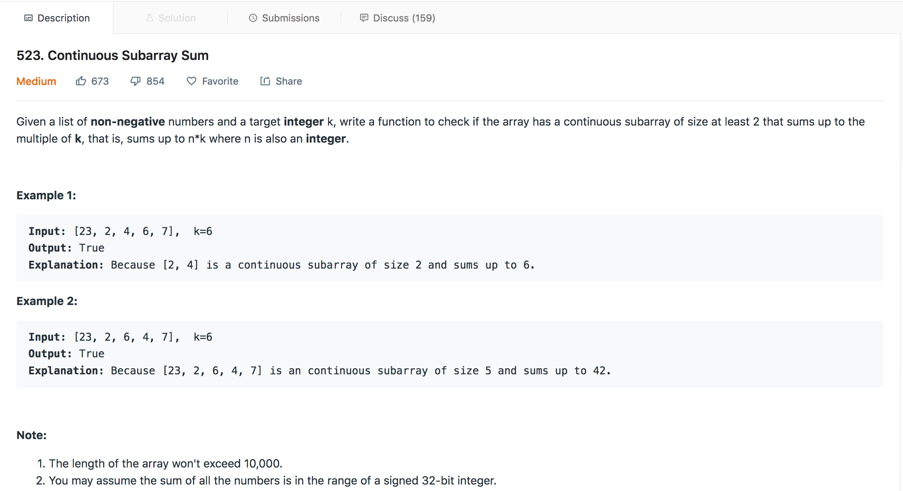
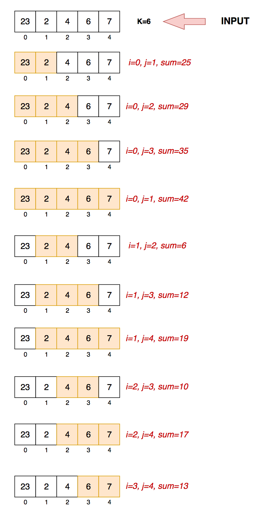
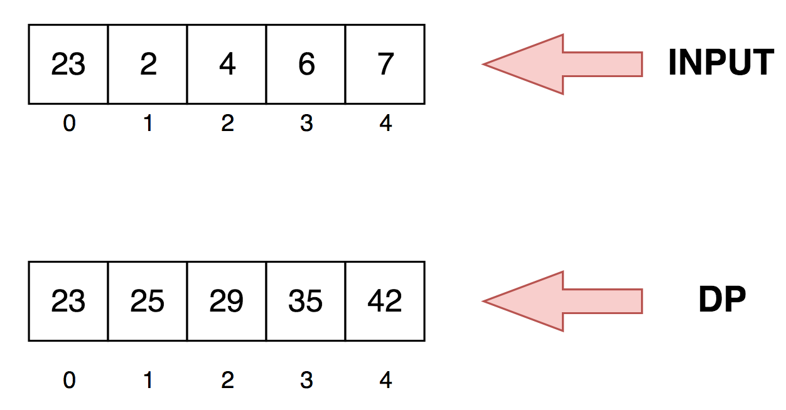

## Continous Subarray Sum

<p>

</p>

---

###  Motivation
We are given an array of Integers `nums` and `K`. we have to find a continuous subset of the array of `length>=2` whose sum is of the form `N*K` where `N` is any integer. 


### Solution-1 : Naive Way

The naive solution involves traversing all the subset of `nums` whose `length>=2` and checking for `nums[i:j]%K==0` where `i<j` and `nums[i:j]= nums[i]+nums[i+1]+...+nums[j-1]+nums[j]`. While traversing the subsets we explicitily need handle the case `K=0` because `nums[i:j]%K` will throw `DivideByZeroException`.


#### Algorithm
1. Create all the subsets of `nums` array whole `length>=2`.
2. Traverse the subsets and check if their sum is a multiple of `K`
3. While traversing the subsets check whether `K=0` which requires sum of the elements in the subset be equal to zero.
   
<p>

</p>

This solution will throw `Time Limit Exceeded` error when run on leet code.


### Solution-2 : Dynamic Programming
In the previous solution we were repeatedly calculating the sum of the subsets. Here, we try to preprocess the array so that we don't have to calculate the sum everytime. Let us see how we accomplish this.

Let's say 

```
sum[0:0] = nums[0]
sum[0:1] = nums[0] + nums[1]
sum[0:2] = nums[0] + nums[1] + nums[2]
sum[0:3] = nums[0] + nums[1] + nums[2] + nums[3] 
```
from above, we can conclude that

```
sum[2:3] = nums[2]+nums[3] = sum[0:3] - sum[0:1]
```

If the above procedure is implemented, it will save us from repetitive recomputation of sum of subsets for which we already calculated.

We create a temporary array called `dp` same length as of input where `dp[i]=sum[0:i]`

```
dp[i] = nums[0] + nums[1] +...+ nums[i]

```

<p>

</p> 

#### Algorithm
1. Create a array called `dp` where `dp[i] = nums[0:i]`
2. We will check each subset for the condition `dp[j]-dp[i]=N*K` where `i<j` and `j-i>1`.
3. The above step is similar to the one we used in Solution-1 except this time we wont need to recompute the sum for each subset generated.    

### Solution-3 : Hashmap
Let us assume any two index positions(i,j) and `0<i<j<len(nums)` in `dp` array where

```
dp[i] = p*K  ie dp[i]%K=0 
dp[j] = q*K  ie dp[j]%K=0

```
Let us take a difference of the above two

```
dp[j] - dp[i] = (q-p)*K
```
which transforms to 

```
dp[j] - dp[i] = N*K where N is any integer
```

From the above we can conclude that, while traversing the array if we store `dp[i]%K` in a hashmap and check if `dp[j]%K` already exists in hashmap and check if `j-i>1` then we have a continous subarray sum.

The handling of the case `K=0` is same as the previous methods. This is a serious improvement in time complexity from the solution-2.


#### Complexity Analysis

Solution-1

* Time Complexity: `O(N^3)` where `N` is the length of the input.
* Space Complexity: `O(1)`

Solution-2

* Time Complexity: `O(N^2)` where `N` is the length of the input.
* Space Complexity: `O(N)` where `N` is the length of the input. This space is occupied by `dp`

Solution-3

* Time Complexity: `O(N)` where `N` is the length of the input.
* Space Complexity: `O(N+k)` where `N` is the length of the input and `k` is size of the hashmap . The space is occupied by `dp` and `hashmap`

#### Link to OJ
https://leetcode.com/problems/continuous-subarray-sum/

---
Article contributed by [Arihant Sai](https://github.com/Arihant1467)

