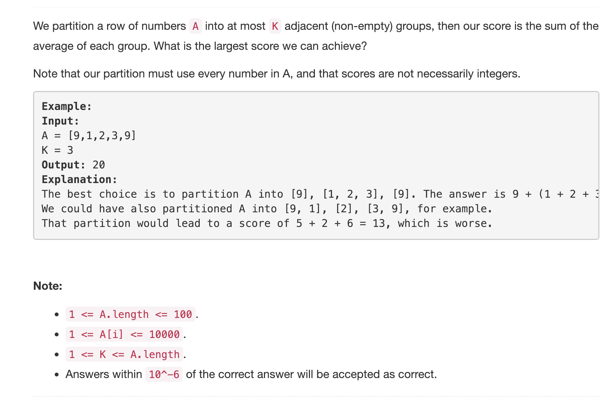
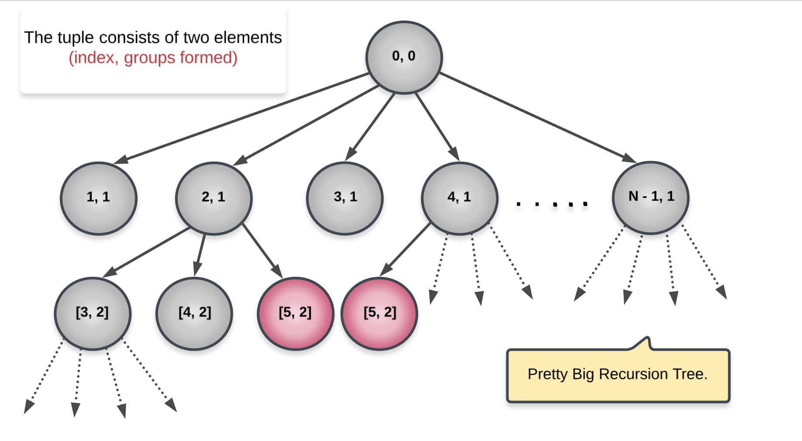

<p align="center">

</p>

---
### Solution: Dynamic Programming.

#### Motivation

Let's iterate over the question statement once. The question asks us to partition the given array into *at-most* K groups such that the sum of the averages of these groups is maximum. There is no *greedy* way of deciding what the partitions should be. As can be seen from the example given in the problem statement, there are multiple ways of partitioning the given array.

What do we do when we have a lot of choices but no direct way of figuring out which choice is the best?

We rely on our good friend, Memoization.

#### Algorithm

We have `N` available indices from the given array. We basically want to know the starting indices for the various groups. Using these starting points, we get to know the size of the individual partitions. This is because all these groups are adjacent to one another. Essentially, these are *sub-arrays*.

> One invariance that we will maintain in our recurrence relation is that every call to the recursion function will indicate the start of a new group.

This makes it easier and much more efficient in terms of the memory footprint of the algorithm. So, given an index, `i`, there are two possible choices:
* Either the number at this given index can be a part of the ongoing group.
* Or, it can be the starting point for the next group or partition.

Since every recursion call will mark the starting of a new group, what we will essentially do is have a loop from the index `i` to `N - 1` and consider all the choices in between as starting points for the next partition. For e.g. `i <= j <= N - 1` is the choice we made as the starting point for the next group, then we will make a new recursive call with `j` as the index. All the elements `[i, j - 1]` will be a part of the ongoing group. That means, `sum(nums[i], nums[i + 1] ... + nums[j - 1]) / (j - i)` will be the average of the current group.

We've explained most parts of our recursive function. An important component, however, is the memoization. We need to see why we need memoization.

> Essentially, we need to see if there are any repeated subproblems. If there are, then we can cache them and use later thus saving on computations.

Before looking at whether we have any repeated subproblems, let's see what state variables are required to define a subproblem. For our solution, we will use 2 variables:
* The index in the given array where we are currently at and
* The number of groups formed till now.

Now let's look at a part of the recursion tree to understand the need for memoization.

<p align="center">

</p>

To explain a single recursion path, let's consider the path `(0, 0) ➔ (4, 1) ➔ (5, 2)`. We said earlier that the index in a given recursive call represents the starting point for a new partition. So, our first partition would consist of elements `[0, 1, 2, 3]`. The next partition would consist of just a single element `[4]` and the third partition starts at the index `5`.

As we can clearly see, there are repeated sub-problems in our recursion tree and we can definitely make use of memoization. Let's now look at the formal algorithm to bring all these ideas together.

1. We have a recursive function having variables `index` and `groups_formed`.
2. First base case is when `index == N`. This means there are no more elements left. The average in this case would be 0.
3. Second base case is when `groups_formed == K - 1` where K is the maximum number of partitions we can form (according to the question). In such a case, all the remaining elements in the array form the last partition. So, we don't recurse further and simply return their average.
4. We iterate over indices from `index ➔ N - 1`. Let's consider an option as `j`. We have to maintain a running sum for the current partition as well. As we mentioned before, for each index, `j`, there are two choices. We can either start a new group or consider it a part of the current one.
    1. For considering it a part of the current one, we simply add it to our running sum.
    2. Else, we make a new recursive call with `j` as the new index and `groups_formed + 1`.
5. We find the index, `j`, that gives us the maximum value and cache that result.

#### Complexity Analysis

* Time Complexity: `O(KN^2)` since we have two different variables defining the state of our recursion, `index` and `groups_formed` each with `N` and `K` values each. And in each recursive call, there are `N` possible choices.
* Space Complexity: `O(KN)` for the cache that we use.

#### Implementation Notes

The approach that we described is more commonly called as `memoization` since it is a top-down approach. We can also adopt a bottom-up approach or tabular approach which is more commonly referred to as `dynamic programming` and get a better space complexity than above. Let's look at the pseudocode for the same

```
for i in 1..K
  for j in 1..N
     for k in 1..N
       dp[i] = max(dp[i], average(j, k) + dp[k])
```

In the above pseudocode, `average(j, k)` implies average of elements from in `[j, k]`. We can do some preprocessing in `O(N)` time so that the average calculation can be cone in `O(1)` time. Such preprocessing will also help in the memoization solution in the base case when `groups_formed == K - 1`.

What we need to do here is to create an array of cumulative sums. e.g.

```
Original Array: [1, 3, -1, 5, 8]
Cumulative Array: [1, 4, 3, 8, 16]
```

Using this array, we can find the sum of *any* given range of numbers. Suppose we wanted to find the sum of range `[2, 4]`, we can do `cumu[4] - cumu[1] = 16 - 4 = 12`. We have the sum means we have the average. Using this cumulative array we can find the average of any given range of numbers in constant time. This is a huge optimization in the code.

#### Link to OJ

https://leetcode.com/problems/largest-sum-of-averages/description/

---
Article contributed by [Sachin](https://github.com/edorado93)
