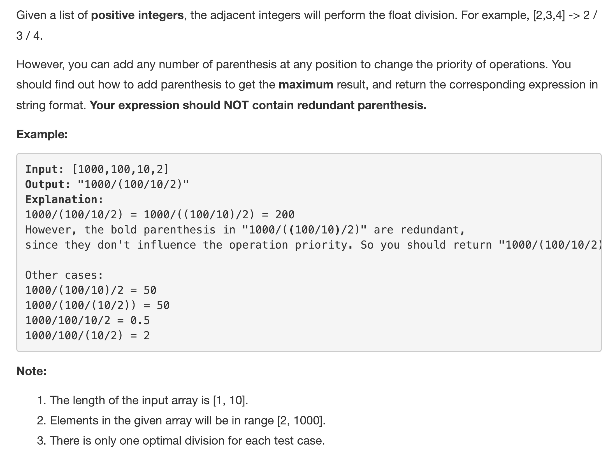
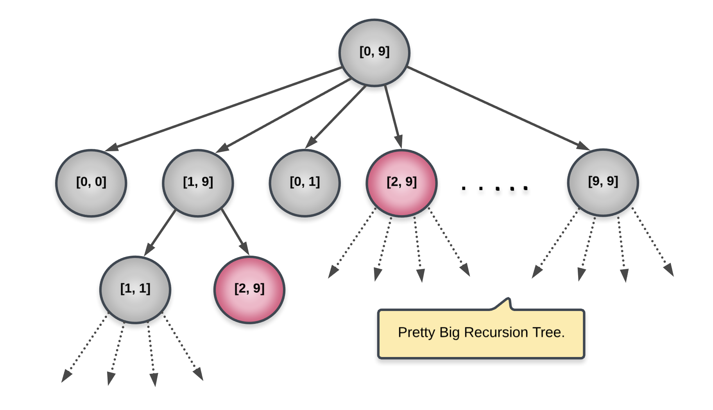

<p align="center">

</p>

The problem asks us to allocate brackets between the given set of numbers so that the result of the overall division comes out to be maximum. There are multiple ways of thinking about this problem. Let's start off with the most intuitive way in which the problem can be structured.

---
### Solution 1: Dynamic Programming - I

#### Motivation

Whenever we divide two numbers, e.g. `A / B`, we always have two different components to the division. Numerator and the Denominator. Extending this idea to dividing an entire expression by another expression, we will have a numerator expression and a denomination expression. Let's consider an example.

```
[2,3,4,5]

* If we don't add any parentheses, then the expression that we will get is 2/3/4/5. This is without any parentheses.
* Not let's consider a variant of this expression with some parentheses added.

2 / 3 / (4 / 5) OR
2 / (3 / 4 / 5) OR
(2 / 3) / (4 / 5) OR
2 / (3 / (4 / 5))s
```

e.g. in the expression `(2 / 3) / (4 / 5)`, we have `(2 / 3)` as the numerator expression and `(4 / 5)` as the denominator expression. Similarly, `2` and `(3 / (4 / 5))` become the numerator and denominator expressions respectively for the expression `2 / (3 / (4 / 5))`.

An important thing to note about any such expression is it's recursive nature. For e.g. `2 / (3 / (4 / 5))` has `3 / (4 / 5)` as the denominator which itself can be broken down into numerator and denominator expressions clearly. This recursive structure is what we will make use of to come up with our first dynamic programming solution to the problem.

#### Algorithm

Algorithmically speaking, we are given a list of numbers and we can have two pointers namely `start` and `end` mark the starting and the ending indices for the given array. Since we are dealing with a recursive problem, we will have smaller and smaller arrays to deal with in later recursions. Instead of actually passing subarrays of the original array, we will simply make use of two pointers that mark the subarray within the original array.

Given an array defined by `(start, end)`, we need to essentially find the *split point* between `[start, end]`. The split point will define the numerator and denominator sub-expressions that can be formed from the original expression (array).

As mentioned before, the numerator and denominator sub-expressions are recursive in nature and hence, we will make two different recursive calls to solve these two *subproblems*. As can be seen from the problem formulation, a subproblem is defined by the two indices `start, end`.

Our recursive function will return the result of *optimally* solving a given expression. So, for a given subproblem defined by `start, end` and a given split index, `start <= i <= end`, we will get two expression results, one from `start, i` and another one from `i + 1, end`. Let's call these results `N` and `D` respectively.

The overall expression value would be `N / D` and our job is to select a split index such that the value of `N / D` is maximized, right?

<p align="center">

</p>

Stay with me :P, I know this is getting exhausting.

If you've been following along, you know that `N` and `D` have been derived from their individual sub-expressions which were solved recursively. Since, we define our recursion to *maximize* `N / D`, this would lead to incorrect results.

> For us to maximize N / D , we need to maximize N and minimize D.

That means, a single recursive call for a given subarray `(start, end)` should return two different values:
* Maximum possible value of the expression using numbers from `[start, end]` and
* Minimum possible value for the expression using numbers from `[start, end]`.

Let's have a look at the pseudo-code for the recursive structure we just defined.

```
function recurse(start, end) {
  if (start == end) {
    handle base case here
  }

  for all i in the range start ... end, do {
    N_Max, N_Min = recurse(start, i)
    D_Max, D_Min = recurse(i + 1, end)

    store maximum value of (N_Max / D_Min)
  }

  return (N_Max / D_Min), (N_Min / D_Max)
}
```

That is the recursive skeleton for the algorithm we have just discussed.

Why do we need memoization here?

Let's look at the recursion tree to understand the need for memoization.

<p align="center">

</p>

As we can clearly see in the figure above, the subproblem `2, 9` got repeated twice. This means we could have calculated it once and stored or *memoized* the result once and then used it thereafter thereby saving on a lot of computation. That's why we will use memoization.

`Note:` the two subproblems `[0,0]` and `[1,9]` are corresponding to `start = 0, i = 0 and end = 9`. Similarly for the rest of the nodes shown. Let's look at the formal algorithm now.

1. We have a recursive function, conveniently called `recurse` :P, which takes in two parameters, `start` and `end`.
2. The base case is when these two variables are equal meaning there is just one value left in the subarray. No need to solve any further. The number itself forms the minimum and maximum values.
3. In all other cases, we iterate from `start` to `end` and consider each value as the splitting point, `i`.
4. For each choice of `i`, we:
    1. Make two recursive calls, one for `start, i` and another one for `i + 1, end`.
    2. We obtain `N_Max, N_Min` from the first one and `D_Max, D_Min` from the second one.
    3. Record the maximum value of `N_Max / D_Min` and cache it.
    4. Also record the splitting point, `i`, in a `parent` dictionary for backtracking (explained later).

Once we are done with recursion, we can make use of the `parent` dictionary we formed to backtrack and form the final expression. Essentially, for every given `start, end` we know what the *best* splitting point was and we can use that information to create the final expression.

> An important thing to note about an expression that will come handy for understanding the backtracking part in the code. For a given expression, where the numerator is `A` and denominator is of the form `B / C`, to minimize this expression, we don't need any parentheses. A / B / C will give the minimum value. However, to maximize this expression, we need parentheses around the denominator i.e. A / (B / C) will give the maximum value.

#### Complexity Analysis

* Time Complexity: `O(N^2)` since we have two variables for forming out cache and both can take values from `1 to N`.
* Space Complexity: `O(N^2)` used by the cache.

This is a nice, intuitive approach for solving the problem, but we have another way of approaching this using dynamic programming. Let's look at that approach now.

---
### Solution 2: Mathematical

#### Motivation

Let's try and approach this problem of optimal division from another perspective. Let's consider the following set of numbers:

```
[A, B, C, D, E]
```

No matter where we put the parentheses, `A` will always be in the numerator. That means, We will have something like the following:

```
A / {Some parentheses arrangement of B, C, D and E}
```

> In case we want to maximize the overall result from the resulting expression, we need to minimize the result from the expression formed by B, C, D and E.

#### Algorithm

We had slightly talked about the following idea in the previous approach in the note for backtracking. We said that the element `A` will *always* be in the numerator for the final expression. Similarly, the element `B` will always be in the denominator for the final expression. These two elements are essentially fixed and we can't alter their positing. Rest of the elements can be played around with.

> If we enclose all the elements in the array except the first one within parentheses and make that the denominator, then the resulting expression will be of maximum value.

```
[A, B, C, D, E]

--> A / (B / C / D / E)
--> (A * C * D * E) / B       -----    MAX Value
```

The reason for this is, all the other elements in the array, except for `B` will become a part of the numerator and that is the best we can do here. No matter what permutation combination we try with the parentheses, this is in fact the maximum value we can achieve.

Sometimes, thinking deeply about the problem statement and evaluating different scenarios can lead to simple yet super efficient solutions.

<p align="center">

</p>

#### Complexity Analysis

* Time Complexity: `O(N)` since we have to iterate over the list of numbers just once to form the final expression.
* Space Complexity: `O(1)`.

#### Link to OJ

https://leetcode.com/problems/optimal-division/description/

---
Article contributed by [Sachin](https://github.com/edorado93)
