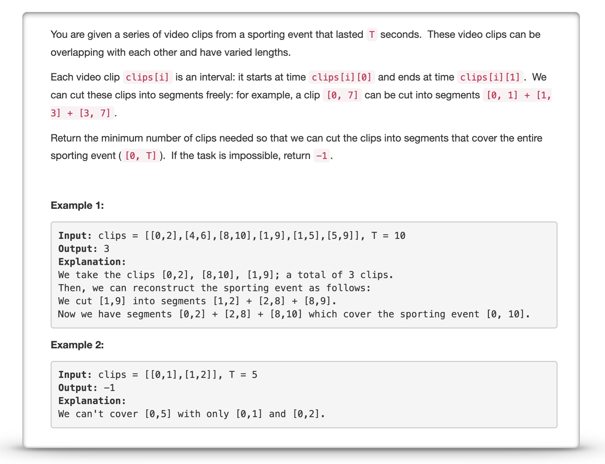
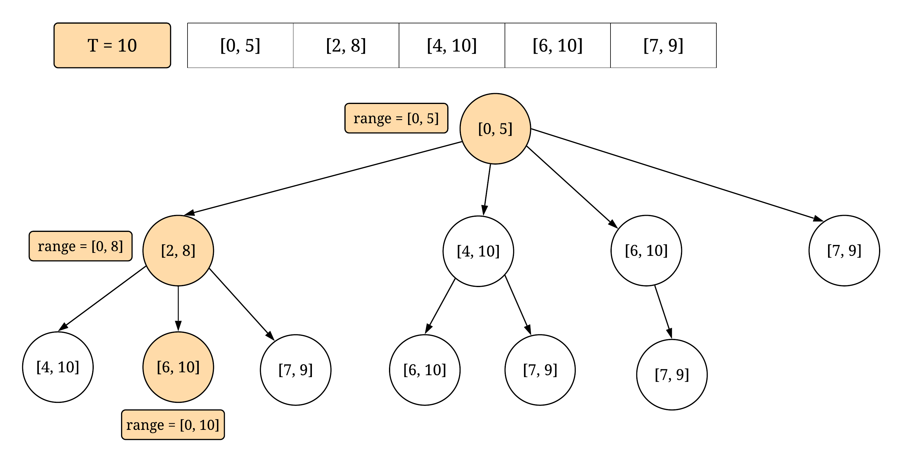
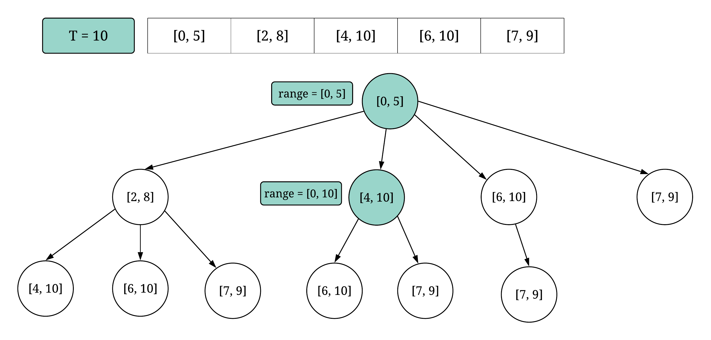
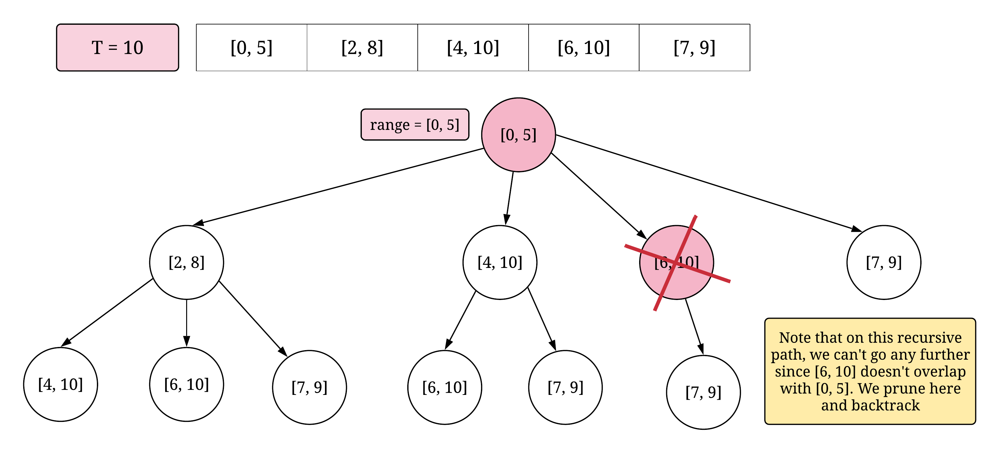
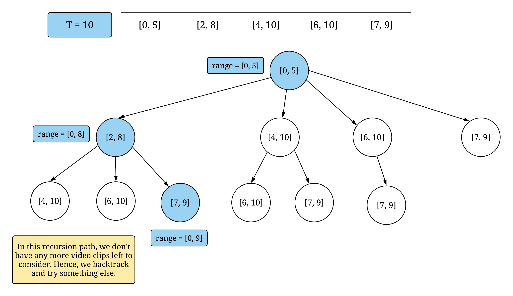
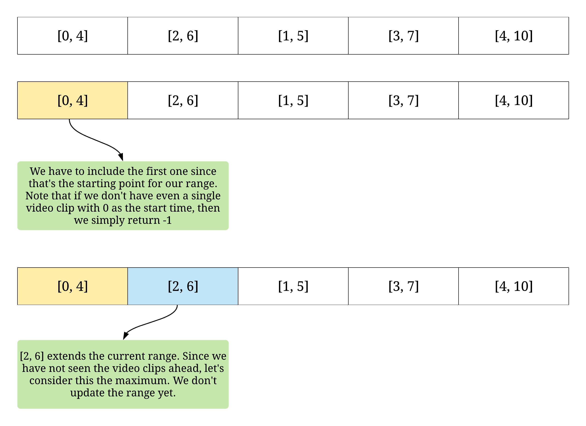
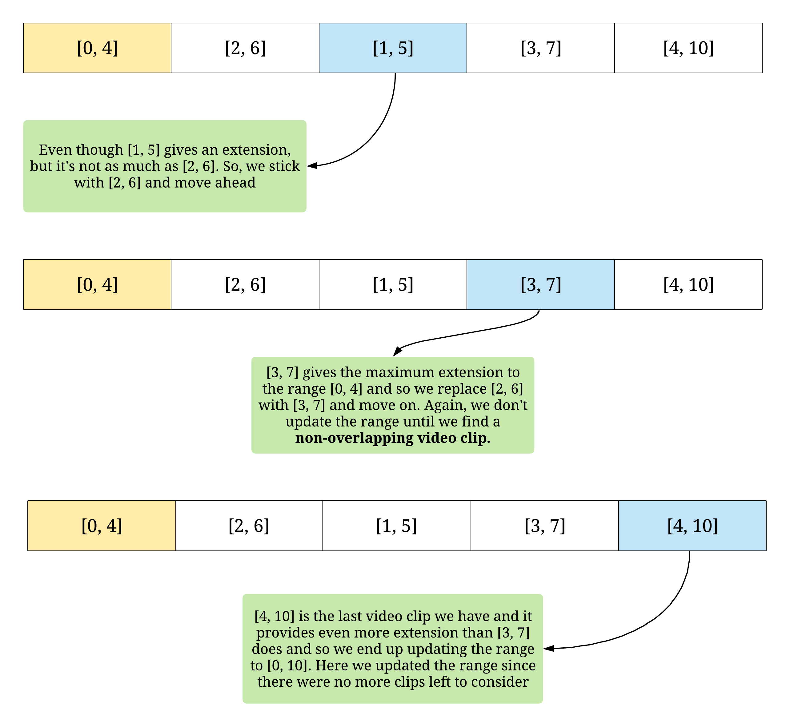

<p align="center">

</p>

The problem statement essentially asks us to find the minimum number of video clips which when put together in bits and pieces are able to cover the entire range of `[0, T]`. If you carefully look at one of the examples given in the problem statement, then you'd notice that we don't necessarily have to cover the *exact* range. We can also have video clips which when put together cover a greater range than `[0, T]` i.e. something like `[0, T + k]`. 

We will be looking at two solutions to this problem, below. One is based on the dynamic programming paradigm and the other one is a greedy solution. The common theme in both the solutions is that we need to find video clips that are able to *extend* the current set of clips. For e.g. if we have chosen the clips `[1, 3]` and `[2, 5]` till now, then we essentially cover the range `[1, 5]`. A potential clip that would extend this range would be say `[4, 10]`. This would increase the range to `[1, 10]`. 

---
### Solution 1: Dynamic Programming

#### Motivation

A dynamic programming solution essentially involves recursion and memoization. The problem should have the ability to be broken down into smaller subproblems and we should be able to combine the solutions to smaller subproblems to get the optimal solution for the main problem. Also, the problem should have some parameters which can essentially be *cached*. 

Let's take a look at the following example that will help us understand the use case for recursion in this problem. Usually, it makes more sense to look at a greedy approach before considering a dynamic programming approach. However, for this problem we will take the reverse approach since the greedy approach also works out well.

Suppose we are given the following list of video clips (in no particular ordering).

```
[[0, 4], [3, 7], [2, 3], [7, 9], [8, 10], [3, 10]]
T = 10
```

This implies that we are required to find the *minimum* number of video clips that when *stiched together* will essentially cover the range `[0, T + k]` where `k >= 0`. Let's look at two possible set of video clips that can cover this range:

```
* [0, 4] + [3, 7] + [7, 9] + [8, 10] 
* [0, 4] + [3, 10]
```

As we can clearly see, the second set of video clips are the minimum set of video clips required to cover the given range. That implies, even if we find a video clip that can *extend* the current range that we have, it doesn't necessarily mean that we should consider that video clip as a part of the answer. For e.g. even though `[3, 7]` extends the range, it doesn't lead to an optimal solution.  

> Therefore, for every video clip that possibly extends the current range of the sporting event, we will have to consider two possible choices, one where we consider it and one where we don't and see which choice leads to the optimal solution. 

Since we have 2 potential options corresponding to every video clip, we will have to try all possible combinations and choose the one that gives us the minimum answer. This is the **recursive** part of the solution. Now let's move on and see why we need memoization. For that, let's consider yet another example:

```
[[0, 4], [3, 7], [2, 7], [6, 9], ...]
T = 10
```

Since we will be using recursion here, naturally, we will have a recursion tree which will contain all the possibilities that we will be considering. Suppose that initially, we consider the path `[0, 4] --> [3, 7] --> [6, 9] ... ` and we get some answer for this path. The next time around, we consider a slightly different path `[0, 4] -> [2, 7] -> [6, 9]`. Now, when we arrive at `[6, 9]` during our recursion, we have the exact same situation as the previous path. 

>This is because the first two video clips in both the scenarios essentially cover the same range i.e. [0, 7]. So, when we arrive at [6, 9] during our recursion, it doesn't matter which path we took since the overall range covered till then was the same. Thus, it would be much more efficient to cache our answers so as to avoid repeated computations.

Let's look at a concrete algorithm that brings all these ideas together.

#### Algorithm

1. Sort the given list of video clips on the basis of their start times. This is done to reduce the overall complexity of the dynamic programming solution. 
    *  Suppose we already have a certain range `[0, K]` covered and now we want to consider options that will extend this range. To find the next option/video clip for extending this range, we will have to do a *linear search* over all the video clips and find the ones that overlaps. This would be an `O(N)` operation. In a sorted order, we can just consider the next video clip in sequence as a potential candidate
    * Also, if we don't sort the video clips, it would be hard to keep track of the video clips that we have already considered i.e. discarded or included. 
2. Our recursion would consist of two different parameters. One would be a variable called `index` which will tell us which video clip to consider next in the sorted order. We will be done once we reach the end of the sorted list i.e. when `index == N`. The second variable would be `prev_end` which will simply keep track of the end of the current range. **Note** that the start of our final range *always* has to be `0`.
3. For a video clip at `index`, we consider two possible choices. One is where we ignore this video clip and move onto the next index. The other one is where we consider this video clip and extend our current range by passing an updated `prev_end` variable to the next recursion i.e. `prev_end = video_clip[index][1]`. Note that we only do this if the video clip at `index` extends the current range. If it does not, then we don't consider this option.
4. Base cases for our recursion would be:
    * `index == N` -- No more video clips left to consider
    * `prev_end >= T` -- We are done covering the entire range
    * `video_clip[index][0] > prev_end` -- No video clips left to extend the current range.
    * Look at the solutions to see what values to return and a proper ordering of these conditions.
5. As for memoization, we will cache results using `(index, prev_end)` as our key in a dictionary and whenever we obtain the same combination as key, we return the cached results.

<p align="center">

</p>

This represents one of the normal paths in the partially constructed recursion tree which reached the desired result using 3 video clips. Note that there is another path in the tree which is more efficient in terms of minimising the number of video clips required.

<p align="center">

</p>

The optimal solution for this example. We just need these two video clips. Note the importance of pruning in recursion. We have already reached the required amount of range i.e. `[0, 10]` and hence, we should not be going any further.

<p align="center">

</p>

This example showcases one of the pruning conditions during recursion. Essentially, if the next video clip in the sorted order doesn't overlap with the range we have covered till now, then there's no point going further. This is because all the video clips are in a sorted order of their start times. So, we simply backtrack from this point on.

<p align="center">

</p>

This shows another base case where we are done exhausting all the available video clips but we were not able to cover the entire sporting event i.e. `[0, 10]`. So, our return value should depict an unsuccessful recursion path. Since we want to minimise the number of video clips, returning a very large value here would suffice.

#### Complexity Analysis

* Time Complexity: `O(NlogN + NT)`. We initially sort the list of clips which takes `O(NlogN)` time. Then, we use memoization and recursion to find the minimum number of video clips. The recursion state is defined by the index number and the remaining value of `T`. So, total unique recursion states or nodes in the recursion tree can be `O(NT)`.
* Space Complexity: `O(NT)`

---
### Solution 2: Greedy Solution

#### Motivation

The greedy solution springs from the fact that once we sort the given list of video clips, there's a very simply way of finding out the next video clip to consider for extending the range. We don't have to try out multiple options here. Suppose we have `K` different video clips that can extend the current range:

```
0 ------------------- T
        A ----------------B
    C---------------------------------------D      
              E-------------------F
```

The best choice would be the one that gives the `maximum` extension possible. This way, we make sure we are covering maximum range using as few video clips as possible and we don't have to try out multiple options.

#### Algorithm

1. Sort the given list of video clips on the basis of their start times.
2. We need to maintain the end point for the current range. Let's call the variable containing this value as `prev_end`. 
3. We iterate over the video clips one by one and we find the one that gives the maximum extension to the current range. Let's say this video clip is `V`. So, we use this and update our range as `prev_end = V[1]`. 
4. We keep on doing that until we are done iterating over all the video clips. This way we would consider each video clip exactly once and at each point we make a greedy choice i.e chosing the clip that gives the maximum extension possible.

Suppose we are given a list of video clips `[[0, 4], [2, 6], [1, 5], [3, 7], [4, 10]]` and `T = 10`. Let's look at how the greedy solution would work. We considered the example where all the video clips are already sorted according to their starting times.

<p align="center">

</p>

<p align="center">

</p>

For this example, 2 video clips were the least number required to cover the range `[0, 10]`. If there were more video clips in this example and we had to cover a larger range, we would continue doing this until we found a video clip that doesn't overlap with the current range and at that point we update `prev_end` to the ending time of the maximum extension video clip and continue from there.

#### Complexity Analysis

* Time Complexity: `O(NlogN)` since finding the minimum number of video clips now becomes a linear time operation. The maximum time therefore is consumed in sorting.
* Space Complexity: `O(1)` since we perform the sorting in place and don't use any other additional memory.

#### Link to OJ

https://leetcode.com/problems/video-stitching/description/

---
Article contributed by [Sachin](https://github.com/edorado93)