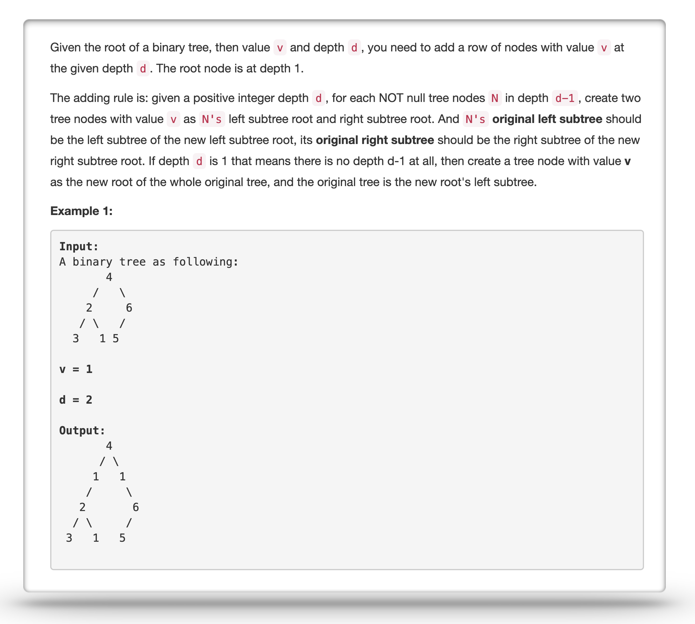
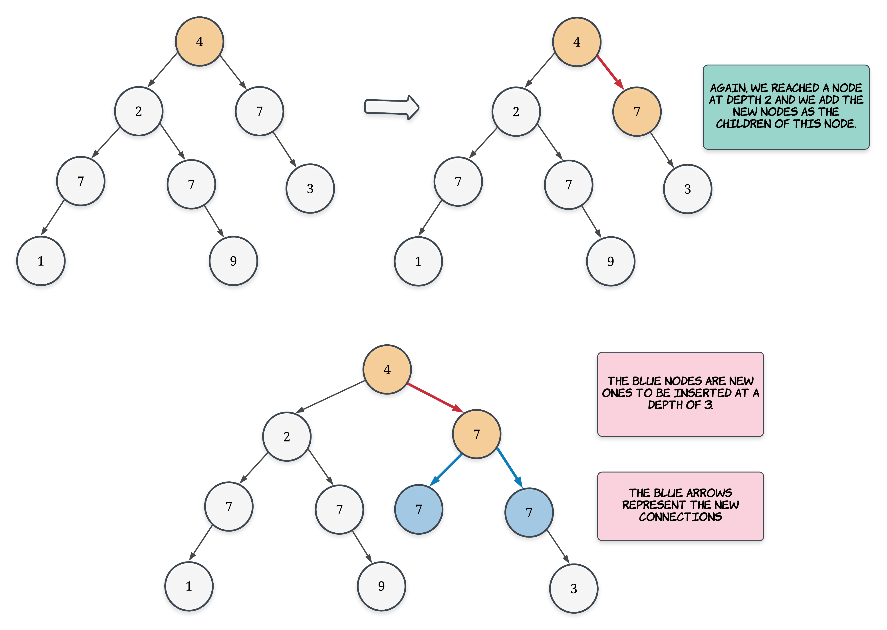
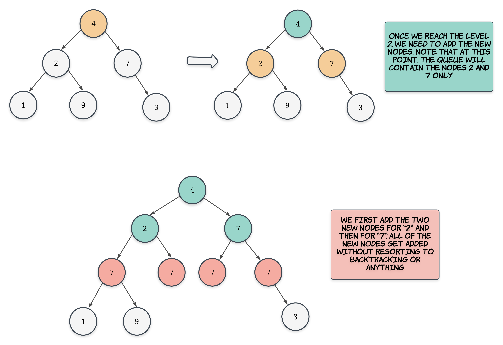

For this problem we have to modify the given binary tree at a certain level and add new nodes. The problem statement also provides information about how we can maintain the original structure of the tree i.e. where do the old set of nodes go when we add the new ones. The problem becomes very simple once we get access to the nodes at the provided depth. So, this essentially becomes a tree traversal problem.

We have two basic methods for traversing a tree or a graph. One is depth first traversal or DFS which processes one branch of the tree at a time and uses the concept of backtracking as well. The other one is level order or breadth first traversal which is an iterative method and it processes all the nodes at a certain level before moving onto the next one. 

Usually, there comes in a certain distinction between which traversal method to use for a given tree/graph problem. However, that distinction is mostly for problems like finding shortest paths in an unweighted graph. Here, both the approaches perform exactly the same and we will be looking at both the methods for solving this problem.

---
### Solution 1: Depth First Traversal

#### Motivation

As mentioned before, we need to be able to access the nodes at a certain depth for us to add the new nodes properly. In this approach we will be using the depth first traversal for accessing these nodes. As we know, DFS is a recursion based approach and for this problem, we only have to go up to the nodes at a certain level. We don't have to process the nodes after that level. So, we will be passing an additional piece of information for our recursive DFS which will be the current level or depth of the node so that we can stop at the appropriate time and backtrack.

Also, if we have to add nodes at say depth `3`, then in our DFS approach we will be stopping when we reach nodes at depth `2`. We do this because we want to access the parent nodes for nodes at depth `3` and using these parent nodes we can add all the new nodes we want and also restructure our tree as required. So, for a given depth `d` in the input, we stop our DFS when we reach a depth of `d - 1`.

#### Algorithm

1. Let's say we define a function called `dfs()` for performing the basic depth first traversal for us. Apart from the node which we are currently processing, this method will also take as input the depth of this node. We have to stop at depth `d - 1`. The depth of the root node would be `1`.
2. We initially pass the `root` node to our `dfs` function along with a depth of `1`. Note that adding a node at depth `1` is a special case and we handle that separately and don't call the `dfs` function in that case. 
3. We keep on recursing on the left and right of a given node and for every recursive call we pass a new depth which is 1 more than the depth passed as the input. 
4. Once we reach a node which is on depth `d - 1`, we don't recurse any further and this is where we add the two new nodes. The rule is very crisp as to how we have to add the new nodes. We have to add 2 new nodes and the value for these new nodes is already provided in the input to the main function (not the dfs one). The left child of the new left node is the original left child of the node at depth `d - 1`. Similar rule exists for the right child as well.
5. We keep on doing this and we will add new nodes at the given depth in accordance with the problem's requirements.

Let's take a quick look at this algorithm on a sample binary tree. So, for the tree given below we have to add new nodes at depth `3` and the value for these new nodes would be `7`. 

An important thing to remember here is that we don't process the nodes `1` and `9` since we backtrack from depth `d - 1` which would be `2` for this example. It's important to backtrack to avoid unnecessary processing of the tree. We only have to go up to a certain depth in the tree, add new nodes, and then traceback the steps and process a different branch. Let's take a look at the processing of the second branch of the tree.  

Finally, the tree looks like the one shown below with the new nodes contained in the dotted area. 

#### Complexity Analysis

* Time Complexity: `O(2^d)` where `d` is the depth where we have to add new nodes and in the worst case every node will have exactly two children except for the leaf nodes. 
* Space Complexity: `O(d)` since we only go up to the level `d - 1` and add the new nodes and then we backtrack.

---
### Solution 2: Breadth First Traversal

#### Motivation

If you notice the diagram above, you'll notice the basic intuition behind the breadth first traversal method for adding the new nodes. Essentially, the BFS method will allow us to access ALL the nodes on the level `d - 1` in one go unlike DFS where we have to backtrack and then process a different branch and so on. Essentially, we can add all the new nodes in one shot iterative fashion and that just feels a bit more intuitive than the DFS approach. 

It's important to note that both the methods process exactly the same number of nodes and there is practically no difference between the two approaches as far as the time complexity is concerned. For the space complexity, we can't really say one approach is better than the other one. If we have a very tall tree, BFS would be better. For a very broad tree, DFS would be better. Let's look at the exact algorithm based on our level order traversal.

#### Algorithm

1. We have to use the queue data structure for level order traversal. So, initialize a queue containing just the root node. 
2. It's important to note that we need to keep track of the level of each node. There are multiple ways for doing so. We can keep the level information as a part of a tuple and add it to the queue. Or, we can add a dummy `None` or `null` entry to the queue to mark the end of a level. However, there's a better approach that helps us keep track of the level of the nodes. 
3. We iterate till our queue becomes empty. In every iteration, the queue would contain all the nodes at a certain level. So, we simply record the size of the queue and we process that many nodes only. For each node, we add their left and right children to the queue. Since we had recorded the size of the queue beforehand, it won't matter now even if we add more nodes to the queue thus leading to potential increase in it's size. Essentially we do something like the following:

    <pre>
    level = 0
    Q = [root]
    while Q is not empty:

        size = Q.size
        for i in range 0..size:
            element = Q.pop_front()
            add right child of element to Q
            add left child of element to Q
        
        level = level + 1    
    </pre>
4. Once we reach the level `d - 1`, we don't really need to add any further nodes to the queue since we won't have to process the nodes at a further level. We simply iterate over the remaining nodes in the queue which will be all the nodes at `d - 1`. For each of the nodes, we add two new nodes according to the rules in the problem statement

#### Complexity Analysis

* Time Complexity: `O(2^d)` where `d` is the depth where we have to add new nodes and in the worst case every node will have exactly two children except for the leaf nodes. 
* Space Complexity: `O(2^d)` since in BFS, the queue contains all the nodes at a certain level. In the worst case, there would be `2^(d - 1)` nodes at the depth `d - 1` and this would be a very fat tree depending upon what depth is. We can see the space can grow exponentially for BFS depending upon the shape of the tree. Thus, even though we might not know the shape of the tree, DFS tends to have a better space complexity than BFS for most practical cases.

#### Link to OJ

https://leetcode.com/problems/add-one-row-to-tree/description/

---
Article contributed by [Sachin](https://github.com/edorado93)
 