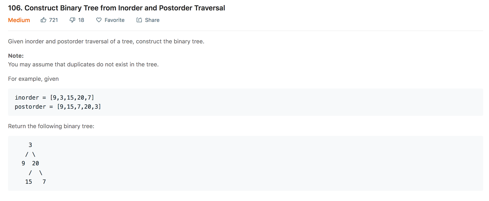
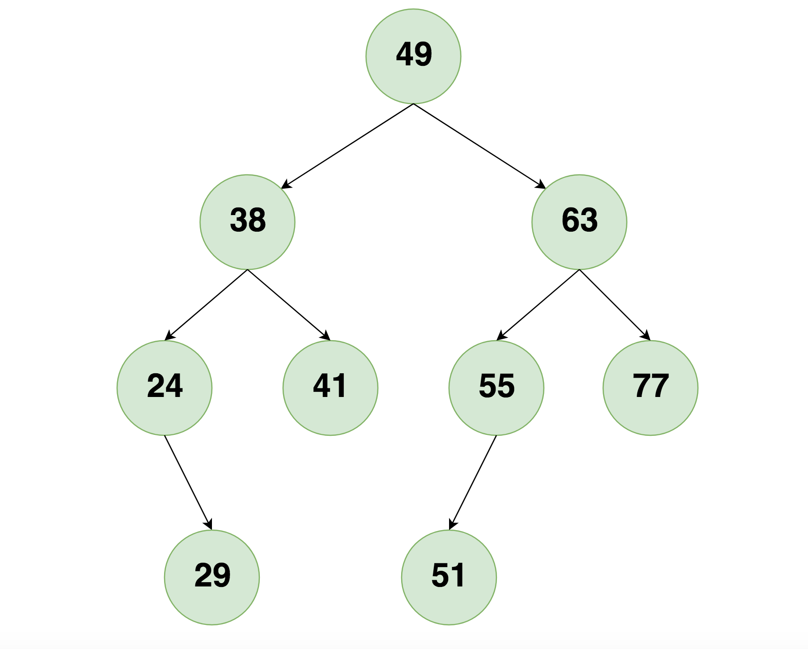

## Construct a Binary Tree from in-order and Postorder Traversal

<p>

</p>

---

### Solution One : Recursion

####  Motivation
We are given in-order and postorder traversal of a Binary Tree and we have to recreate the Binary Tree from the given traversals.

**TIP:** To create a binary tree we need at least two different traversals. A single traversal can correspond to many different tree structures.

Let us understand how are we going to approach the problem by taking an example.

<p>

</p>

Let us write the `in-order` and `Postorder` traversal of the above tree.

```
in-order    = [24,29,38,41,49,51,55,63,77]
Postorder  = [29,24,41,38,51,55,77,63,49]
```
#### Observations derived from the Tree structure and it's traversals :

1. `root` of the tree will always be the last node in it's postorder traversal.
2.  Nodes left to the `root` and Nodes right to the `root` appear in same fashion in it's in-order traversal. From the diagram Node(38) and Node(63) are left and right node of Root(49), they appear in same manner in the `in-order` traversal of the tree. They don't change their relative ordering with respect to it's parent.

#### Algorithm
1. Find the last node in the `postorder` traversal.
2. Mark this as root for the current state.
3. Find the index of above node in the `in-order` traversal tree. So everything left to that `index` will be the left subtree and right to the `index` will be the right subtree.
4. If we carefully observe the part before `index` in `postorder` traversal and the part after `index` in `postorder` traversal, they correspond to `postorder` traversal of left and right subtrees respectively.
5. Recursively repeat the the process from step 1-3 for left and right subtree.


#### Complexity Analysis
* Time Complexity: `O(N^3)` where `N` is the number of nodes. This is because we are searching the index of last node in `postorder` traversal in the `in-order` traversal of the tree for each recursive call and also creating the sub-arrays in each recursive call. Linear search for the index and preparing sub-arrays for the recursive calls adds a lot of complexity to the solution. Hence the higher complexity.
* Space Complexity: `O(N)` where `N` is the number of nodes. The space is occupied by the recursion stack in this case.

---

### Solution Two : Optimized Recursion

####  Motivation
In solution one we were passing subarrays of `postorder` and `in-order` traversals of the tree in each recursive call. Since creating a subarray is also a `O(N)` operation, instead of creating a subarray, we will pass indices of `in-order` and `postorder` array which will improve the performance.

#### Algorithm
1. Find the last node in the `postorder` traversal.
2. Mark this as root for the current state.
3. Find the index of above node in the `in-order` traversal tree. So everything left to that `index` will be the left subtree and right to the `index` will be the right subtree.
4. If we carefully observe the part before `index` in `postorder` traversal and the part after `index` in `postorder` traversal, they correspond to `postorder` traversal of left and right subtrees respectively.
5. Recursively repeat the the process from step 1-3 for left and right subtree.
6. The only thing different from the previous solution is that now we use a pair of indices for each of the two arrays `postorder` and `in-order`. Rather than splitting the arrays themselves, we play around with the indices.

#### Complexity Analysis
* Time Complexity: `O(N^2)` where `N` is the number of nodes. This is because we are searching index of last node in `postorder` traversal in the `in-order` traversal of the tree for each recursive call. The complexity reduced because we don't create any subarrays now. There is still some optimization that can be done and we will look at that in the next solution.
* Space Complexity: `O(N)` where `N` is the number of nodes. The space is occupied by the recursion stack in this case.

---

### Solution Three : Super Optimized Recursion!

####  Motivation
In all the above solutions the index finding operation was simply a linear search which was `O(N)` operation. We can reduce this complexity by keeping a dictionary between `value` and `index` of each element of `in-order` traversal. This will reduce our search operation time to `O(1)` time. The reason we can do this is because the problem statement clearly states that the nodes in the in-order traversal are *unique* and hence such a mapping would bring down the search complexity from `O(N)` to `O(1)`.

#### Algorithm
1. Iterate over the `in-order` traversal array and prepare the dictionary that maps values to their indices.
2. Find the last node in the `postorder` traversal.
3. Mark this as root for the current state.
4. Find the index of above node in the `in-order` traversal tree using the dictionary we prepared in the first step. As before, everything left to that `index` will be the left subtree and right to the `index` will be the right subtree.
5. Recursively repeat the the process from step 2-4 for left and right subtree.

#### Complexity Analysis
* Time Complexity: `O(N)` where `N` is the number of nodes.
* Space Complexity: `O(N)` where `N` is the number of nodes. The space is occupied by the recursion stack in this case and hash map of the `in-order` traversal.


#### Link to OJ
https://leetcode.com/problems/construct-binary-tree-from-in-order-and-postorder-traversal/

---
Article contributed by [Arihant Sai](https://github.com/Arihant1467)
