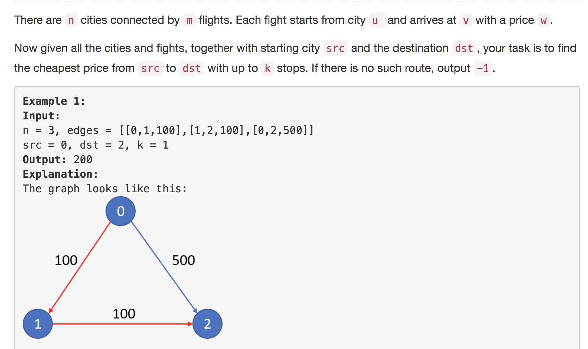
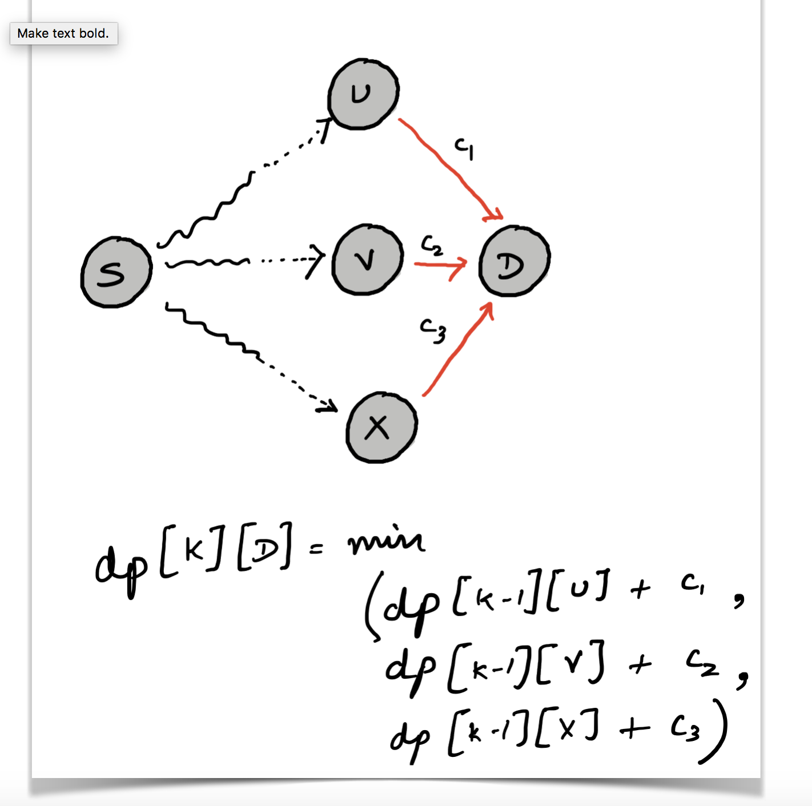

<p align="center">

</p>

---
### Solution 1: Dynamic Programming Solution

#### Algorithm

There is a very simple dynamic programming based solution to this problem. Have a look at the following diagram and then we'll will explain the recursive relation for the problem.

<p align="center">

</p>

The figure has the DP based recurrence written on it. Essentially, the shortest flight within K stops from `S` to `D`
would have to go through one of the neighbors of `D` or nodes that have an edge to `D` which in the above diagram happen to
be the nodes `U, V and X`. That edge, be it `U --> D` or `X --> D` would count towards the total stops because neither `U` nor `X` is the destination. So, then recurrence relation is

```
dp[k][D] = min(dp[k-1][x] + cost[x --> D]) for all x which have an edge to D.
```

#### Complexity Analysis

* Time Complexity = `O(NK)`
* Space Complexity = `O(NK)`

---
### Solution 2: Using Breadth First Search

#### Algorithm

This solution is the most natural solution that comes to one's mind when thinking of these kind of problems. You may have come up with Dijkstra's Algorithm and a modification to it, but I tried doing that and didn't work out for me. DP was the way to go initially.

But, as it turns out, there is a faster alternative to this problem.

> We can use BFS to keep track of the recursion states i.e. the nodes and use them to find the shortest path.

You might say that BFS cannot be used to find the shortest path in a weighted graph. That is correct, but the constraint here is that of the K stops and hence, the algorithm can only go until a max level of K and not beyond. That is what makes the problem tractable using something like BFS.

Essentially, a node gets added once to the queue for initial processing, it gets added again only if BFS discovers an alternate path with smaller cost under K stops to that node. Otherwise not. This is a flight network and it is quite possible that every location is connected to every other location, but we cannot figure out for sure how many times a node would get processed during BFS. It is not possible that all the paths to all the nodes end up improving the shortest path. So, from the look of it i.e. algorithmic complexity wise this algorithm seems worse than DP one but it turns out to be `3X` faster on the leetcode platform.

#### Complexity Analysis

* Time Complexity = `O(N^2)` since we end up exploring all the possible edges in the network
* Space Complexity = `O(N)` since the BFS queue might contain all the nodes in the graph at any point in time.

#### Link to OJ

https://leetcode.com/problems/cheapest-flights-within-k-stops/solution/

---
Article contributed by [Sachin](https://github.com/edorado93) and [Divya](https://github.com/DivyaGodayal)
