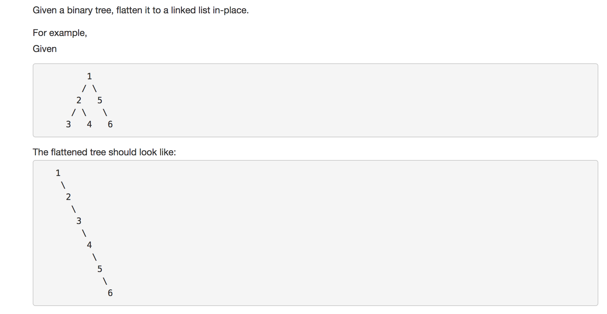

---
### Solution 1: Recursive Approach

#### Algorithm

1. Essentially, we perform a preorder traversal on the given tree and recursively flatten the sub-trees and connect them. 
2. Let `node` represent the current node for which a recursive call is made. This is the root of the tree that needs to be flattened into a linked list. 
3. We recursively flatten the left subtree of this `node` represented by `node->left` and let the result returned be `flattened-left`.
4. Then we recursively flatten the right subtree of this `node` and let that result be `flattened-right`. Since this is a linked list, it will have a header and that header node is the one returned by the recursion. So `flattened-right` and `flattened-left` represent the head nodes of their respective linked lists. 
5. All we need to do now is to connect the **tail** of the `flattened-left` linked list with the head of `flattened-right` linked list. So we iterate over the `flattened-left` linked list and we reach the last node and we connect it to the `flattened-right` linked list thus giving us a combined flattened linked list for the given `node`. 

#### Complexity Analysis

* Time Complexity: `O(N)` because we are simply doing a pre-order traversal and considering all the nodes exactly once. 

* Space Complexity: `O(N)` for the recursion stack.

#### Link to OJ

https://leetcode.com/problems/flatten-binary-tree-to-linked-list/

---
Article contributed by [Sachin](https://github.com/edorado93) and [Divya](https://github.com/DivyaGodayal)
