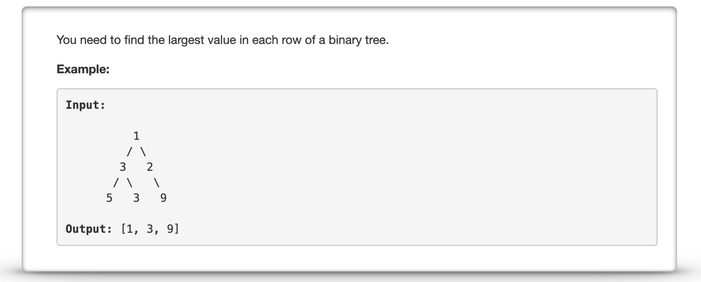
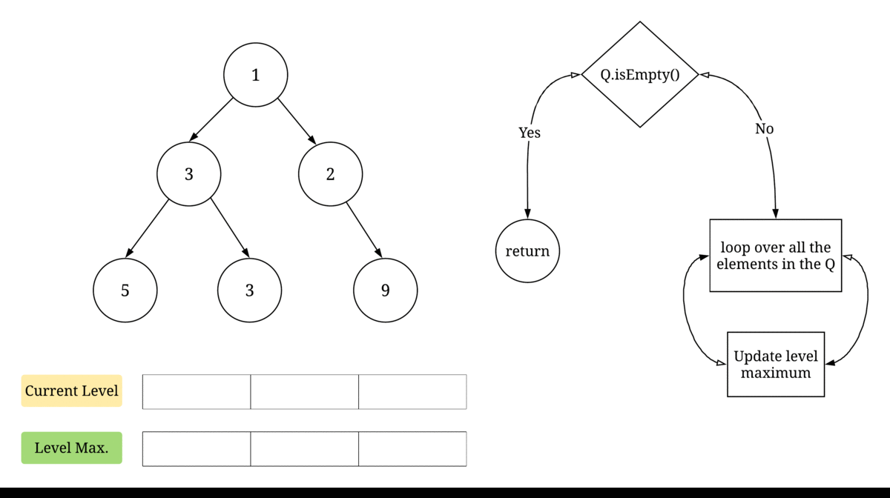

---
### Solution 1: Level Order Traversal

#### Motivation

The problem statement gives a huge hint towards performing a `level order traversal` on the tree. Whenever we want to access elements in the tree one row or level at a time, level order traversal (or breadth first search) is usually the way to go. This question is no exception to this rule. Essentially, we will perform level order traversal and will simply keep a track of the maximum element in each level. 

#### Algorithm

1. Initialize an empty queue, `Q`. Queue is the data structure that is used for performing the level order traversal. The logic that we will adopt is that the queue, at any point in time will contain *all* the elements belonging to a particular level. That ways, we can simply find out the maximum element for each level.
2. Push the root node, `R` for the tree in the queue. Root node is the only node in the first level or level `0` of the tree and so that will be the maximum.
3. We iterate until the queue becomes empty. In each iteration, we note the size of the queue. Let's call the size, `L`. This size would represent the number of nodes in the current level. We don't need to keep track of the level number here. We just need to find the maximum valued node in each level and add it to an answer array. 
4. For each of the `L` elements in the `Q`, we push their left and right children into the queue and also update a local maximum. Note that we use an additional internal loop for iterating over the `L` elements of the queue. This is in addition to the outermost `while` loop. This is done so that we can easily iterate level-by-level *without using any additional information for keeping track of the level*.

#### Complexity Analysis

* Time Complexity: `O(N)` where `N` represents the number of nodes in the tree. The complexity for running breadth first search on a graph is `O(V + E)` where `V` are the number of vertices and `E` are the number of edges. For a binary tree, at most every node will have 2 children and hence, `E = kV`. So, the overall time complexity is `O(V) = O(N)`.
* Space Complexity: `O(N)` which is the space occupied by the number of nodes on a particular level. For a complete binary tree, the maximum number of nodes will be in the last level and all of them will be in the queue at the same time. 

#### Link to OJ

https://leetcode.com/problems/find-largest-value-in-each-tree-row/description/

---
Article contributed by [Sachin](https://github.com/edorado93)

