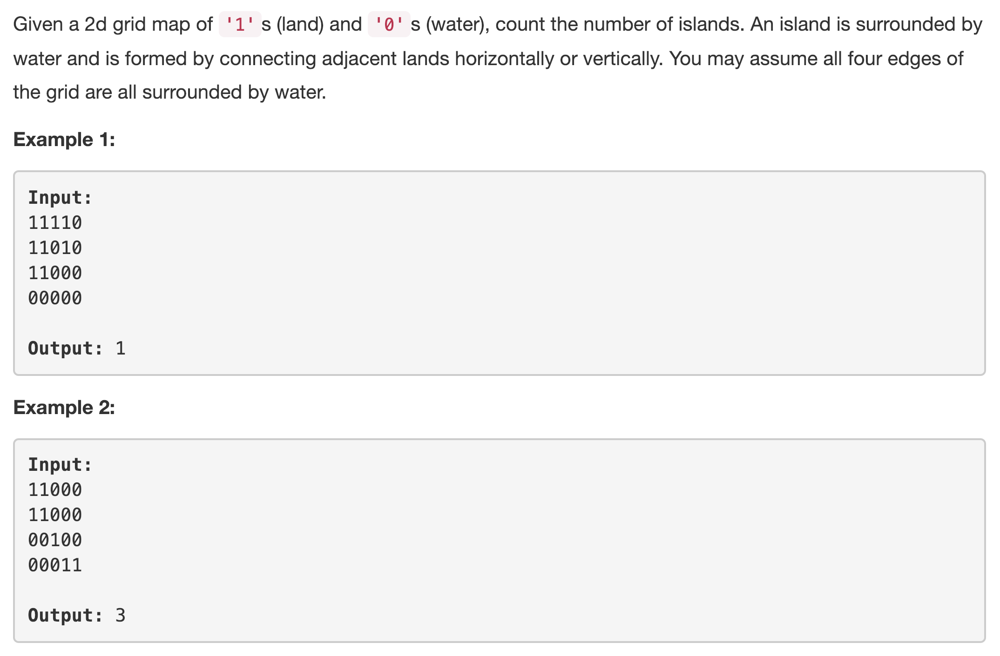
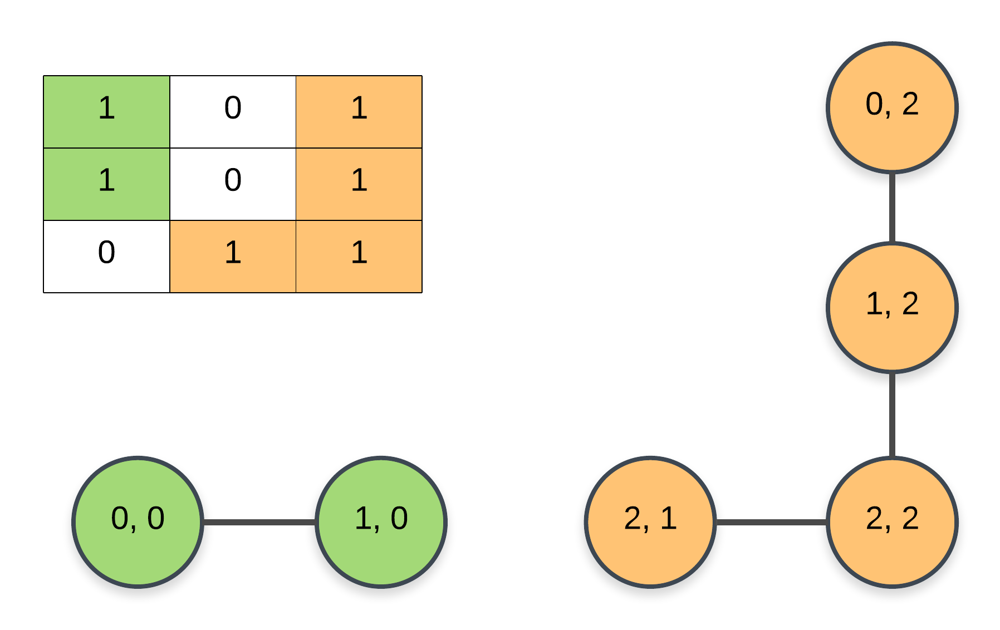
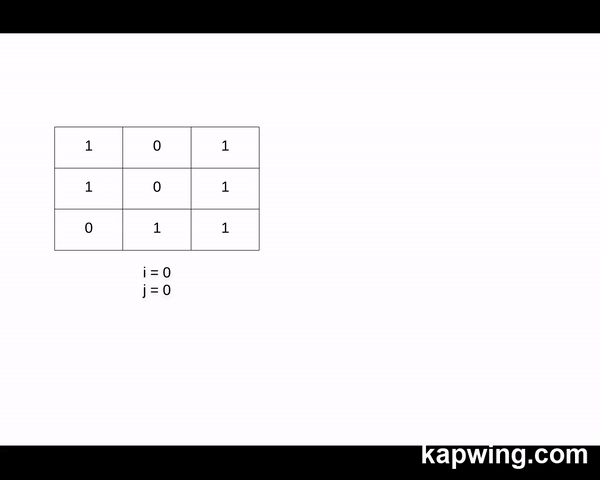

Before looking at the solutions for this problem, there is a common theme in this problem that we need to explore. Essentially, we need to model this problem as a graph based problem and that helps us because then, we can make use of some standard graph search algorithms to solve this problem.

> We can consider each cell of the matrix as a node in our graph. For a given node, represented by two indices (i, j) i.e. row number and column number, we have 4 different edges one each to the cell at positions (i + 1, j), (i - 1, j), (i, j + 1), and (i, j - 1).

Another important thing to note here is that we only consider the cells with a value of `1` as a node in the graph. Rest of the cells do not count as such. Let's look at a sample graph formed from a matrix.

---
### Solution 1: Depth First Search

#### Motivation

Now that we know how to model the given matrix as a graph, let's get to actually solving the problem. If you look at the figure presented above, you'll notice that the island is essentially a `connected component` in the graph. So, we can make use of the depth first search algorithm to find out all the connected components and return the number as our answer.

#### Algorithm

1. Have an outer loop, say `i` over the rows, `R`, of the matrix.
2. Have another loop, called `j` over the columns, `C` of the matrix.
3. For each given cell, we check two conditions:
    1. If the value stored at that particular cell is a `1` and
    2. If that cell has not been processed previously. We use the value of the cell itself to check if the it was visited in another node's (cell's) dfs or not. If the value is `-1`, then it means the cell has already been processed and we continue to the next cell.
4. If both the conditions are satisfied, this implies the start of a new connected component and we recursively process all the nodes reachable from the current node using DFS. By process we simply mean mark all the reachable nodes in the matrix as `-1`.
5. In the dfs function, for a given cell, `(i, j)`, we mark it as visited and then we recursively call the dfs function on all 4 of it's neighbors i.e. `(i + 1, j)`, `(i - 1, j)`, `(i, j + 1)`, and `(i, j - 1)`.
6. We simply count the number of calls to the dfs function and that count is the total number of connected components in our undirected, unweighted graph.

Let's have a look at an animation representing this algorithm. It's the same for the next algorithm as well. The only difference is in the graph search strategy used (DFS v/s BFS).

#### Implementation Notes

We need some way of tracking which nodes have already been processed and which ones aren't. There are two ways of doing this. One, we can use the grid itself, like it's mentioned in the algorithm and simply put a `-1` in the cells which have been processed. This doesn't add to the space complexity at all but it changes the underlying data structure.

An alternative might be to make use of a `visited` set. We can simply add tuples of cell indices which have been processed and use it in the algorithm. This, however, will need `O(M * N)` space. But, it is additional space which is not really required unless you cannot change the input matrix.

#### Complexity Analysis

* Time Complexity: `O(M * N)` where the matrix consists of `M` rows and `N` columns and we only process each node exactly once. Us marking a processed cell as a `-1` in the matrix ensures that we don't end up in a cycle during the depth first search process.
* Space Complexity: `O(M * N)` consumed by the recursion in the worst case where all the nodes in the matrix are `1s` and we have one single island.

---
### Solution 2: Breadth First Search

#### Motivation

The motivation is the same as above. Except that now, instead of making use of the depth first search algorithm, we will make use of the breadth first search algorithm for finding out the reachable nodes.

#### Algorithm

1. Initialize a queue, `Q` that we will use for the breadth first search.
2. Have an outer loop, say `i` over the rows, `R`, of the matrix.
3. Have another loop, called `j` over the columns, `C` of the matrix.
4. For each given cell, we check two conditions:
    1. If the value stored at that particular cell is a `1` and
    2. If that cell has not been processed previously. We use the value of the cell itself to check if the it was visited in another node's (cell's) bfs or not. If the value is `-1`, then it means the cell has already been processed and we continue to the next cell.
5. For each cell that we call the bfs function on, we add it to the queue, `Q` and then process all the nodes reachable from it (at all the levels). The advantage here is in the space occupied by the queue. There's no recursion here unlike in dfs and hence, there's lower space usage.
6. For a node popped from the queue, we add all valid neighbors from amongst the 4 possible as explained in the previous algorithm.
7. The number of calls to the bfs function are the number of connected components that we need to report.

#### Complexity Analysis

* Time Complexity: `O(M * N)` where the matrix consists of `M` rows and `N` columns and we only process each node exactly once.
* Space Complexity: `O(max(M, N))`. We don't have any recursion here and hence, no space used by the recursion stack as before. Even if we have a giant island in the matrix, the queue's size never grows beyond `max(M, N)`.

---
### Solution 3: Union Find using Disjoint Sets

#### Motivation

An alternative to using the graph algorithms discussed above is by using the disjoint set data structure and the union-find algorithm based on it to find the number of connected components in the graph. You can read more about this data structure and the algorithm itself [here](https://www.geeksforgeeks.org/union-find/).

Essentially, for a given edge between two nodes, `A` and `B`, we perform a set union between them. Eventually, all the nodes in a component fall in a single disjoint set and the number of disjoint sets is what we need to answer the problem.

#### Algorithm

1. Initialize a `UnionFind` data structure. The data structure needs to support the following functions and optimizations:
    1. `get_parent` that gets the parent of a given node. You should implement path compression optimization here, in this function as well.
    2. `union` which performs union of the sets for the two nodes `A` and `B`. The union operation should be rank based for it to be optimized.
    3. You can read more about path compression and union by rank [here](https://www.geeksforgeeks.org/union-find-algorithm-set-2-union-by-rank/).
2. Also a part of initialization, for each cell in the matrix, we set the parent to itself.
3. Initially, each node is a disjoint set in itself (if it's value is `1`). So, we initialize the rank for each cell to 0 initially.
4. For each cell in the matrix, perform a union with all it's 4 neighbors. This is not a recursive process and we can't mark nodes as processed as we did earlier on.
5. We convert the cell indicis, `i, j` to an integer as `i*C + j` so as to make calculations easier in the disjoint set operations.
6. Initially, the number of components is the number of `1`s in the matrix. With every union operation, we reduce the number of disjoint sets (or the number of components) by 1.
7. Once we are done processing all the nodes in the matrix, we simply return the number of disjoint elements we've been tracking all along.

#### Complexity Analysis

* Time Complexity: `O(M * N)` since we still perform an entire grid iteration and process each element exactly once. The time taken by the union function essentially takes a `O(1)` time when both, path compression and union by rank are implemented.
* Space Complexity: `O(M * N)` since we have the `parent` and the `rank` dictionaries that store the data for all the cells in the matrix.

#### Link to OJ

https://leetcode.com/problems/number-of-islands/description/

---
Article contributed by [Sachin](https://github.com/edorado93)
