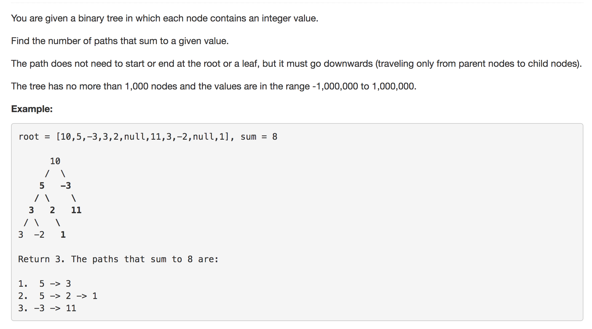
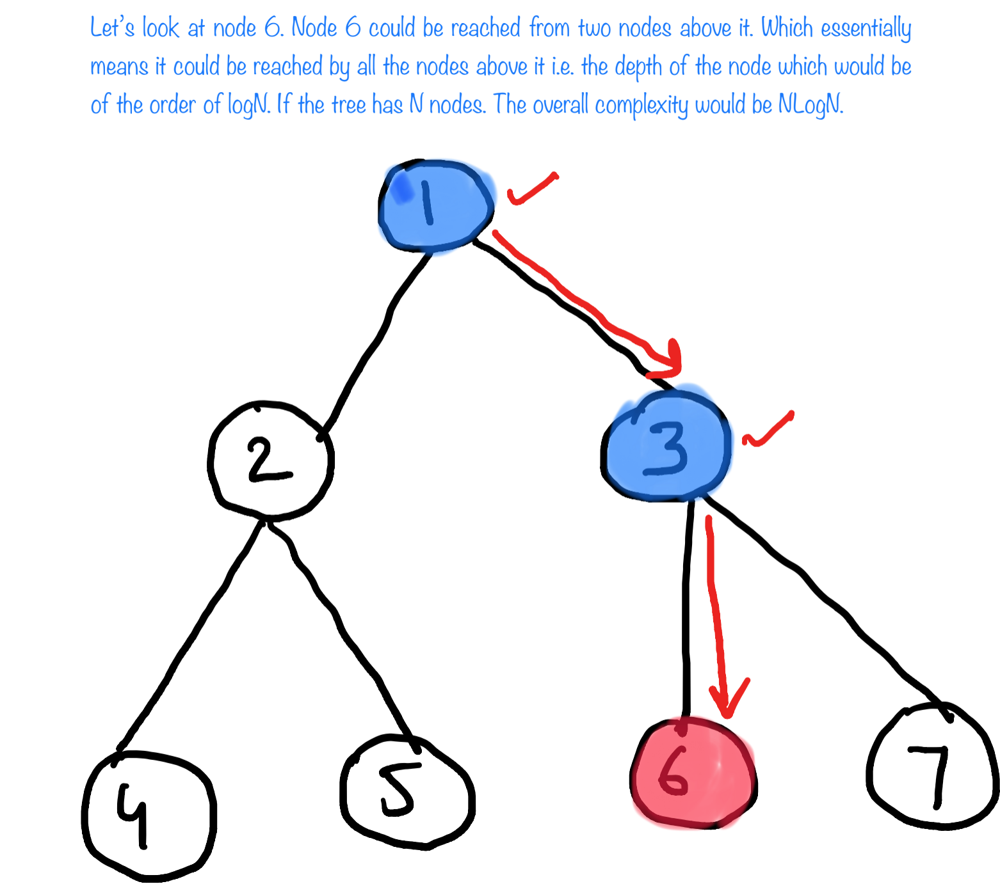
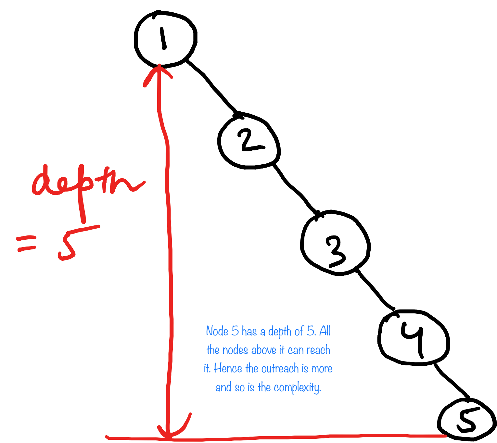
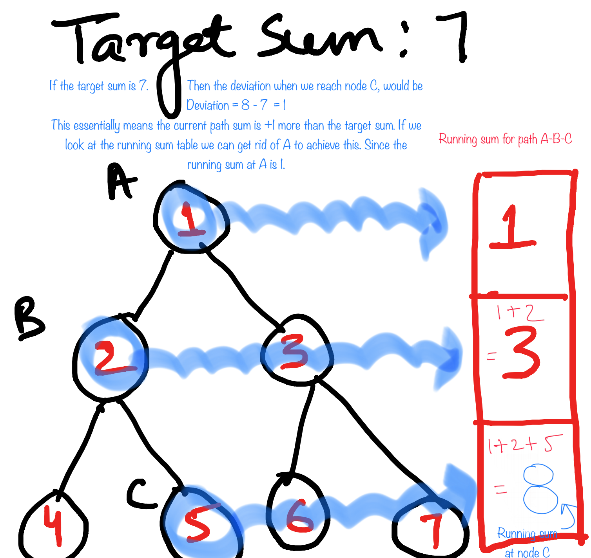
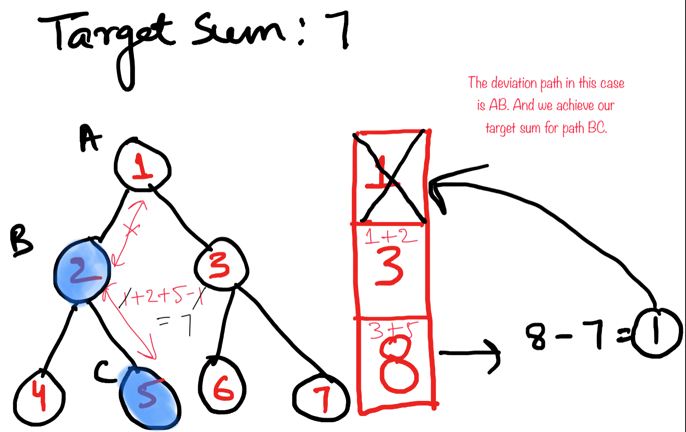
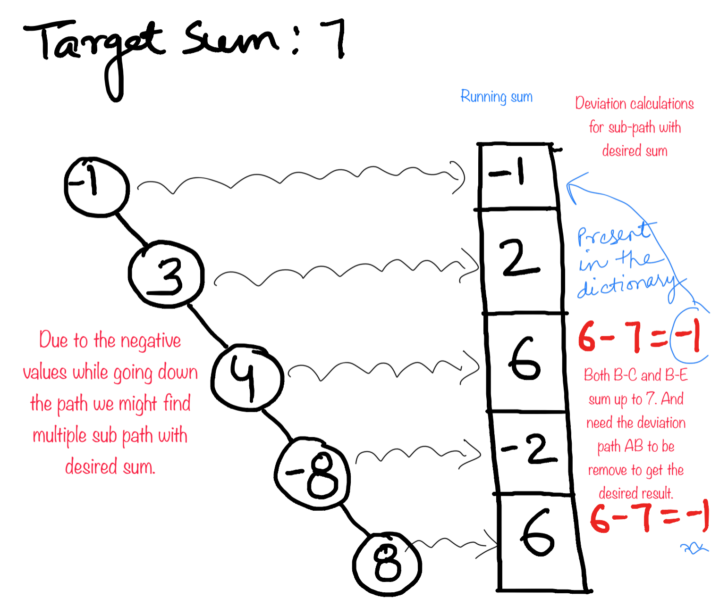

<p align="center">

</p>

---
### Solution 1: Brute Approach


#### Algorithm

The `brute` way of approaching this problem would be to try all possible paths which would essentially mean going down every possible path from every node and checking if the path results in the given sum. 

#### Complexity Analysis

##### Average Case

* Time Complexity: `O(Nlog(N))`. Since this is a binary tree, so on an average the height of the tree considering there are N nodes in it would be `log(N)`. If we look at the implementation described above, we find that a given node can be visited multiple times. How many times we may ask ?
 
Every node is visited during the recursion from each of its ancestors (including the parent). Nodes that are at the very top of the tree would have very few ancestral nodes and hence would only be repeated relatively fewer number of times as compared to the nodes at the bottom.

However, on an average, the depth of a node i.e. the distance of a given node from the root of the tree is `log(N)` and this is exactly the number of ancestral nodes it will have. 

So, we have `N` nodes and each of them gets processed `log(N)` number of times giving us the complexity of `O(Nlog(N))`

* Space Complexity: `O(logN)`, would be the recursion stack i.e. height of tree when its balanced.

<p align="center">

</p>

##### Worst Case

* Time Complexity: `O(N^2)`. If the tree is a skewed tree then every node would be visited from all the nodes above it in the similar fashion as above but since the height of the tree is now N, the complexity is N * N. For a more strict complexity analysis, we will have a height of `N` for the last node in the tree, a height of `N - 1` for the second last node and so on till a height of `1` for the only child of our root node. So, the time complexity in this worst case scenario would be as follows. 

```
Worst time complexity 
= 1 + 2 + 3 + .......+ N-1
= O(N^2)
```
<p align="center">

</p>

* Space Complexity: `O(N)`, N is the height of the tree when it is skewed.

---
### Solution 2: Optimal Approach

#### Algorithm

* In the optimal solution we traverse the tree one node at a time in regular depth first fashion. Keeping a track of the sum down any path till that node and calling it the `running_sum`.

    <p align="center">
    
    </p>

Storing these running sum in a dictionary helps to keep a track of what all milestones we have reached so far. Since this is a cummulative sum we can at any time find the difference between any milestone to find the distance for any sub-path.

    <p align="center">
    
    </p>

2. Here, since we have the target sum i.e. the desired sum for a path we can find out the difference between target_sum and the running_sum for a node and call it the `deviation`. 
    ```
    deviation = running_sum - target_sum
    ```
The deviation tells us how far is our running sum from the target_sum.

3. Now if we have this present in the dictionary of running_sums then we can say we do have a path in the dictionary which is causing this deviation and could be removed to get a sub-path with desired sum.

    <p align="center">
    
    </p>

4. Since there could be nodes with negative values hence there could be paths with same running_sum. Thus we need to save the count of same running_sums. Since either of these running sums could lead us to a sub-path with desired sum. 

    <p align="center">
    
    </p>


#### Complexity Analysis

* Time Complexity: `O(N)`, Number of nodes in the tree = N
* Space Complexity: This is decided by the running sum values that we are storing. In the worst case this would be `O(S)` where S is the sum we want to form.

#### Link to OJ

https://leetcode.com/problems/path-sum/

---
Article contributed by [Sachin](https://github.com/edorado93) and [Divya](https://github.com/DivyaGodayal)


