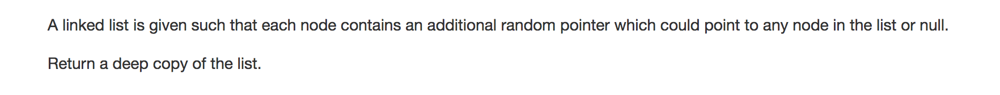
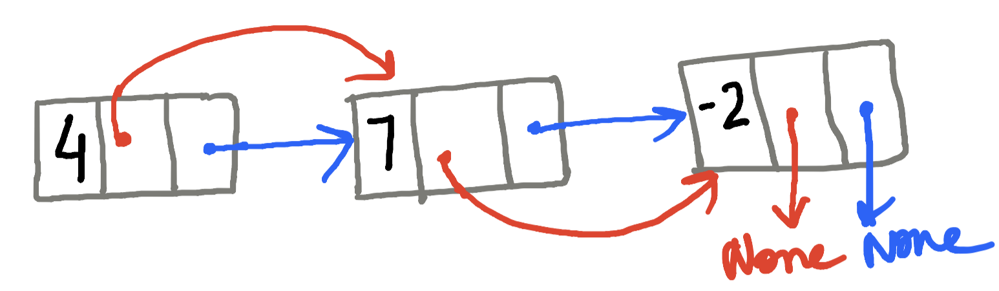
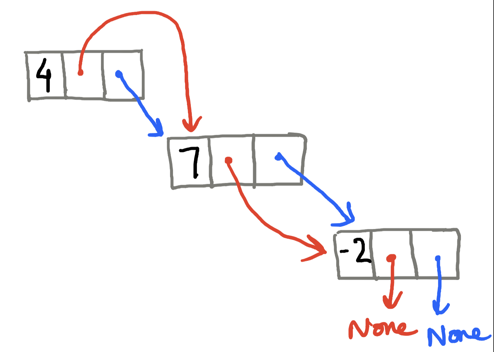
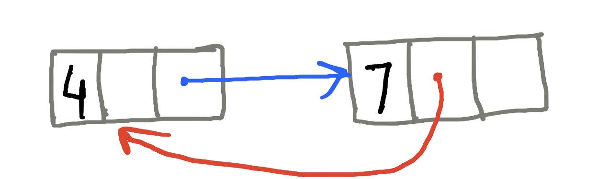
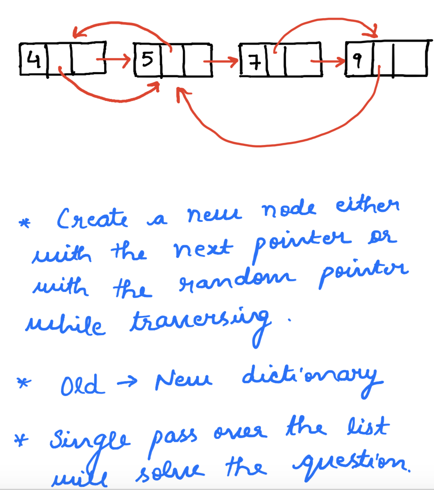

Before looking at the solution, have a look at how the linked list looks, just to get a better understanding of the question.

---
### Solution 1: Recursive Approach

#### Motivation

The basic idea behind the recursive solution is to consider the linked list like a binary tree. Every node of the Linked List has 2 pointers. So we consider these nodes as belonging to a binary tree. The head of the list becomes the root of the tree.
So what we basically have to do now is to traverse the binary tree and clone it. The main issue that we need to tackle here is that of loops. So we can have 

 We need to handle this in the code. 

#### Algorithm

We start from the root node and we keep traversing the tree (list) and we keep generating new nodes whenever we find a node for which the clone has not been generated. For e.g. we were at the node A and we used the next pointer to go to node B and we created B' which is a new node B with the same data. Also, say there was a random pointer from A to B. In this case we don't have to create yet another copy of the node B because B' already exists. We need to take care of this as well. 

#### Complexity Analysis

* Time complexity: `O(N)`. Where n is the number of nodes in the list. 
* Space complexity: `O(N)`. If we look closely, we have the recursion stack, then we have the space complexity to keep track of nodes already cloned. But asymptotically, the complexity is `O(N)`

---
### Solution 2: Two Passes - Iterative 

#### Motivation

The iterative solution to this problem does not model it as a tree and instead simply treats it as a LinkedList. 

#### Algorithm

1. We can solve this in two passes. 
2. In the first pass over the original list, we can create an exact clone of the list with consistent `next` pointers. Note that the random pointer are not yet cloned. 
3. Additionally, we have a dictionary that maintains old node to new node mapping. We will need it later on. 
4. In the second pass we clone the random pointer. The way we do it is like this. The random pointer for A' (A' is the cloned version of the node A) is dictionary value of the node pointed to by the random pointer of A. In case this is unclear, look at the code. 

#### Complexity Analysis

* Time complexity: `O(N)` because we make 2 passes over the original list.
* Space complexity: `O(N)` as we have a dictionary containing mapping from old list nodes to new list nodes. Since there are `N` nodes, we have `O(N)` space complexity.

---
### Solution 3: Single Pass - Iterative 

#### Algorithm
1. We can also solve this problem in a single pass. 
2. When we are iterating over the list, we make a new node using the `next` pointer essentially, right? We cannot assign the random pointers in the first pass because the random pointer may point to say the last node and we don't have a clone for that node yet. So we simply assigned the next pointers in the first pass and in the second pass we assigned the random pointer. 
3. However, we can create new nodes via the random pointer or the next pointer whichever points to a node that doesn't exist in our old --> new dictionary. Say, if the random pointer of the first node points to the last node, we will create a new node corresponding to the last node and add it to the dictionary. Then, when we will be at the second last node during our iteration, we will check the dictionary to see if a clone already exists for the last node. Since a clone exists, we will simply assing the `next` pointer of the secon last node and move on. Take a look at the diagram below 

#### Complexity Analysis

* Time complexity: `O(N)` because we make single pass over the original list.
* Space complexity: `O(N)` as we have a dictionary containing mapping from old list nodes to new list nodes. Since there are `N` nodes, we have `O(N)` space complexity.

#### Link to OJ
https://leetcode.com/problems/copy-list-with-random-pointer/

---
Article contributed by [Sachin](https://github.com/edorado93) and [Divya](https://github.com/DivyaGodayal)
