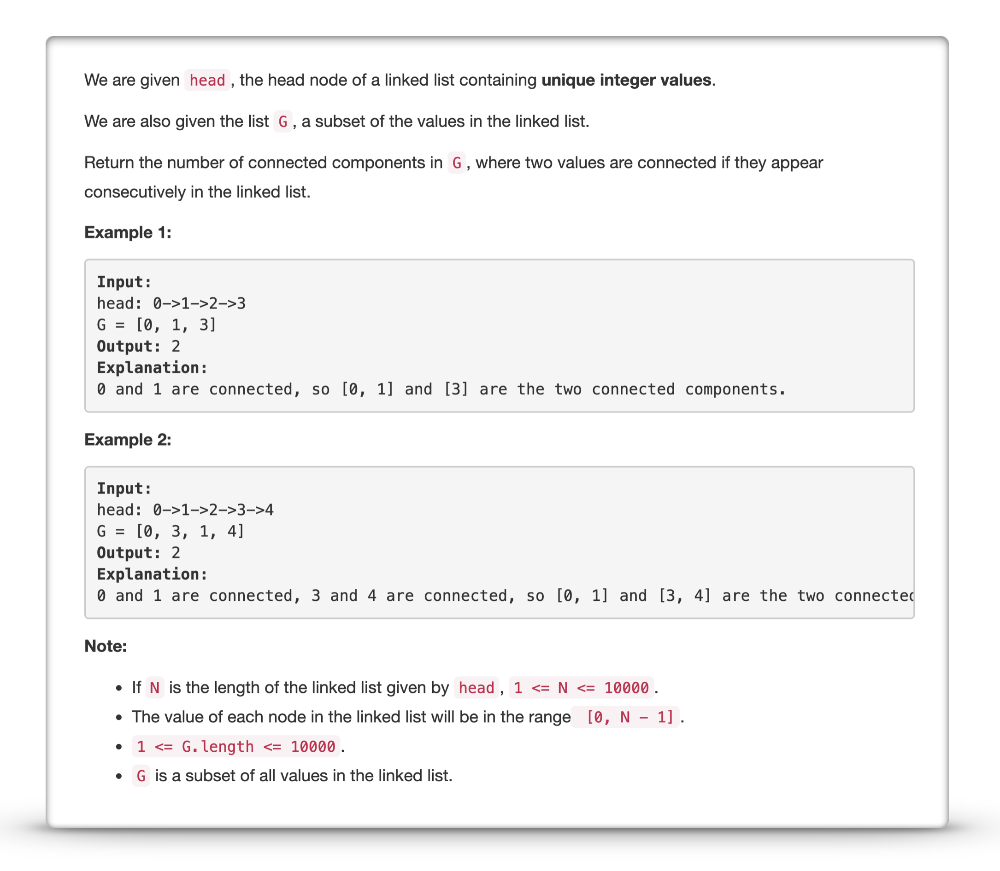
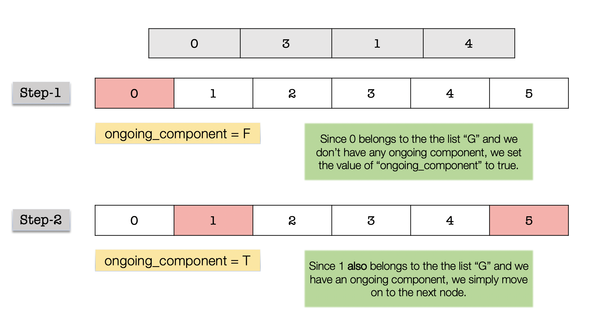
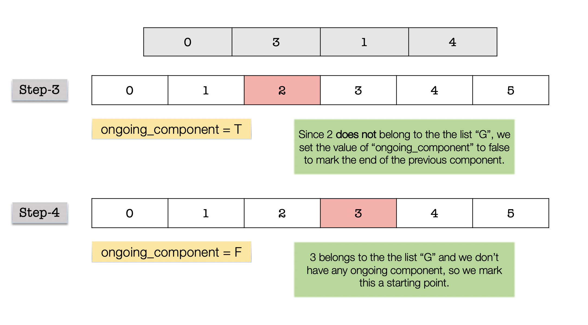
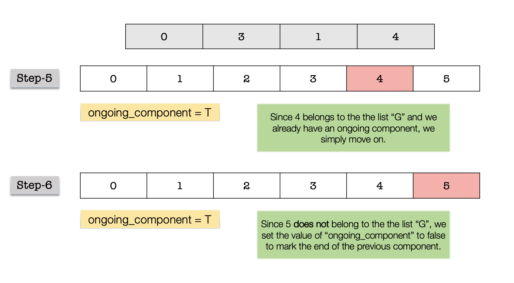
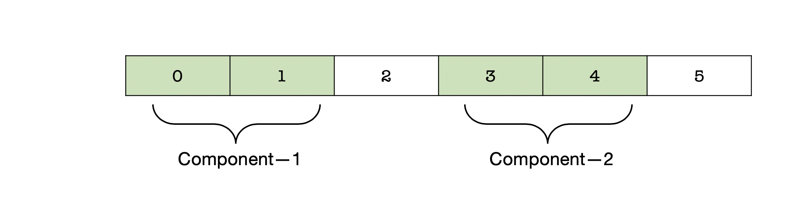

---
### Solution 1: Iterative Grouping

#### Motivation

For every element in the linked list, there are multiple states that they can be in:

1. they can belong to a component or
2. they can be the *starting* point for a component
3. they don't belong to any component

We are much more interested in finding out the starting points for the various components. A component is essentially composed of multiple nodes from the linked list which are all connected together or which are all consecutive nodes. So, once we find the starting point of a component, we simply keep checking the next set of nodes until we find one which *doesn't belong to the group* and we end the component there. And we continue in the same way.

#### Algorithm

1. The first and foremost step that we do is to convert the given list `G` into a set. We do this to improve the runtime complexity. Checking whether an element belongs to a given list is a linear time operation whereas it's a logarithmic time operation to check set inclusion. We can also convert `G` to a dictionary which would be even faster.
2. Next, we initialize a boolean variable called `ongoing_component` to false. We use this variable to keep track of an ongoing component in the linked list. We will see the use case for this variable in the following set of steps.
3. We have to use a list iterator for going over the elements of the linked list one by one. Let's initialize a variable called `list_itr` to the head of the linked list and we will make use of `list_itr = list_itr.next` to progress one node at a time in the linked list.
4. As mentioned before, for every node we have three possible options. Let's look at each one of them and the kind of action we need to take in each case:
    1. The node doesn't belong to the set `G` that we created in step `1` of the algorithm. If this is the case, we simply move onto the next node and make no changes to the number of components. However, we do need to set the value of `ongoing_component` to false. The reason for this is that the previous node *might* mark the end of an ongoing component. Since the current node doesn't belong to the given set `G`, we set our component tracking variable to false. 
    2. If the node belongs to the set `G`, then we need to see if it's a part of an ongoing component. For that we have a variable called `ongoing_component`. If it's value is true, that implies that the some of the previous nodes (consecutive!) belong to the same component. In this case, we simply move on and don't update the number of components.
    3. Finally, the third case is when we encounter a node which belongs to `G` and the value of `ongoing_component` is false. That implies the start of a new component and we increment the counter that keeps track of number of components. Also, we set the value of `ongoing_component` to true.
5. We keep on doing this until we reach the end of the linked list.

Let's look at a series of diagrams that show a dry run of the algorithm on a sample linked list and list `G`.

#### Complexity Analysis

* Time Complexity: `O(N)` which essentially consists of two basic operations. Firstly, we convert the given list `G` to a set. Since `G` consists of a a subset of values of the main linked list, this is an `O(N)` operation. Next, we iterate over the list one element at a time to find the number of components. This again is a `O(N)` operation.
* Space Complexity: `O(N)` since we build a set using the list `G`. Note, if we don't do this, then the time complexity will go up to `O(N^2)` since checking for an element in a list would take `O(N)` operation.

#### Link to OJ

https://leetcode.com/problems/linked-list-components/description/

---
Article contributed by [Sachin](https://github.com/edorado93)

