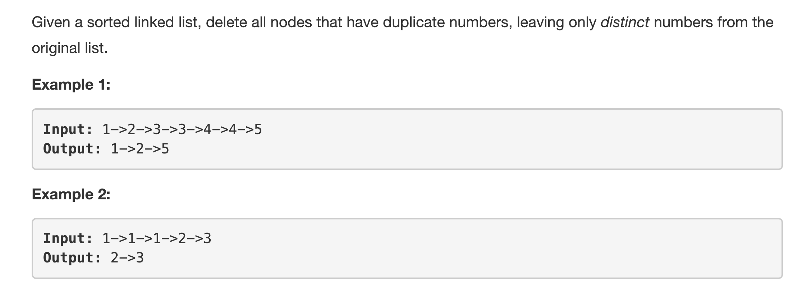
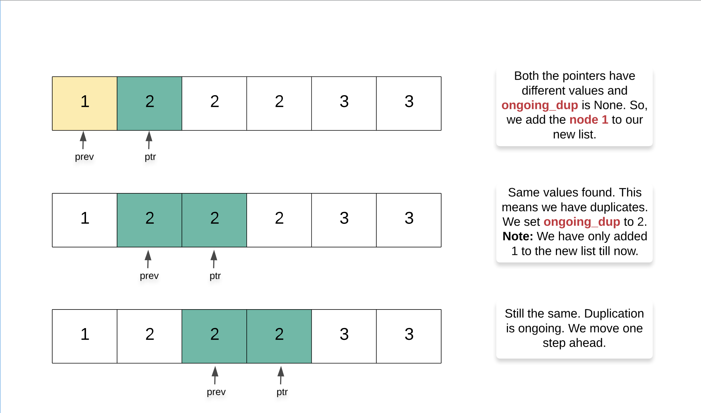
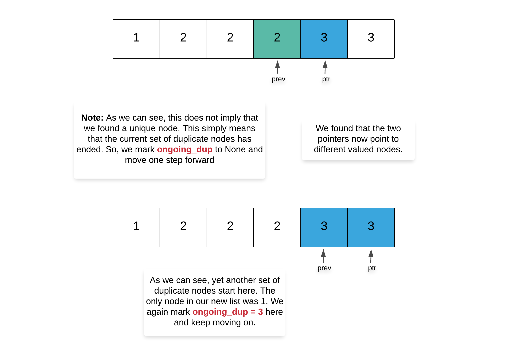

<p align="center">

</p>

---
### Solution 1: Iterative One Pass

#### Motivation

The intuition for this problem is very simple. Consider a set of numbers, `[1,4,3,2,5,1,3,2]`. If we sort these numbers, we get `[1,1,2,2,3,4,5]`. The unique property about duplicates is that they occur *together* in a sorted order. Descending or ascending doesn't matter.

#### Algorithm

1. We have to maintain two different pointers here. Let's call one of them `ptr` which points to the current node and the other one `prev` which points to the previous node in the list. Essentially, the node pointed to by `prev` is the node right behind the one pointed to by `ptr`. Both these pointers progress one node at a time. 
2. Additionally, we need a boolean variable－let's call it `ongoing_dup`－which keeps track of whether there is a duplication of values going on or not. We will see the importance of this variable in just a moment. The default value for this variable will be `None` to mark that there is no current duplicate values series ongoing.
3. Apart from the variables and pointers above, we also maintain two additional pointers called `final_head` and `final`. The first one is the head for the new, shortened linked list we create out of the unique nodes. The second variable, `final`, keeps track of the tail of this new list. This is used for adding new elements.
4. In case `prev.val != ptr.val` and there is no ongoing duplication i.e `ongoing_dup = None`, that means we have a unique value at our hands. The unique value is pointed to by `prev` and not `ptr`. The value at `ptr` can have duplicates further on but not `prev`. We simply add `prev` to our new list.

      ```
      final.next = prev
      final = prev
      ```
5. In case `prev.val == ptr.val`, this implies duplicate set of nodes. We have to avoid all of them. So, we mark the duplication by setting `ongoing_dup = prev.val`. This will only end when we find that that the values of the two pointers are unequal. At that point of time we set `ongoing_dup = None` and move one step forward. This is really important. We have to move one step to forward since at this point the node pointed to by `prev` will still be an invalid node. Consider the following example.

<p align="center">

</p>
<p align="center">

</p>      

Hope this example makes the importance of `ongoing_dup` variable clear in this algorithm

#### Complexity Analysis

* Time Complexity: `O(N)` since we make one pass over the given linked list and delete the duplicates.
* Space Complexity: `O(1)`

#### Link to OJ

https://leetcode.com/problems/remove-duplicates-from-sorted-list-ii/description/

---
Article contributed by [Sachin](https://github.com/edorado93)
