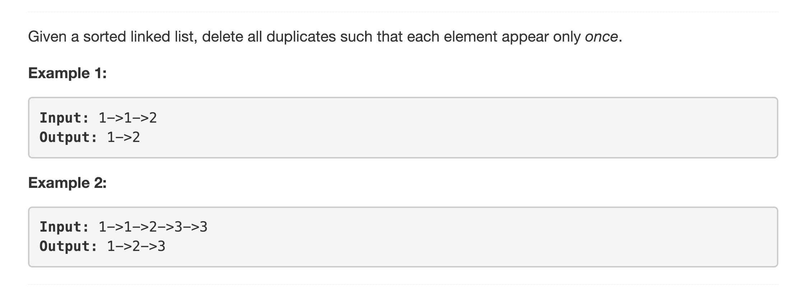

<p align="center">

</p>

---
### Solution 1: One Pass Iterative

#### Motivation

The intuition for this problem is very simple. Consider a set of numbers, `[1,4,3,2,5,1,3,2]`. If we sort these numbers, we get `[1,1,2,2,3,4,5]`. The unique property about duplicates is that they occur *together* in a sorted order. Descending or ascending doesn't matter.

#### Algorithm

1. Have one pointer point to the node next to the head of the linked list. Let's call this pointer `ptr`. Also have a pointer called `prev_ptr` point to the head node of the linked list. We will use this additional pointer for making deletions in `O(1)` time.
2. Additionally, have a variable called `prev` store the value of the previous node in the linked list. Initialize it with the value of the head node.
3. We iterate the list one step at a time. At every node pointed to by `ptr`, we check if the value of that node is equal to the value stored in `prev`. If the value is the same, then it's a duplicate node and it can be deleted. We make the deletion using

      ```
      prev_ptr.next = ptr.next
      ```
4. We keep on iterating till the end of the list and keep on deleting the duplicates this way. Of-course, the `prev_ptr` has to be moved along with the `ptr` node. it always has to be one step behind the `ptr` node for us to be able to perform deletions in `O(1)` time.

#### Complexity Analysis

* Time Complexity: `O(N)` since we make one pass over the given linked list and delete the duplicates.
* Space Complexity: `O(1)`

#### Link to OJ

https://leetcode.com/problems/remove-duplicates-from-sorted-list/description/

---
Article contributed by [Sachin](https://github.com/edorado93)
