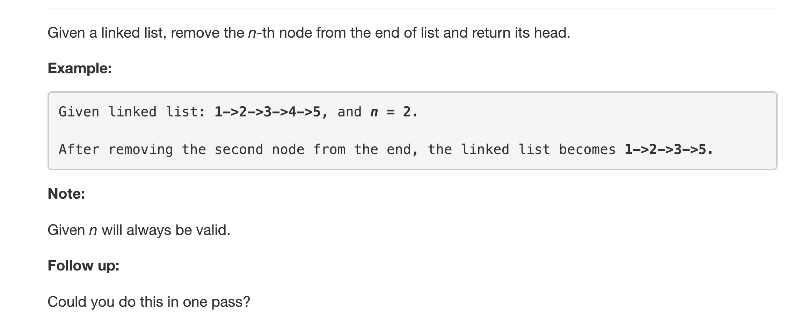

---
### Solution 1: Two Pass

#### Motivation

The basic intuition for this approach comes from the fact that the problem would become much easier if we knew the length of the linked list. Once we know the length of the list, we can find what node to remove from the *beginning*.

#### Algorithm

1. Iterate over the linked list in one pass and find the length. Let's call this `L`.
2. Iterate over the list a second time and once we reach the `L - N`th node from the beginning, we can simply delete it.

#### Complexity Analysis

* Time Complexity: `O(L)` considering there are `L` nodes in the linked list.
* Space Complexity: `O(1)`

---
### Solution 2: One Pass

#### Algorithm

It turns out that we don't really need to find the length of the linked list for us to be able to solve the problem. There is better approach which allows us to directly find the `Nth` node from the end.

1. Have two pointers `ptr1` and `ptr2`.
2. Move `ptr2` ahead `N` places forward from the head of the list. Also have `ptr1` point to the head of the list. Now the two pointers are separated by `N` nodes.
3. Move both the pointers one node at a time. When the `ptr2` pointer hits the end, the `ptr1` pointer will be pointing to the node we want to delete

#### Complexity Analysis

* Time Complexity: `O(N)`
* Space Complexity: `O(1)`

#### Link to OJ

https://leetcode.com/problems/remove-nth-node-from-end-of-list/description/

---
Article contributed by [Sachin](https://github.com/edorado93)
