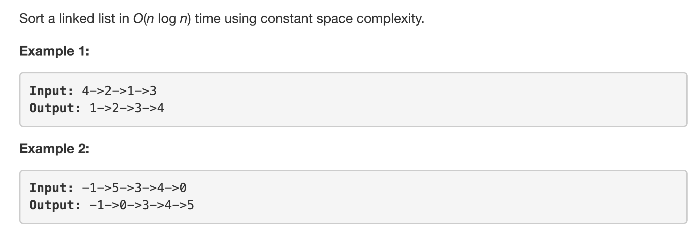
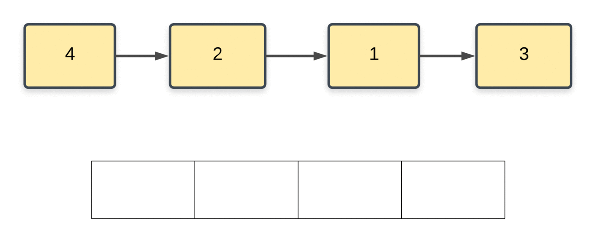

---
### Solution 1: Array Conversion and back

#### Motivation

This isn't really the kind of solution the problem statement wants. But it's one that does get accepted. What we can do here is to convert the list to an array and then sort the list and finally, convert the array back to a linked list.

#### Algorithm

1. Initialize an array, `A`.
2. Iterate over the linked list and add the elements to `A`.
3. Sort the array, `A`.
4. Iterate over the elements (now sorted) in `A` and change the values of nodes in the linked list (the original one) according to values in the sorted array.

Let's look at an animation for this algorithm on a sample array.

#### Complexity Analysis

* Time Complexity: `O(NlogN)`
* Space Complexity: `O(N)`. We need to improve on this. The question asks us to come up with a constant time solution.

---
### Solution 1: Merge Sort

#### Motivation

The actual solution for this problem is requires us to sort the given linked list without actually using any additional space. A lot of sorting algorithms that sort a given array in `O(NlogN)` time tend to make use of `indexes` in the array. However, we know that a linked list doesn't have any indexes as such. The only algorithm that doesn't really requires any indices is `Merge Sort`.

#### Algorithm

1. We use the traditional merge sort algorithm to recursively sort the linked list.
2. For a given `head`, we find the middle of the list. For finding the middle element, we use the slow-fast pointer approach.
    1. Essentially, we keep two pointers, `slow` and `fast`. The slow pointer proceeds one element at a time. The fast pointer proceeds two nodes at once.
    2. Once the fast node reaches the end, the slow pointer would be in the middle of the linked list.
3. After finding the middle, we disconnect the original list so that we now have two different halves. One starting at the original `head` and the other one starting at the `mid` element.
4. Sort the two halves recursively.
5. Merge the two sorted halves together using the two-finger approach. Essentially, we have two fingers (pointers), one each pointing to the beginning of the two sorted lists. At every step, we take the smaller valued node and add it to a final, `sorted/merged` list (whatever you wanna call it). Proceed like this until one of the lists finishes. Add the remaining portion of the second (longer) list to the end of the `final` list.

#### Complexity Analysis

* Time Complexity: `O(NlogN)`
* Space Complexity: `O(1)`. Traditionally, merge sort makes use of a temporary buffer array for sorting purposes. The space complexity is not constant when using merge sort on arrays. But, we can make do with `O(1)` time in linked lists because of the loosely coupled nature of nodes and connections.

#### Link to OJ

https://leetcode.com/problems/sort-list/description/

---
Article contributed by [Sachin](https://github.com/edorado93)
