<p align="center">
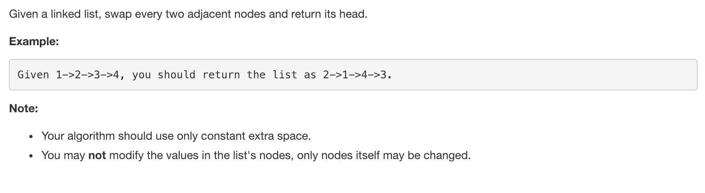
</p>

---
### Solution 1: Recursive Approach

#### Motivation

The question has asked us to swap nodes in pairs. This means we can reach to the end of the linked list by jumping in pairs of two in a recursive manner.

<p align="center">
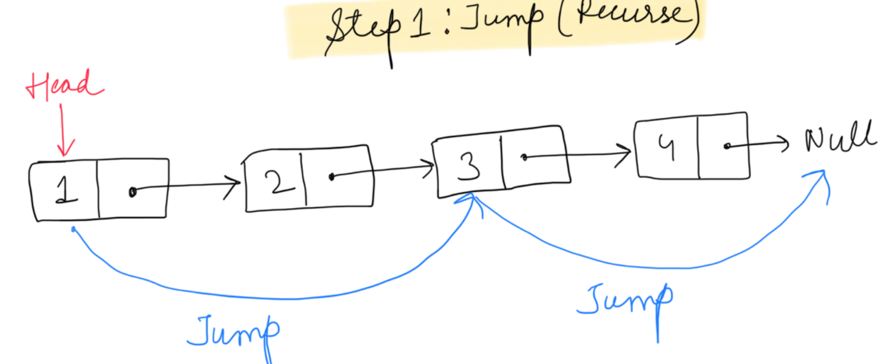
</p>

While back tracking the nodes are swapped.

<p align="center">
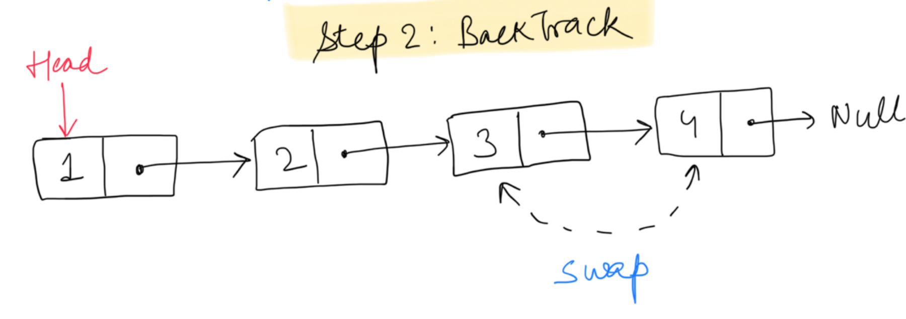
</p>

This means every recursion call breaks the list at the second node and forwards the remaining list in next recursion.

Let's say every time we get into a recursion call, `head` points to the `head` of the remaining list or the head of the next pair.

#### Algorithm

1. The base condition for recursion is to check if either of  `head` or `head.next` is pointing to a null. This would mean we don't have a pair of element to swap for the current recursion call.
2. Let's represent the two nodes to be swapped by `firstNode` and `secondNode`.
    ```
    firstNode = head
    secondNode = head.next
    ```
    <p align="center">
    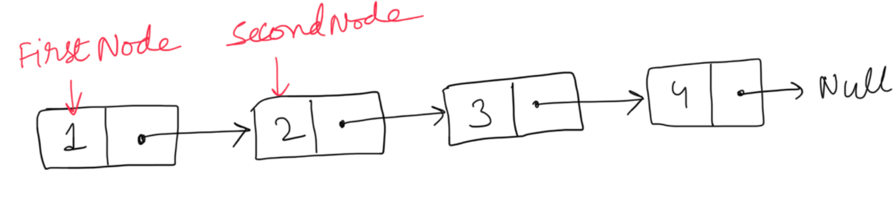
    </p>

3. Make a recursive call to the function with head of the next pair of nodes.

    <p align="center">
    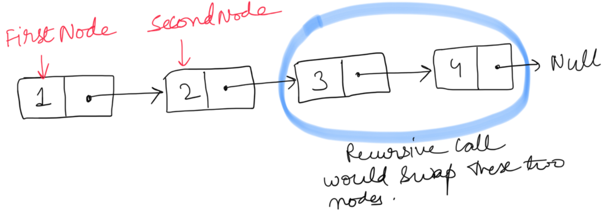
    </p>

    This call would swap the next two nodes and return the pointer to the now first node of the swapped nodes.

    <p align="center">
    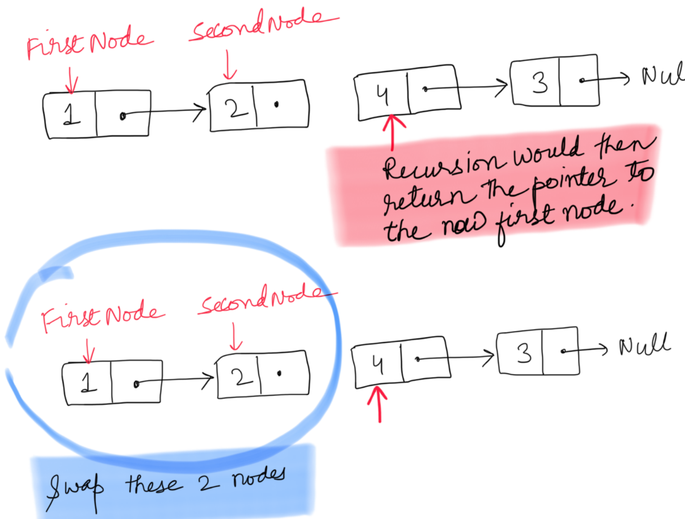
    </p>

    Once we get the pointer to the remaining swapped list from the recursion call. We can swap the first and second node of the current call and return the pointer to the second node since it will be the new head after swapping.

    <p align="center">
    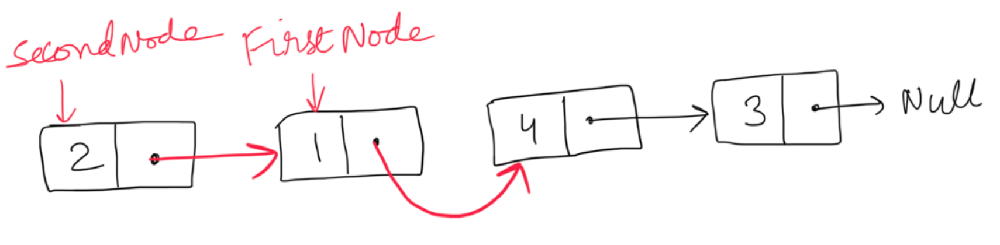

  4. Once all the pairs are swapped in the backtracking step, we would eventually be returning the pointer to the swapped original list.

      <p align="center">
      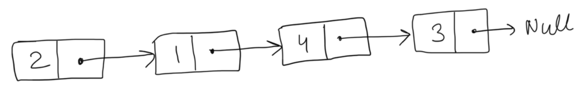

  </p>

#### Complexity Analysis

* Time Complexity: `O(N)` where N is the size of the linked list.
* Space Complexity: `O(N)` Stack space utilized for recursion.

---
### Solution 2: Iterative Approach

#### Motivation

The concept is similar to recursive. We break the linked list into pairs by jumping in steps of two. The only difference is, when two nodes are swapped, the head of the pair is now at the second node of the pair. This should be assigned to the next pointer of the previous node. So we save the previous node in a variable `prevNode`.

<p align="center">
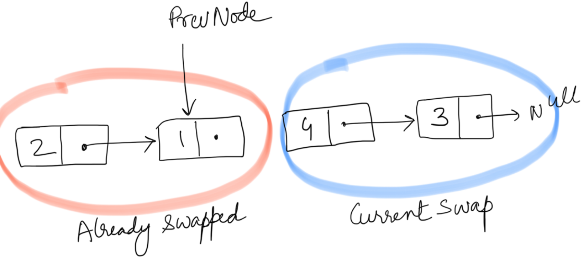

<p align="center">
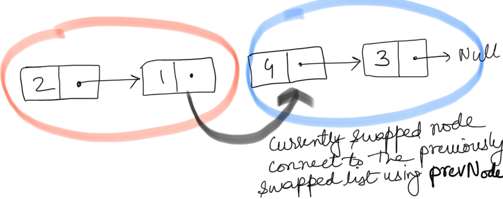  

#### Algorithm

1. We iterate the linked list and after swapping two nodes, we jump to the next pair.

2. Let's represent the two nodes to be swapped by `firstNode` and `secondNode`.

    <p align="center">
    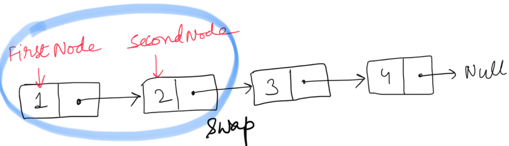

3. Swap the two nodes. The swap step is
    ```
    firstNode.next = secondNode.next
    secondNode.next = firstNode
    ```
    <p align="center">
    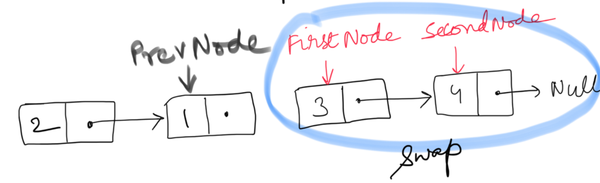

4. We also need to assign the prevNode's next to the current head of the swapped pair.
    ```
    prevNode.next = secondNode
    ```
    <p align="center">
    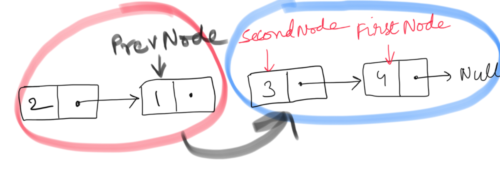

    This step would ensure the currently swapped pair is linked to the end of the previously swapped list.

This is an iterative step, so the nodes are swapped on the go and attached to the previously swapped list. And in the end we get the final swapped list.

  <p align="center">
  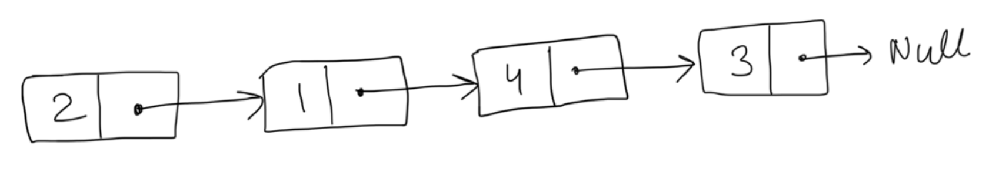


#### Complexity Analysis

* Time Complexity: `O(N)` where N is the size of the linked list.
* Space Complexity: `O(1)`

#### Link to OJ

https://leetcode.com/problems/swap-nodes-in-pairs/

---
Article contributed by [Divya](https://github.com/DivyaGodayal)
