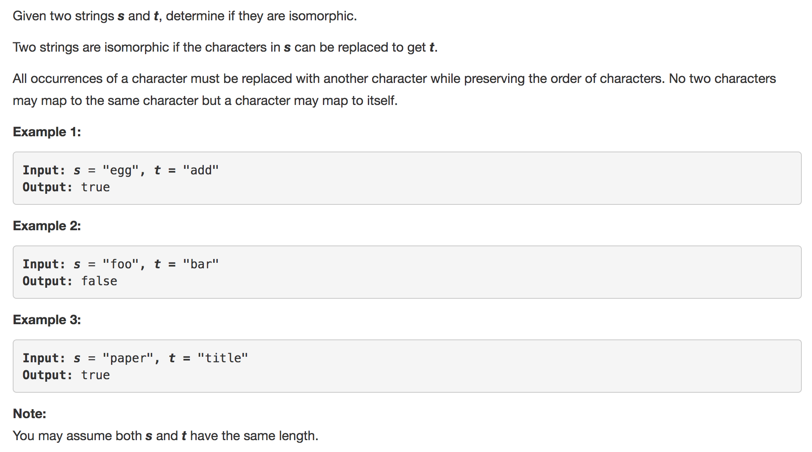
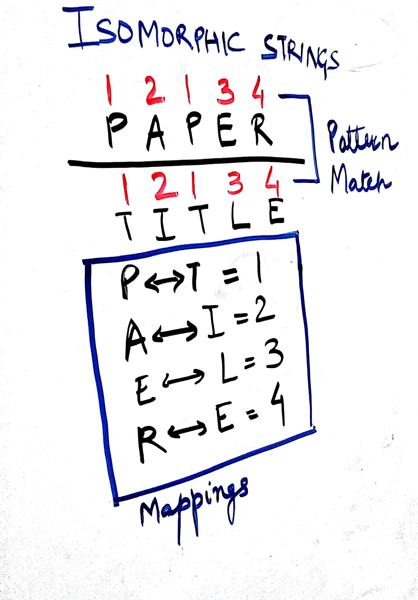
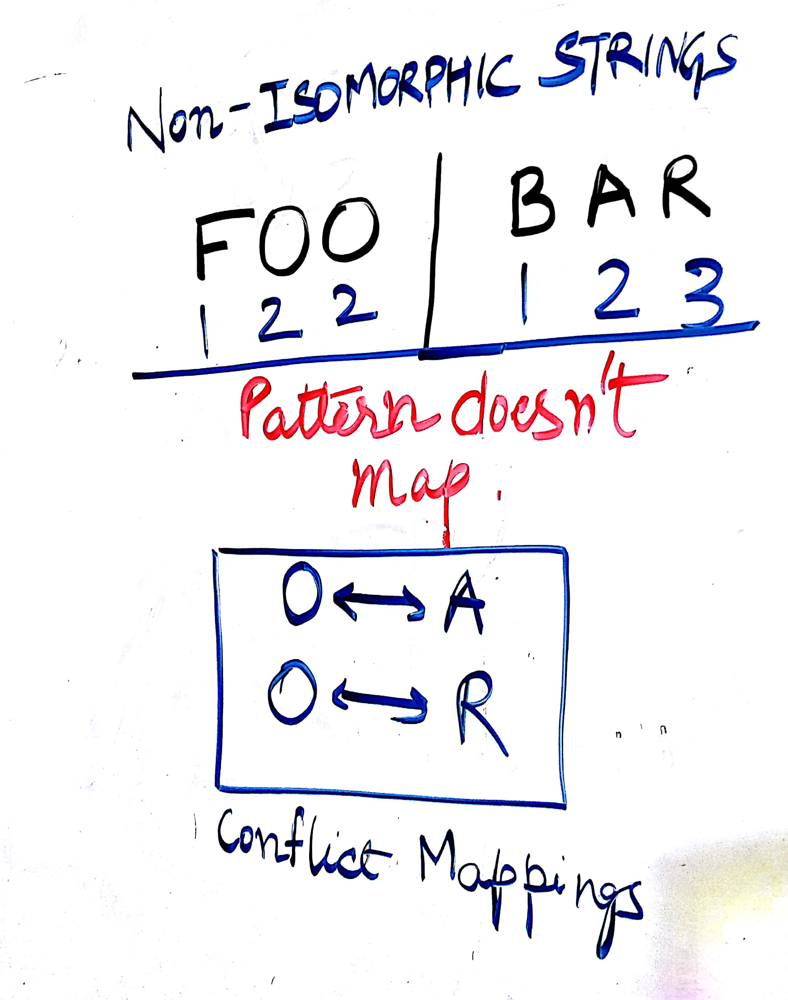

<p align="center">

</p>

The important thing to notice in this question is that isomorphic strings would always follow a pattern. This is how you will  replace characters in one string to get the other one. 

<p align="center">

</p>

In the above example `PAPER` and `TITLE` are isomorphic strings. Both of which follow a pattern which leads to the mappings given in the diagram above. This means P can be replaced by T, A by I, E by L and R by E, to get string `TITLE` from `PAPER`.
 
<p align="center">

</p>

In the example above the two strings are not isomorphic. The pattern generated from both the strings is different. This means if O maps to A, then O maps to R would be conflicting. This happens because there are conflicting mappings. O maps to A and O maps to R. That's not allowed in isomorphism.

---
### Solution 1: O(N<sup>2</sup>) Approach

#### Motivation

Since we are trying to determine a pattern here. The pattern could be determined by using the index of the first occurrence of a given character.

Index Mappings for `PAPER`:

| Find Operations		|		Index Mappings
|-----------------------|---------------------:
| (PAPER).find('P') = 0 |		P <----> 0
| (PAPER).find('A') = 1	|		A <----> 1
| (PAPER).find('P') = 0	|		P <----> 0
| (PAPER).find('E') = 3	|		E <----> 3
| (PAPER).find('R') = 4	|		R <----> 4


Mappings for both the strings:
`
s = "PAPER"
t = "TITLE"
`
```
P | A | P | E | R = 0 | 1 | 0 | 3 | 4
--------------------------------------
T | I | T | L | E = 0 | 1 | 0 | 3 | 4
```

#### Algorithm

1. The index mappings can be achieved by:
   ``` 
    def isIsomorphic(self, s, t): 
       return [s.find(i) for i in s] == [t.find(j) for j in t]
   ```

2. The code is creating a list that contains the index of the first occurence of the corresponding characters in the strings s and t and then we compare the two resulting lists to see if they are equal.

3.  If the index returned is same then the strings are isomorphic.

#### Complexity Analysis

* Time Complexity: O(N<sup>2</sup>), Where N is the length of the strings s and t. For every character we have to find its first occurrence in the given list and use that index. Finding the first occurence would take O(N) for every time since we not using any dictionary or something. Hence, O(N<sup>2</sup>)

* Space Complexity: O(N)

---
### Solution 2: O(N) Approach

#### Motivation

This approach is an improvement over Approach 1. The idea is similar here in that we try to form a pattern and see if the pattern formed in both the strings is similar. Instead of using a find operation we use our own incremental counters `digit_s` and `digit_t` and dictionaries `s_dict` and `t_dict`. The dictionaries would keep a track of all the {character -> digit} mappings. 

#### Algorithm

1. Read the strings character by character in parallel.
2. If the characters are in their respective dictionaries we get the mappings from dictionaries.
3. Else we increment the respective counters and save the mappings in the respective dictionary. 
4. If at any point the characters for an index in `s` and `t` map to different digits, then the strings `s` and `t` are not isomorphic.

#### Implementation Notes

This approach is better than the previous approach since we are using our own counters and dictionaries to keep track of the position/digit mappings thus saving on the computation of `find` operation.

Refer to the code for the complete solution. 

#### Complexity Analysis

* Time Complexity: O(N)

* Space Complexity: O(1), Since the number of characters would always be limited. For eg. all ASCII characters. The size of dictionaries would always be some constant value which is not too big.

#### Link to OJ

https://leetcode.com/problems/isomorphic-strings/

---
Article contributed by [Sachin](https://github.com/edorado93) and [Divya](https://github.com/DivyaGodayal)

