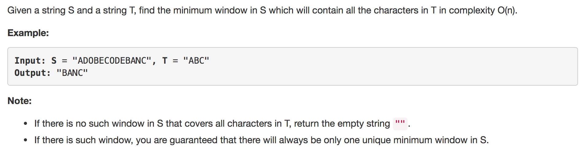
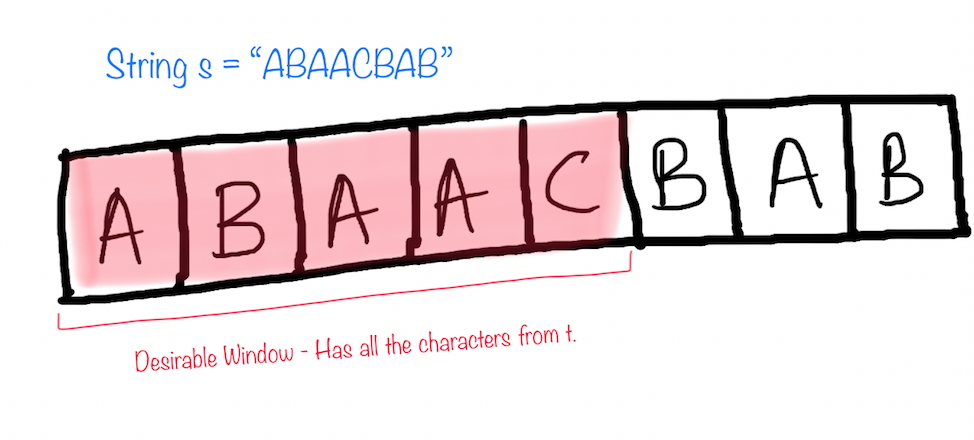
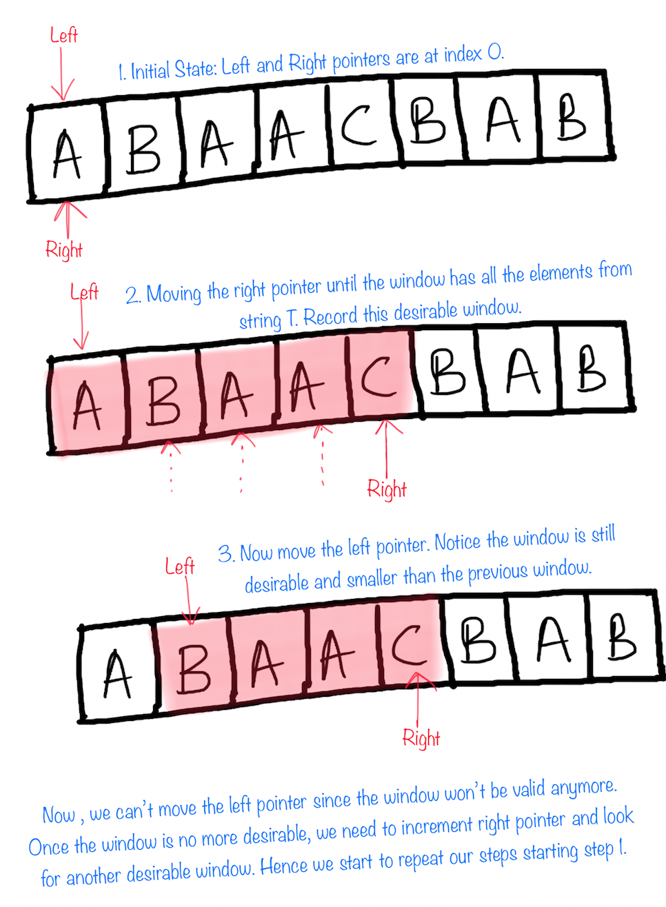
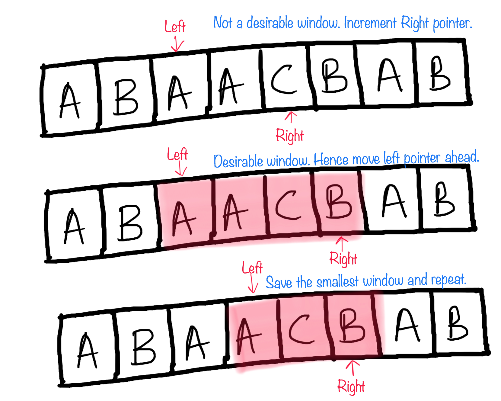

## SOLUTION 1

The question asks us to return minimum window from `S` which has all the characters of `T`. Lets call a window `desirable` if it has all the characters from t.

* The solution is pretty intuitive. We keep updating the window by moving right pointer. When the window has all the desired characters, we save the smallest window till now.

* The answer is the smallest desirable window.

For eg. ` S = "ABAACBAB" T = "ABC" Then our answer window is "ACB"`

* Once we have a window with all the characters, we can move the left pointer ahead one by one. If the window is still a desirable one we keep saving it if its the minimum till now.

* If the window is not desirable any more. We try to make it desirable again by moving the right pointer this time.

* The above steps are repeated until we have looked into all the windows. The smallest window is returned.

* **Time Complexity:** `O(2*|S| + |T|)`
In the worst case we might end up visiting every element of string `S` twice, once by left pointer and once by right pointer. |T| to get the T counter.

* **Space Complexity:** `O(|S| + |T|)`
|S| when the window size is equal to the entire string `S`. |T| when `T` has all unique characters.

## SOLUTION 2 (A better approach)

* A small improvement to the above approach can reduce the time complexity of the algorithm to `O(2*|filtered_S| + |S| + |T|)`, where `filtered_S` is the string formed from S by removing all the elements not present in `T`.

* This complexity reduction is evident when |filtered_S| <<< |S|.
This kind of scenario might happen when length of string `T` is way to small than length of string `S` and string `S` consists of numerous characters which are not present in `T`.

* Hence we create a list called `filtered_s` which has all the characters from string 'S' along with their indices in `S`, but these characters should be present in `T`.

  `S = "ABCDDDDDDEEAFFBC" T = "ABC"
  filtered_S = [(0, 'A'), (1, 'B'), (2, 'C'), (11, 'A'), (14, 'B'), (15, 'C')]
  Here (0, 'A') means in string S character A is at index 0.`

* We can now follow our sliding window approach on the reduced `filtered_S`.
