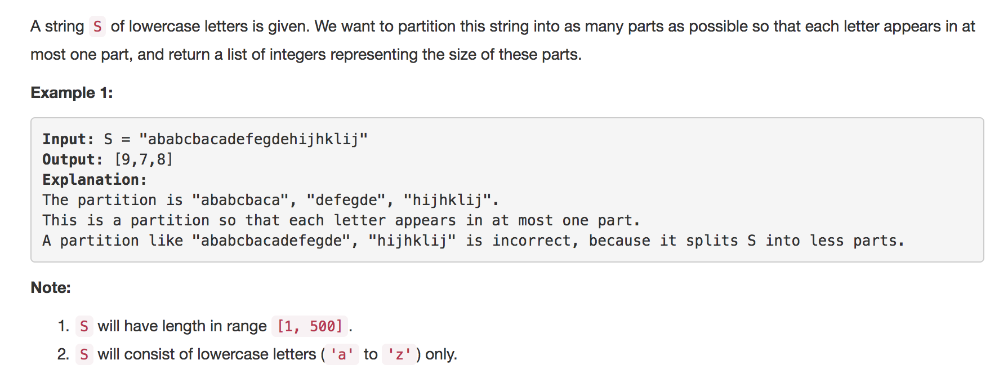

<p align="center">

</p>

The question asks us to partition the given string in such a way so that each character only occurs in just a single partition. We also need to find the maximum number of partitions. eg:- For a string `abcde` we can have a partition like `abc`,`de`and hence the answer would be `[3,2]` but as you can see, the optimal answer here is `[1,1,1,1,1]` because of partitions `a`,`b`,`c`,`d`,`e`.

---
### Solution 1: Interval Scheduling

#### Algorithm

1. First step is to find out intervals for all the individual characters. We will have 26 intervals in all since we have 26 unique characters in the worst case in the string.

2. Once we have the intervals, they will look something like this for the given example in the question `[('a', [0, 8]), ('c', [4, 7]), ('b', [1, 5]), ('e', [10, 15]), ('d', [9, 14]), ('g', [13, 13]), ('f', [11, 11]), ('i', [17, 22]), ('h', [16, 19]), ('k', [20, 20]), ('j', [18, 23]), ('l', [21, 21])]`

3. Now we need to sort these intervals according to the starting indices. 

4. Then, we start from the very first interval. Note: It doesn't matter what character occurs first. We are just concerned with the first interval in the sorted order to start off. For our example that interval is that of 'a' = [0,8]

5. We keep iterating over the sorted list of intervals. 
     * If We get an overlapping interval with the current one, we merge the two intervals and thus effectively, increase the current partition's length.
     * If we get an interval that is not overlapping, then we end the current interval and hence record the partition's size and start the next interval / partition. And so on. 

     eg:- We have the first interval as [0,8]. The next interval in the sorted order is [1,5]. This is overlapping and the new interval is [0,8]. The next interval is [4,7] and this again is overlapping. Updated partition is [0,8]. The next interval is [9,14] and this is clearly not overlapping with [0,8]. So we end the current partition and record its size as 8-0+1 = 9 and start the next partition from [9,14] as the initial boundaries. 
     
#### Complexity Analysis

* Time Complexity: `O(N)`. Note, we sort the character intervals which are 26 at max. 
* Space Complexity: `O(1)` as we need a dictionary of 26 elements and then an array of 26 intervals for sorting and processing. 26 is fixed for the given problem as the number of characters. 

---
### Solution 2: Improved Interval Scheduling

#### Motivation

The approach is similar to the above one. But we realized that instead of keeping a track of the start and end indices we can just save the end indices for each character.

* Example:
```
S = "ababcbacadefegdehijhklij"
letter_dict {'a': 8, 'c': 7, 'b': 5, 'e': 15, 'd': 14, 'g': 13, 'f': 11, 'i': 22, 'h': 16, 'k': 20, 'j': 23, 'l': 21}

letter_dict would keep a track of the last occurence of each character in the string
```

#### Algorithm

1. The idea behind this algorithm is we start from the start index of the string and consider each element one by one.
2. For each element encountered since all the occurences of the first character of the string have to be a part of the same partition, we consider the end of the current partition to be the end index of this character i.e. the last occurence of this character in the string
3. As of now we consider this character's last index to be the cut_point or the end of the current partition. 
4. We still move ahead to reach the cutpoint and check for all the characters encountered. If any of the newly encountered characters' last index is beyond the current cutpoint of the partition, we expand the cut_point.
5. If we reach the end of the current partition i.e. the cut_point, then we add the number of elements in the current partition to the list of answers and start a new partition and repeat the same steps until we reach the end of string.

#### Complexity Analysis

* Time Complexity: `O(N)` Iterating through the string of length n. Note we do not have any sorting complexity involved here unlike the above approach.
* Space Complexity: `O(1)` as we need a dictionary of 26 elements.  

#### Link to OJ

https://leetcode.com/problems/partition-labels/

---
Article contributed by [Sachin](https://github.com/edorado93) and [Divya](https://github.com/DivyaGodayal)


