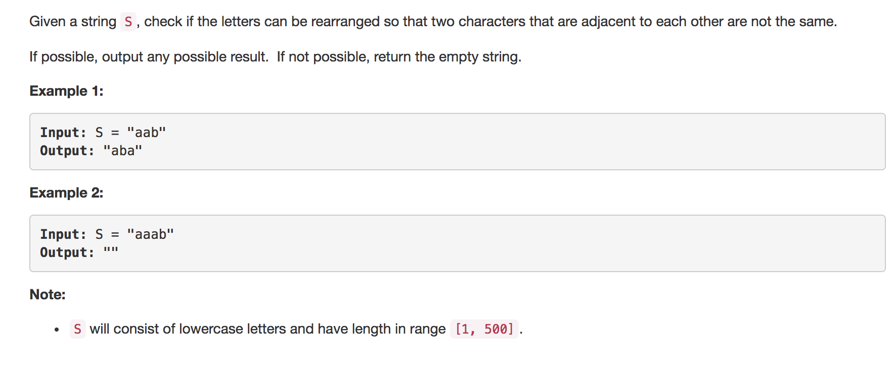

---
### Solution 1: Heap Based Approach

#### Algorithm

1. The solution to this problem uses a heap based greedy approach. So the basic idea is that we count the frequencies of all the elements of the given string and then we create a max-heap for these characters along with their frequencies.
2. Now that we have the heap, we pop an element, add it to our resulting string, reduce it's frequency and we keep repeating until all the characters in the original string have been accounted for. 
3. Say the frequencies were as follows 'a':2, 'b':1. Now if we pop the first element from the heap, we get 'a':2 and after adding 'a' to our resulting string we get 'a':1. Now if we add it back immediately, it is possible that the heap will give us 'a':1 right back at the next pop operation. This would lead to violation of the condition that no two character should come side by side. 
4. Therefore, after adding a character to the resulting string, we hold on to it and only add it back once the next character has been added to the resulting string. So for our example, we will only add 'a':1 back to the heap once 'b':1 has been popped and added to the resulting string. 

#### Complexity Analysis

* Time Complexity: `O(NlogA)` where `N` is the length of the string and `A` is the alphabet size
* Space Complexity: `Q(A)` where `A` is the size of the alphabet.

#### Link to OJ

https://leetcode.com/problems/reorganize-string

---
Article contributed by [Sachin](https://github.com/edorado93) and [Divya](https://github.com/DivyaGodayal)
