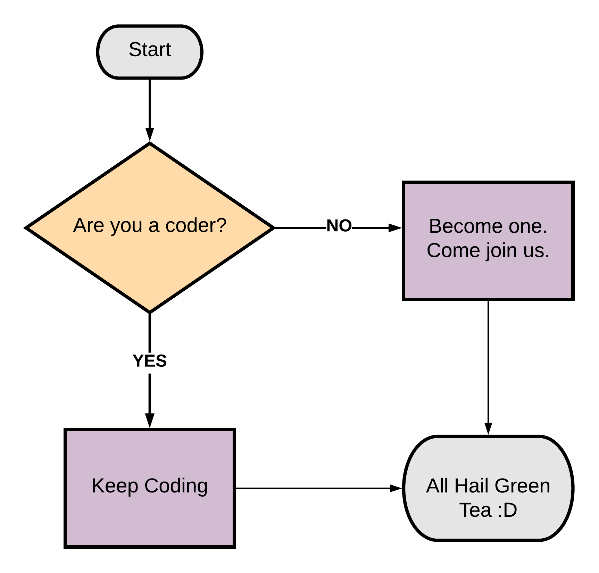

We tend to follow a set template for writing the articles on the CoderChef platform. If you are a writer who wants to contribute new articles to the repository, please download the template available [here](template.md).

## Template Description

Every article starts off with a screenshot of the question. This saves the reader a lot of time which they would otherwise spend on visiting the OJ and reading the problem statement there. For adding the screenshots, use the following markdown syntax.

```
<p align="center">
/<Image-Name>.png" width="X" height="Y">
</p>
```
For eg:

<p align="center">

</p>

What follows the screenshot is a basic problem introduction. In case you might want to describe the problem in more detail, add some basic figures describing the problem. For e.g. you might want to add a figure describing the graph representation for the problem.
<p align="center">

</p>

---
### Solution 1: < Approach Name >

#### Motivation

Each approach should have 3-4 subsections starting off with the motivation section. Here you should describe the basic motivation for the current approach for solving the problem. Add what is the core idea behind the algorithm.

#### Algorithm

You should describe the algorithm in detail here. Use numbered lists for representing the steps of the algorithm.
We believe illustrations or animations are the best way to convey your thoughts and ideas. Add as many images as you can to explain the algorithm. We tend to use [LucidChart](http://lucidchart.com), [Pages](https://www.apple.com/pages/), etc to create illustrations. Be as creative and as expressive in your articles. We always love that :smile:
<p align="center">

</p>


#### Implementation Notes

This section is *optional*. In case there are special implementation caveats that you want the reader to know about, add them here. There might be some implementation specific details for say, Java that you want to point out to the reader. All such things can be added here.

#### Complexity Analysis

Every approach *must* be accompanied by the complexity analysis section. This is one of the most important components of any algorithmic approach. Think carefully about all the different aspects of the algorithm.

Some things that we always take into consideration are as follows:

* The data-structure to be returned does not add to the space complexity of the algorithm. For e.g. if the question asks you to return a list of numbers, then the space occupied by this list will not be a part of the space complexity.
* Recursion stack always contributes to the space complexity. For e.g. if you have a binary tree problem, then the space will definitely be `omega(N)` since the tree can be skewed.
* Pruning strategies don't affect the algorithmic complexity, but they do speed up the actual code a lot.
